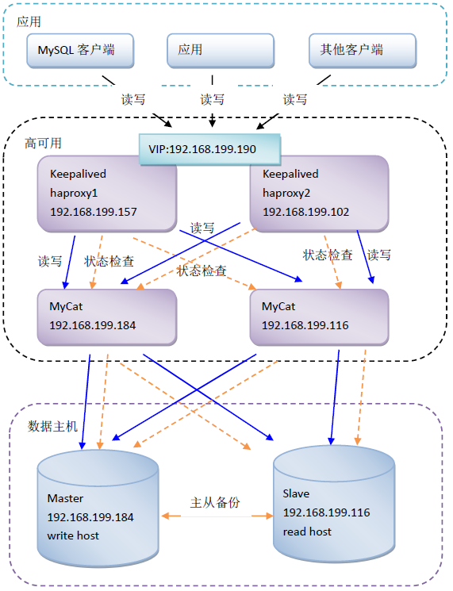

# MyCat


[官网](http://www.mycat.io/),具体见Mysql_Mycat.pdf


# 概述


* 纵向切分:把数据库切成多个数据库,根据路由规则匹配进行数据库操作.mycat只能实现2张表的连接查询
* 横向切分:把单张表中的字段切成多个表,根据id关联.mycat中不能表连接查询
* 逻辑库:mycat中database属性,逻辑上存在,物理上未必存在,主要针对纵向切分提供概念
* 逻辑表:mycat中table属性,主要针对横向切分
* 默认端口:8066
* datahost:数据主机,mysql存放的物理主机地址,每个主机可以存放一个或多个datanode
* datanode:数据节点,database的物理存放节点,每个节点可以分配一个或多个数据库
* mycat只能访问mysql的schema,不能自动创建逻辑库对应的真实数据库,也不能创建逻辑表对应的物理表


# 命令


* 启动:mycat/bin下,mycat start
* 停止:mycat stop
* 重启:mycat restart
* 状态:mycat status
* `mysql -u myCatusername -p myCatpassword -hmycat_ip -P8066`:远程访问MyCat,8066是MyCat服务端口


# MyCat配置


* 下载mycat的安装包,解压

* 主库mysql给mycat新建一个用户,注意不同版本赋权语句不一样,8以上自行查找

  ```mysql
  grant all privileges on *.* 'mycat'@'%' identified by 'password' with grant option;
  flush privileges;
  ```


## rule.xml


* 分库策略,修改了rule之后,需要删除bin目录下的ruleData文件夹,该文件夹中存放了分片的规则信息,但是每次修改了rule.xml之后并不会重置该文件夹,需要手动删除.重启mycat后自动创建该文件夹
* tableRule:分片规则配置
  * name:属性,分片规则名称,自定义,在

  * rule:子标签,具体分片规则
    * column:子标签,需要进行分片的表字段
    * algorithm:子标签,分片的算法规则,对应function的name属性
* function:分片算法,可以使用mycat自带的,也可以自己实现
  * name:属性,算法名称
  * class:属性,算法实现类,自定义算法的类完整地址
  * property:子标签,根据算法不同,需要的参数不同,见官网


## schema.xml


* 分库,分表,集群,读写分离,负载均衡策略

* schema: 配置逻辑库的标签
  * name:属性,配置逻辑库名,如logicName,并非真实存在的数据库,主要给其他配置文件使用
  * checkSQLschema:属性,是否检测SQL 语法中的schema 信息,如select * from logicName.tableName时,
    * true,发送到mysql语句会去掉logicName
    * false,原样发送sql语句到mysql
  * sqlMaxLimit:属性,最大查询数据条数.若查询时不带分页条件,默认查该属性值的数据
  * table:逻辑表标签.如有多个逻辑表,可写多个table标签,逻辑表的表名要和物理表名一致
    * name:逻辑表名
    * dataNode:mycat中dataNode标签的name属性值,多个用逗号隔开或使用$0-100
    * rule:分片规则,对应rule.xml的tableRule的name属性,用来计算sql应该发送到那一个物理库中
    * type:global,全局表,只需要在部分数据库中存在即可
    * autoIncrement:主键自增策略
    * primaryKey:主键字段名

* dataNode:定义物理db的信息,可以定义多个,用逗号分隔
  * name:逻辑节点名称,对应table中的dataNode属性
  * dataHost:对应dataHost的name属性
  * database:物理主机中,真实的数据库名称

* dataHost:定义物理数据主机的安装位置
  * name:属性,逻辑节点名称,在dataNode标签中需要使用
  * maxCon/minCon:属性,最大连接数/最小连接数
  * dbType:属性,数据库类型,mysql
  * dbDriver:属性,驱动类型,native,使用mycat提供的本地驱动
  * balance:属性,读和写的时候如何实现负载均衡
    * 0:不开启读写分离机制,所有读操作都发送到当前可用的writeHost 上
    * 1:默认,写走writeHost,读走readhost
    * 2:所有读操作都随机的在writeHost,readhost上分发
    * 3:所有读请求随机的分发到wiriterHost对应的readhost执行,writerHost不负担读压力,1.4 其以后版本有效
  * writeType:属性,写策略.当集群时,多个writeHost,如何进行写操作.0表示按顺序,从上到下
  * switchType:属性,是否自动切换,默认1自动切换,-1不自动切换,2基于MySQL主从同步状态决定是否切换
  * heartbeat:子标签,内容为心跳语句
  * writeHost:子标签,定义物理数据库的连接.写数据库的定义标签,可实现读写分离操作
    * host:逻辑节点名
    * url:连接地址ip:port
    * user:登录用户名
    * password:密码
  * readHost:writeHost的子标签,需要读写分离时,在标签里配置
    * host:逻辑节点名
    * url:真实数据库连接地址ip:port
    * user:数据库用户名
    * password:数据库密码


## server.xml


* mycat对外服务策略

* property:属性定义
  * serverPort:mycat的服务端口,默认8066
  * managerPort:mycat的管理端口,默认9066

* user:访问mycat的属性,类似访问mysql的属性
  * name:访问mycat用户名,类似mysql的登录名
  * property:
    * password:访问密码
    * schemas:可访问的逻辑库名,多个逗号隔开,对应schema.xml的name属性
    * readOnly:是否只读,true只读,默认false

* privileges:user的子标签,表级DML权限设置
  * check:true检查权限,false不检查权限

* schema:privileges的子标签,对数据库的具体访问权限
  * dml:权限值,4位数字,分别表示insert,update,select,delete,0表示禁止,1表示不禁止,如0110,0000,1111

* table:schema的子标签,具体的表访问权限
  * name:逻辑表名,非真实表名
  * dml:权限值,4位数字,分别表示insert,update,select,delete,0表示禁止,1表示不禁止,如0110,0000,1111


# 读写分离


* 直接在schema.xml中的writeHost标签里写readHost,而writeHost的balance值设为1即可


# 数据库集群


* 需要在schema.xml的dataHost中配置多个writeHost标签,而每个writeHost中配置一个readHost标签


# MyCat集群


```shell
# 直接将整个MyCat复制
cp mycat mycat2 -R
vim wrapper.conf
# 设置jmx端口
wrapper.java.additional.7=-Dcom.sun.management.jmxremote.port=1985
vim server.xml
# 设置服务端口以及管理端口
<property name="serverPort">8067</property>
<property name="managerPort">9067</property>
# 重新启动服务
./startup_nowrap.sh
tail -f ../logs/mycat.log
```


# xinetd


* 配置MyCat 状态检查服务:在所有MyCat(192.168.199.184/192.168.199.116)服务所在主机中增加状态检查服务脚本
* 此操作为HaProxy 提供对MyCat 服务状态检查的依据,本案例中使用xinetd 实现,通过xinetd,HAProxy 可以用httpchk 来检测Mycat 的存活状态
* xinetd 即extended internet daemon,xinetd 是新一代的网络守护进程服务程序,又叫超级Internet 服务器,经常用来管理多种轻量级Internet 服务
* xinetd 提供类似于inetd+tcp_wrapper 的功能,但是更加强大和安全,xinetd 为linux 系统的基础服务


## 安装


* yum install -y xinetd

* 添加: `includedir /etc/xinetd.d`

* 检查/etc/xinetd.conf 的末尾是否有includedir /etc/xinetd.d,没有就加上

* 创建/etc/xinetd.d 目录: `mkdir /etc/xinetd.d/`

* 增加Mycat 存活状态检测服务配置: `vi /etc/xinetd.d/mycat_status`

  ```shell
  service mycat_status
  {
      flags = REUSE
      # 使用该标记的socket_type 为stream,需要设置wait 为no.封包处理方式,Stream 为TCP 数据包
      socket_type = stream
      # 服务监听端口
      port = 48700
      # 表示不需等待,即服务将以多线程的方式运行
      wait = no
      # 执行此服务进程的用户
      user = root
      # 需要启动的服务脚本
      server =/usr/local/bin/mycat_status
      # 登录失败记录的内容
      log_on_failure += USERID
      # 要启动服务,将此参数设置为no
      disable = no
  }
  ```

* 添加/usr/local/bin/mycat_status 服务脚本: `vi /usr/local/bin/mycat_status`

  ```shell
  #!/bin/bash
  #/usr/local/bin/mycat_status.sh
  # This script checks if a Mycat server is healthy running on localhost.
  # It will return:
  # "HTTP/1.x 200 OK\r" (if Mycat is running smoothly)
  # "HTTP/1.x 503 Internal Server Error\r" (else)
  Mycat=`/root/upload/mycat/bin/mycat status | grep 'not running' | wc -l`
  if [ "$Mycat" = "0" ]; then
  	/bin/echo -e "HTTP/1.1 200 OK\r\n"
  else
  	/bin/echo -e "HTTP/1.1 503 Service Unavailable\r\n"
  fi
  ```

* 给新增脚本赋予可执行权限: `chmod 755 /usr/local/bin/mycat_status`

* 在/etc/services 中加入mycat_status 服务,在该文件末尾加入: mycat_status 48700/tcp # mycat_status

* 重启xinetd服务: `service xinetd restart`


# HAProxy





## 安装


* 上传haproxy.tar.gz 到Linux 并解压安装包

* 安装编译依赖: `yum install -y gcc gcc-c++ pcre pcre-devel zlib zlib-devel openssl openssl-devel`

* 编译

  ```shell
  cd haproxy
  # TARGET 是指定内核版本,高于2.6.28 的建议设置为linux2628,Linux 操作系统内核版本查看命令: uname -r
  # ARCH 指定系统架构
  make TARGET=linux2628 ARCH=x86_64 USE_PCRE=1 USE_OPENSSL=1 USE_ZLIB=1
  PREFIX=/usr/local/haproxy
  ```

* 安装: `make install PREFIX=/usr/local/haproxy`

* 创建配置文件目录: `mkdir -p /usr/local/haproxy/conf`, `mkdir -p /etc/haproxy/`

* 添加配置文件并创建软连接: `ln -s /usr/local/haproxy/conf/haproxy.cfg /etc/haproxy/haproxy.cfg`

* 为HAProxy 添加Linux 系统用户

  ```shell
  groupadd haproxy
  useradd -g haproxy haproxy
  ```

* 创建chroot 运行的路径: `mkdir /usr/share/haproxy`

* 拷贝开机启动文件,并赋予权限

  ```shell
  cp /root/upload/haproxy/examples/haproxy.init /etc/rc.d/init.d/haproxy
  chmod +x /etc/rc.d/init.d/haproxy
  ```

* 添加HAProxy 命令脚本软连接: `ln -s /usr/local/haproxy/sbin/haproxy /usr/sbin`

* 设置HAProxy 开机启动

  ```shell
  chkconfig --add haproxy
  chkconfig haproxy on
  ```


## 配置


```cfg
# 创建文件
vi /usr/local/haproxy/conf/haproxy.cfg

# global 配置中的参数为进程级别的参数,通常与其运行的操作系统有关
global
    # 定义全局的syslog 服务器,最多可以定义2 个
    # local0 是日志设备,对应于/etc/rsyslog.conf 中的配置,默认回收info 的日志级别
    log 127.0.0.1 local0 info
    # 设定每个haproxy 进程所接受的最大并发连接数,其等同于命令行选项"-n","ulimit-n"自动计算的结果正式参照从参数设定的
    maxconn 4000
    daemon
    # 修改HAProxy 的工作目录至指定的目录并在放弃权限之前执行
    # chroot() 操作可以提升haproxy 的安全级别
    #chroot /usr/share/haproxy
    # 同gid,不过这里为指定的用户组名
    #group haproxy
    # 同uid,但这里使用的为用户名
    #user haproxy
    # 设置haproxy 后台守护进程形式运行
    #daemon
    # 指定启动的haproxy 进程个数,只能用于守护进程模式的haproxy;默认为启动1 个进程,一般只在单进程仅能打开少数文件描述符的场中才使用多进程模式
    #nbproc 1
    # 进程文件(默认路径/var/run/haproxy.pid)
    #pidfile /var/run/haproxy.pid
    # 定义当前节点的名称,用于HA 场景中多haproxy 进程共享同一个IP地址时
    #node haproxy1
    # 当前实例的描述信息
    #description haproxy1

## defaults:用于为所有其他配置段提供默认参数,这默认配置参数可由下一个"defaults"所重新设定
defaults
    ## mode:所处理的模式(tcp:四层, http:七层, health:状态检查,只会返回OK)
    ## tcp: 实例运行于纯tcp 模式,在客户端和服务器端之间将建立一个全双工的连接,且不会对7 层报文做任何类型的检查,此为默认模式
    ## http: 实例运行于http 模式,客户端请求在转发至后端服务器之前将被深度分析,所有不与RFC 模式兼容的请求都会被拒绝
    ## health: 实例运行于health 模式,其对入站请求仅响应“OK”信息并关闭连接,且不会记录任何日志信息,此模式将用于相应外部组件的监控状态检测请求
    mode http
    ## 继承global 中log 的定义
    log global
    option httplog
    option dontlognull
    option http-server-close
    option forwardfor except 127.0.0.0/8
    ## serverId 对应的服务器挂掉后,强制定向到其他健康的服务器
    option redispatch
    retries 3
    timeout http-request 10s
    timeout queue 1m
    ## 连接超时(默认是毫秒,单位可以设置us,ms,s,m,h,d)
    timeout connect 10s
    ## 客户端超时
    timeout client 1m
    ## 服务器超时
    timeout server 1m
    timeout http-keep-alive 10s
    timeout check 10s
    ## 前端的最大并发连接数,默认为2000
    ## 不能用于backend 区段,对于大型站点,可以尽可能提高此值以便让haproxy管理连接队列,从而避免无法应答用户请求,最大值不能超过global段的定义
    ## haproxy 会为每个连接维持两个缓冲,每个缓存的大小为8KB,再加上其他的数据,每个连接将大约占用17KB的RAM 空间,
    ## 这意味着1G的可用RAM将维护4W-5W并发连接,如果指定了一个过大值,极端场景中,其最终所占据的空间可能会超过当前主机的可用内存
    maxconn 3000

## HAProxy 的状态信息统计页面
listen admin_stats
    ## 绑定端口
    bind 0.0.0.0:4001
    mode http
    ## 统计页面
    stats uri /dbs
    stats realm Global\ statistics
    ## 设置统计页面认证的用户和密码,如果要设置多个,另起一行写入即可
    stats auth admin:admin123
    ## 启用日志记录HTTP 请求
    option httplog

## 用于定义通过关联前端和后端一个完整的代理,通常只对TCP 流量有用
listen mycat
    ## 绑定端口,非MyCat和MySQL端口
    bind 0.0.0.0:4002
    mode tcp
    ## 定义负载均衡算法,可用于"defaults"、"listen"和"backend"中,默认为轮询方式
    balance roundrobin
    ## 记录TCP 请求日志
    option tcplog
    ## 是否允许向server 和client 发送keepalive
    #option tcpka
    ## 后端服务状态检测
    ## 向后端服务器的48700 端口(端口值在后端服务器上通过xinetd 配置)发送OPTIONS 请求(原理请参考HTTP 协议)
    ## HAProxy 会根据返回内容来判断后端服务是否可用.2xx 和3xx 的响应码表示健康状态,其他响应码或无响应表示服务器故障
    #option httpchk OPTIONS * HTTP/1.1\r\nHost:\ www
    # 代理mycat服务
    ## 格式: server <name> <address>[:[port]] [param*]
    ## server: 在后端声明一个server,只能用于listen 和backend 区段
    ## <name>: 为此服务器指定的内部名称,其将会出现在日志及警告信息中
    ## <address>: 此服务器的IPv4 地址,也支持使用可解析的主机名,但要在启动时需要解析主机名至响应的IPV4 地址
    ## [:[port]]: 指定将客户端连接请求发往此服务器时的目标端口,此为可选项
    ## [param*]: 为此server 设定的一系列参数,均为可选项,常用参数:
    ### weight: 权重,默认为1,最大值为256,0 表示不参与负载均衡
    ### backup: 设定为备用服务器,仅在负载均衡场景中的其他server 均不可以启用此server
    ### check: 启动对此server 执行监控状态检查,其可以借助于额外的其他参数完成更精细的设定
    ### inter: 设定监控状态检查的时间间隔,单位为毫秒,默认为2000.也可以使用fastinter 和downinter 来根据服务器端专题优化此事件延迟
    ### rise: 设置server 从离线状态转换至正常状态需要检查的次数(默认为2)
    ### fall: 设置server 从正常状态转换至离线状态需要检查的次数(默认为3)
    ### cookie: 为指定server设定cookie,此值将会在请求入站时被检查,第一次为此值挑选的server将会被后续的请求所选中,其目的在于实现持久连接
    ### maxconn: 指定此服务器接受的最大并发连接数,如果发往此服务器的连接数目高于此处指定的值,其将被放置于请求队列,以等待其他连接被释放
    server mycat_1 192.168.1.150:8066 check port 8066 maxconn 2000
    server mycat_2 192.168.1.150:8067 check port 8067 maxconn 2000
```


## 日志


* 默认情况下haproxy 是不记录日志的,如果需要记录日志,还需要配置系统的syslog,在linux 系统中是rsyslog 服务

* syslog 服务器可以用作一个网络中的日志监控中心,rsyslog是一个开源工具,被广泛用于Linux 系统以通过TCP/UDP 协议转发或接收日志消息

* 安装配置rsyslog 服务: 

  ```shell
  # 没安装的情况下执行安装
  yum install -y rsyslog
  vi /etc/rsyslog.conf
  # 把$ModLoad imudp 和$UDPServerRun 514 前面的# 去掉
  # 模块名,支持UDP 协议
  $ModLoad imudp
  # 允许514 端口接收使用UDP 和TCP 协议转发过来的日志,而rsyslog 在默认情况下,正是在514 端口监听UDP
  $UDPServerRun 514
  # 确认GLOBAL DIRECTIVES 段中是否有$IncludeConfig /etc/rsyslog.d/*.conf ,没有则增加上此配置
  ```

* rsyslog 服务会来此目录加载配置

  ```shell
  cd /etc/rsyslog.d/
  # 创建haproxy 的日志配置文件
  vi /etc/rsyslog.d/haproxy.conf
  local0.* /var/log/haproxy.log
  # 如果不加下面的"&~",则除了在/var/log/haproxy.log 中写入日志外,也会写入/var/log/message 文件中
  &~
  ```

* 配置保存后重启rsyslog 服务: `service rsyslog restart`

* 启动HAProxy: `service haproxy start`

* 安装完一个HAProxy 之后,可以通过mysql 命令控制台直接测试访问HAProxy: `mysql -uroot -p123456 -h192.168.199.157 -4002`

* 查看HAProxy 提供的WEB 统计应用: `http://localhost:4001/dbs`


# Keepalived


* 安装,见Linux.md

* 修改haproxy1 服务器中的配置文件

  ```conf
  global_defs {
  	# keepalived 自带的邮件提醒需要开启sendmail 服务,建议用独立的监控或第三方SMTP
  	# 标识本节点的字符串,通常为hostname,需要修改/etc/hosts
  	router_id haproxy1
  }
  # keepalived 会定时执行脚本并对脚本执行的结果进行分析,动态调整vrrp_instance的优先级
  # 如果脚本执行结果为0,并且weight 配置的值大于0,则优先级相应的增加
  # 如果脚本执行结果非0,并且weight 配置的值小于0,则优先级相应的减少
  # 其他情况,维持原本配置的优先级,即配置文件中priority 对应的值
  vrrp_script chk_haproxy {
  	# 检测haproxy 状态的脚本路径
  	script "/etc/keepalived/haproxy_check.sh"
  	# 检测时间间隔
  	interval 2
  	# 如果条件成立,权重+2
  	weight 2
  }
  # 定义虚拟路由, VI_1 为虚拟路由的标示符,自定义
  vrrp_instance VI_1 {
  	# 默认主设备(priority 值大的)和备用设备(priority 值小的)都设置为BACKUP,由priority 来控制同时启动情况下的默认主备,否则先启动的为主设备
  	state BACKUP ## 
  	# 绑定虚拟IP 的网络接口,与本机IP 地址所在的网络接口相同
  	interface eth0
  	# 虚拟路由的ID 号,两个节点设置必须一样可选IP 最后一段使用,相同的VRID 为一个组,他将决定多播的MAC 地址
  	virtual_router_id 35
  	# 节点优先级,值范围0-254, MASTER 要比BACKUP 高
  	priority 120
  	# 主设备(priority 值大的)配置一定要加上nopreempt,否则非抢占也不起作用
  	nopreempt
  	# 组播信息发送间隔,两个节点设置必须一样,默认1s
  	advert_int 1
  	# 设置验证信息,两个节点必须一致
  	authentication {
  		auth_type PASS
  		# 密码
  		auth_pass 1111
  	}
  	# 将track_script 块加入instance 配置块
  	track_script {
  		# 检查HAProxy 服务是否存活
  		chk_haproxy
  	}
  	# 虚拟IP 池, 两个节点设置必须一样
  	virtual_ipaddress {
  		# 虚拟ip,可以定义多个,每行一个
  		192.168.199.190
  	}
  }
  ```

* 修改haproxy2 服务器中的配置文件

  ```
  global_defs {
  	router_id haproxy2
  }
  vrrp_script chk_haproxy {
      script "/etc/keepalived/haproxy_check.sh"
      interval 2
      weight 2
  }
  vrrp_instance VI_1 {
      state BACKUP
      interface eth0
      virtual_router_id 35
      priority 110
      advert_int 1
      authentication {
          auth_type PASS
          auth_pass 1111
      }
      track_script {
      	chk_haproxy
      }
      virtual_ipaddress {
      	192.168.199.190
      }
  }
  ```

* 如果非抢占模式不生效, 在Keepalived 的故障节点恢复后会再次导抢占vip,从而因vip 切换而闪断带来的风险

* 按以上配置,配置了Keepalived 非抢占模式, 配置及注意点如下:

  * 主设备,从设备中的state 都设置为BACKUP
  * 主设备,从设备中都不要配置mcast_src_ip(本机IP 地址)
  * 默认主设备(priority 值大的)配置一定要加上nopreempt,否则非抢占不起作用
  * 防火墙配置允许组播(主,备两台设备上都需要配置, keepalived 使用224.0.0.18作为Master 和Backup 健康检查的通信IP)

* haproxy状态检查脚本chk_haproxy.sh

  ```shell
  #!/bin/bash
  START_HAPROXY="/etc/rc.d/init.d/haproxy start"
  STOP_HAPROXY="/etc/rc.d/init.d/haproxy stop"
  LOG_FILE="/usr/local/keepalived/log/haproxy-check.log"
  HAPS=`ps -C haproxy --no-header |wc -l`
  date "+%Y-%m-%d %H:%M:%S" >> $LOG_FILE
  echo "check haproxy status" >> $LOG_FILE
  if [ $HAPS -eq 0 ];then
  	echo $START_HAPROXY >> $LOG_FILE
  	$START_HAPROXY >> $LOG_FILE 2>&1
  	sleep 3
  	if [ `ps -C haproxy --no-header |wc -l` -eq 0 ];then
  		echo "start haproxy failed, killall keepalived" >> $LOG_FILE
  		killall keepalived
  	fi
  fi
  ```

  


# PXC


* Percona XtraDB Cluster是针对MySQL用户的高可用性和扩展性解决方案,是一个针对事务性应用程序的同步多主机复制插件  
* 同步复制,事务可以在所有节点上提交
* 多主机复制,你可以写到任何节点
* 从slave服务器上的并行应用事件,真正的并行复制
* 自动节点配置
* 数据一致性,不再有未同步的从服务器
* 尽可能的控制PXC集群的规模,节点越多,数据同步速度越慢
* 所有PXC节点的硬件配置要一致,如果不一致,配置低的节点将拖慢数据同步速度
* PXC集群只支持InnoDB引擎,不支持其他的存储引擎
* PXC集群方案与Replication区别:
  * PXC集群方案所有节点都是可读可写的,Replication从节点不能写入,因为主从同步是单向的,无法从slave节点向master点同步
  * PXC同步机制是同步进行的,这也是它能保证数据强一致性的根本原因,Replication同步机制是异步进行的,它如果从节点停止同步,依然可以向主节点插入数据,正确返回,造成数据主从数据的不一致性
  * PXC是用牺牲性能保证数据的一致性,Replication在性能上是高于PXC的
  * PXC是用于重要信息的存储,例如订单,用户信息等.Replication用于一般信息的存储,能够容忍数据丢失,例如购物车,用户行为日志等


# 整体解决方案


* HAProxy作为负载均衡器,负责应用和MyCat之间的请求转发
* Mycat节点作为数据库中间件可以部署多个,负责处理HAProxy的请求
* 部署PXC集群,作为2个Mycat分片,每个PXC集群中有2个节点,作为数据的同步存储,存储重要信息
* 根据实际情况部署1个主从复制集群,存储不太重要的数据