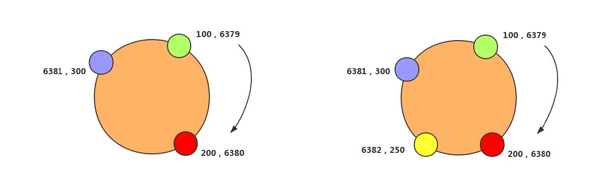

# MySQL


# 数据库设计规范


## 三范式


* 表中所有字段都是不可再分的,即数据库表中的字段都只有单一属性
* 单一属性的列都是由基本数据类型构成
* 设计的表都是简单的二维表
* 一个表中只有一个业务主键,即不要存在复合主键,并且非主键都依赖于业务主键
* 非主属性即不部分依赖于主键也不传递依赖主键,即非主属性列之间不能相互依赖


## 其他规范


* 每个表都要建立主键
* 禁止存储图片和二进制文件,避免使用TEXT,BLOB数据类型
* 不使用字符串存储日期类型,尽量使用DATETIME
* 将IP转换为INT类型存储
* VARCHAR类型定义时指定的长度是字符串长度,不是字节长度
* 避免使用枚举类型,因为有些数据库不支持,且枚举类型排序比较差
* 尽可能将所有列都设置默认值,因为null需要占用索引的额外空间
* 存储比较精准的数字类型,需要使用DECIMAL
* 禁止使用`SELECT *`


# 基础语法


## 特殊语法


* mysql中使用了关键字,需要用``(反引号)包裹起来

* mysql  -uroot -p123456 -e "show databases;":-e参数可以直接在非mysql环境中执行sql语句

* system ls /:在mysql中使用system加上linux命令,可以查看linux系统的文件

* mysqlbinlog:可以查看bin-log日志里的内容

* 命令行内的语句结束符可以为;(分号),此时输出为横排结果.若末尾是\G,不是分号,则是竖排结果

* delimiter:修改当前对话的语句结束符

* SQL对大小写不敏感

* +:mysql中+号只能用来做运算,拼接字符串要用concat

  * +两边是数字,直接做运算

  * 两边的不是数字,先尝试转成数字,该处有2种情况

  * 若A以字符串开头,则将整个字符串转换为0进行运算

    ```mysql
    select 'fdfd34'+4; # 4
    ```

  * 若A是以数字开头的字符串,那么将会把从开头到第一个字符换之间的数字转化之后做运算

    ```mysql
    select '234f'+4; # 238
    select '5fdfd34'+4; # 9 
    ```

  * 若一边为null,则结果null

* MySQL中截取函数的下标从1开始,并不是从0开始,含头不含尾

* LOCK TABLES table:锁定表

* UNLOCK TABLES:解锁所有表

* CREATE TABLE table AS SELECT * FROM table1:将table1中的数据全部插入到table中.在数据量很大的情况下,该方法效率很高.如果数据库禁止使用该方式插入数据,可以先使用`CREATE TABLE table LIKE table1`创建表,再使用`INSERT INTO table AS SELECT * FROM table1`插入数据

* `XOR`:异或,和二进制中表达的啥意思类似,用该运算符连接的条件,只满足其中一个条件的数据才查询,如:

  ```mysql
  -- 得到的数据是age大于10且sex不等于1的数据和age小于等于10且sex等于1的数据
  SELECT * FROM ts_user WHERE age > 10 XOR sex = 1;
  ```

* `USEING`:相当于多表连接中的ON,但是必须是被连接表中都有的字段,如:

  ```mysql
  .... ts_user INNER JOIN ts_user_role ON ts_user.user_id = ts_role.user_id;
  -- 等同于如下,必须2表中都有user_id
  .... ts_user INNER JOIN ts_user_role USING(user_id);
  ```

  


## 系统语法


* SHOW DATABASES:查看所有的数据库
* USE dbname:使用名称为dbname数据库
* SHOW TABLES FOR dbname:直接查看dbname数据库中的所有表
* SHOW TABLES:必须先使用use dbname之后才可以使用,查看当前数据库中所有表
* SHOW TABLE STATUS:查看表状态
* SHOW CREATE TABLE tablename:查看表结构,信息更详细
* DESC tablename/DESCRIBE tablename/EXPLAIN tablename/SHOW COLUMNS FROM tablename:查看表结构,分析表结构,展示表字段
* RENAME TABLE old_tablename TO new_tablename:修改表名
* RENAME TABLE old_tablename TO dbname.tablename:将表移动到另外一个库并重新命名
* ALTER TABLE table []:修改表结构

  * ADD COLUMN col property []:新增字段col,以及其他属性,如类型,长度等
    * AFTER col1:新增在某个已有的字段后
    * FIRST:新增为第一个字段

  * ADD PRIMARY KEY(col):将col字段设置为主键
  * DROP PRIMARY KEY:删除主键,需要先删除AUTO_INCREMENT属性
  * ADD UNIQUE [indexname]  (col):将某字段设置为唯一索引,可自定义索引名
  * ADD INDEX [indexname]  (col):创建普通索引,可自定义索引名
  * DROP INDEX indexname:删除索引
  * DROP COLUMN col:删除字段
  * MODIFY COLUMN col property:修改字段属性,不可修改字段名,所有原有属性也都必须写上
  * CHANGE COLUMN old_col new_col property:同modify,但可修改字段名
  * ADD CONSTRAINT foreignname FOREIGN KEY(col) REFERENCES table1(col1):将table的col字段外键关联到table1的col1字段,table1为主表
  * DROP FOREIGN KEY foreignname:删除外键
* TRUNCATE TABLE table:直接删除表之后再重新建表结构,数据不可恢复
* CREATE TABLE table LIKE table1:复制表table的表结构到table1
* CREATE TABLE table AS SELECT * FROM table1:复制tablename1的表结构和数据到table


## 数据类型


* 数字类型的长度是显示长度,不是占用空间大小,占用空间大小固定,和Java数据类型一样.显示长度要和zerofill一起用才有效果
* 浮点数:FLOAT和DOUBLE,取值范围较大,但是会丢失精度
* 定点数:DECIMAL,取值范围比浮点数小,但是精准,没有误差,通常使用DECIMAL
* TIMESTAMP和DATETIME
  * TIMESTAMP存储空间小,标识的日期范围小,存储的是毫秒值,在日期比较时速度更快
  * TIMESTAMP和时区有关,会根据用户的时区不同,显示不同的结果.而DATETIME则只能反应出插入当时的时区


## 左/右连接


* 以左连接为例,左边的表数据全局查出来,忽略on和where的过滤条件
* 左表的数据查出来之后,再根据on查询右表的数据,有则显示,无则为null


# 常用函数


## 通用


* SELECT database(),now(),user(),version():查看mysql当前数据库,时间,登录用户,版本号
* IFNULL(exp1,exp2):若exp1表达式为null,则使用exp2的值,若不为null,则使用exp1的值
* MD5(str):对字符串加密,只用在新增mysql用户的时候
* LOAD_FILE(file_name):从文件读取内容
* GROUP_CONCAT():


## 字符串


* MySQL中VARCHAR,CHAR是按字符长度存储,不是按字节长度

* CONCAT(str1,str2...):直接将字符串拼接

* CONCAT_WS(sperate,str1,str2...):将字符串按照指定的分隔符sperate拼接

* LENGTH(str):str的**字节**长度,需要根据编码来测算

* CHAR_LENGTH(str):str的字符个数

* UPPER(str):将str字符串全部转换为大写

* UCASE(str):将str全部转换成大写

* LOWER(str):将str字符串全部转换为小写

* LCASE(str):将str全部转换成小写

* SUBSTR/SUBSTRING(str, position [,length]):从str的position开始截取length个字符串,若length不存在,截取到末尾.当position为正数,从开始向末尾读position个下标.若position为负数,从末尾开始向开头读取position,同样是向末尾截取.**注意,mysql中字符串下标从1开始,含头不含尾**

  ```mysql
  substr('sfewrew',5); # rew
  substr('sioioplb,-5); # ioplb
  ```

* SUBSTRING_INDEX(str,delimiter,n):返回str按delimiter分割的前n个子字符串

* LEFT(str,length):从str开头向末尾截取length个字符.若str长度不够,返回str.若length为负数,返回空字符串

* RIGHT(str,length):从str末尾起开头截取length个字符.若str长度不够,返回str.若length为负数,返回空字符串

* INSTR(str,str1):从str中查找str1的第一次出现的下标,找不到返回0

  ```mysql
  substr('sfewrew','ew'); # 3
  ```

* LOCATE(str, str1[,start_position]):同instr,但可指定开始位置

* TRIM([str FROM] str1):去除str1两边的空白字符串,中间的不去除.str表示去除指定字符串

* LTRIM(str):去除前端空白字符串

* RTRIM(str):去除后端空白字符串

* REPEAT(str, count):将str重复count次拼接起来

* LPAD(str, length, pad):从str开头截取length个字符串.若str长度不够,则左边补充pad,直到长度达到length

* RPAD(str, length, pad):从str开头截取length个字符串.若str长度不够,则右边补充pad,直到长度达到length

* REPLACE(str ,search_str ,replace_str):在str中用replace_str替换所有的search_str

* CHARSET(str):返回字串字符集

* FORMAT(num,n):将数字格式化为#,###,###.##格式,并保留n位小数


## 数学

* ABS(x):返回x的绝对值

* FORMAT(x, d):格式化千分位数值

  ```mysql
  select format(1234567.456, 2) # 1,234,567.46
  ```

* CEIL(x):向上取整,返回大于等于x的最小整数

  ```mysql
  select ceil(10.1); # 11
  select ceil(-10.1); # -10
  ```

* FLOOR(x):向下取整,返回小于等于x的最大整数

* ROUND(x[,precise]):四舍五入,默认取整.precise,保留几位小数

* TRUNCATE(x, d):x截取d位小数,并不进行四舍五入.若小数位不够,返回x

* MOD(m, n):等同于m%n, m mod n,求余.10%3=1

* PI():返回6位小数的圆周率

* POW(m, n):返回m的n次方

* SQRT(x):算术平方根

* RAND():随机数


## 时间

```mysql
# %Y:4位年
# %y:2位年
# %m:2位月
# %c:1位或2位月
# %d:2位月中日
# %H:24小时制
# %h:12小时制
# %i:2位分钟
# %s:2位秒
```

* NOW(), CURRENT_TIMESTAMP():当前日期时间

* CURDATE()/CURRENT_DATE():返回当前日期

* CURTIME()/CURRENT_TIME():返回当前时间

* DATE('yyyy-mm-dd hh:ii:ss'):获取日期部分

* TIME('yyyy-mm-dd hh:ii:ss'):获取时间部分

* DATE_FORMAT(date/datestr,format):将日期或时间字符串格式化为指定格式字符串

  ```mysql
  select date_format(now(),'%y-%c-%d'); # 20-1-01
  select date_format('2020-01-01','%y-%c-%d'); # 20-1-01
  select date_format('20-01-01','%y-%c-%d'); # 20-1-01
  select date_format('20-01-01','%Y-%c-%d'); # 2020-1-01
  select date_format('2020-01-01','%Y-%m-%d'); # 2020-01-01
  ```

* STR_TO_DATE(datestr,format):将日期格式的字符串转换为指定格式的日期,年月日必须一起,时分秒必须一起.在转换时,不要用%y,%c,可能会出现预期之外的结果.尽量使用date_format

  ```mysql
  select str_to_date('2020-01-01','%Y-%m-%d'); # 2020-01-01
  select str_to_date('2020-01-01','%y-%m-%d'); # NULL,不知道是什么逻辑
  select str_to_date('20-01-01','%y-%m-%d'); # 2020-01-01,不知道是什么逻辑
  select str_to_date('20-01-01','%y-%c-%d'); # 2020-01-01,不知道是什么逻辑
  select str_to_date('2020-1-01','%Y-%c-%d'); # 2020-01-01,不知道是什么逻辑,%c无效
  select str_to_date('2020-01-01','%Y-%c-%d'); # 2020-01-01,不知道是什么逻辑,%c无效
  select str_to_date('2020-1-01','%y-%c-%d'); # NULL,不知道是什么逻辑,%y,%c无效
  select str_to_date('2020-01-01','%y-%c-%d'); # NULL,不知道是什么逻辑,%y,%c无效
  ```

* UNIX_TIMESTAMP():获得unix时间戳

* FROM_UNIXTIME():从时间戳获得时间

* YEAR/MONTH/DAY(NOW()/'yyyy-mm-dd hh:ii:ss'):获得指定时间的4位年部分,1或2位月,1或2位月中天

* MONTHNAME(NOW()):获得指定时间的月份英文


## IP


* INET_ATON:将IP转换为数字
* INET_NTOA:将数字转换为IP


# 流程控制


## IF


```mysql
# 第一种形式,只有2种结果
IF(cnd,res1,res2) # 当cnd条件的结果为true,返回结果res1,false返回res2
# 第二种形式,有多种结果
IF cnd1 THEN 
	res1
ELSEIF cnd2 THEN
	res2
ELSE
	res3
END IF
```


## CASE WHEN


```mysql
# 第一种形式,该方式适用于等值比较
CASE column # column可以是字段,也可以某个表达式
WHEN cnd1 THEN res1 # cnd1是column的可能值或者是某种判断,res1是满足cnd1之后返回的值
[WHEN cnd2 THEN res] # 另外的分支结果,可以有多个,cnd2是另外的值或判断,满足cnd2则返回res2
[ELSE res3] # 默认值,可有可无
END
# 第二种形式,该方式既适用于等值比较,也适用于范围值比较,如<,>
CASE WHTN cnd1 THEN res1 # cnd1直接是一个条件,若满足该条件,则返回res1
[WHEN cnd2 THEN res2] # 满足cnd2则返回res2
[ELSE res3] # 返回默认值
END
```


## WHILE


```mysql
[label:]WHILE cnd1 DO # label可有无,主要是用来跳出循环时使用.cnd1为循环的条件
	sql;	# 需要执行的sql
END WHILE[label]
```

* 如果需要在循环内提前终止while循环,则需要使用标签,标签需要成对出现
* 退出循环,通过退出的标签决定退出哪个循环
  * leave label:退出整个循环
  * iterate label:退出当前循环


## REPEAT


```mysql
[label:]REPEAT  # label可有无,主要是用来跳出循环时使用
	sql;
UNTIL cnd1 # cnd1为结束循环的条件
END REPEAT[label]
```

* 如果需要在循环内提前终止REPEAT循环,则需要使用标签,标签需要成对出现
* 退出循环,通过退出的标签决定退出哪个循环
  * leave label:退出整个循环
  * iterate label:退出当前循环


# 自定义变量


* 自定义变量只在当前会话有效,只能在定义了之后使用,不限制变量类型,变量前必须带关键字`@`
* `SET @var_name=value`:声明一个变量并给变量赋值
* `SELECT @var_name:=value`:声明一个变量并给变量赋值
* `SELECT column INTO @var_name from ...`:利用sql语句给变量赋值,sql只能返回一个值,但是可以同时给多个变量赋值
* `SELECT @var_name`:查看自定义变量的值


# 局部变量


* BEGIN...END:语句块,可以在其中写多条语句,一般用于逻辑比较复杂的存储过程等
* DECLARE @var_name[,...] type [default]:声明局部变量,初始化值可以是常数或表达式,不赋值则为null
* 局部变量必须先声明,之后才可以用自定义变量赋值的方式进行赋值
* 局部变量只能在begin...end中使用,且必须是第一句话


# 触发器


* TRIGGER:触发器,主要是监听表中记录的增删改
* CREATE TRIGGER triggername triggertime triggerevent ON tablename FOR EACH ROW trigger_sql
  * triggertime:触发程序的时间,可以是before或after,以指明触发程序是在激活它的语句之前或之后触发
  * triggerevent:指明激活触发程序的语句类型,可以是INSERT,DELETE,UPDATE
  * tablename:必须是永久表,不可以是临时表
  * trigger_sql:激活触发程序之后执行的语句,多个语句可以用begin...end
* DROP TRIGGER triggername:删除触发器


# 方法

* CREATE FUNCTION func_name(参数列表) RETURNS 返回值类型 BEGIN ...sql逻辑... END:创建一个方法,必须有且仅有一个返回值

* 参数列表:变量名称 类型(长度),多个用逗号隔开

* SELECT func_name(参数列表):调用方法

  ```mysql
  CREATE FUNCTION func_name(userId int) RETURNS VARCHAR 
  BEGIN
  	DECLARE @result VARCHAR(50);
  	SELECT username into @result from ts_user where id=userId;
  	RETURN @result;
  END
  SELECT func_name(1);
  ```

* DROP FUNCTION [IF EXISTS] function_name:删除方法

* SHOW FUNCTION STATUS LIKE 'partten'/SHOW CREATE FUNCTION function_name:显示方法

* ALTER FUNCTION function_name 函数选项:修改方法


# 存储过程

* CREATE PROCEDURE sp_name (参数列表) BEGIN ...sql逻辑... END:创建存储过程

  * 参数列表:不同于函数的参数列表,需要指明参数类型
    * IN:表示输入型,需要调用的时候传入
    * OUT:表示输出型,将过程体处理完的结果返回到客户端.存储过程体中不需要加return语句
    * INOUT:表示混合型,输入和输出都可以

* CALL sp_name(参数列表):调用存储过程.只能单独调用,不可夹杂在其他语句中

  ```mysql
  CREATE PROCEDURE sp_name(IN userId INT,OUT username VARCHAR(50))
  BEGIN
  	SELECT username into username from ts_user where id=userId;
  END
  CALL sp_name(1,@username); # @username是定义的一个变量
  ```

* DROP PROCEDURE sp_name:删除存储过程

* SHOW CREATE PROCEDURE sp_name:查看存储过程的定义


# CTE


* 公用表表达式,MySQL8以后才有的语法,类似递归,可以自引用,可多次重复使用

  ```mysql
  # WITH开头,定义一个公用表表达式
  # RECURSIVE:若不写该参数,不能自引用
  # test为公用表表达式的名称,类似于表名.若有多列字段,可以指定字段名
  WITH RECURSIVE test[(column1,column2...)] AS(
      # 第一步的结果查询后先放入test中
  	SELECT 1 AS n
  	UNION ALL
      # 获得上一步的结果,执行第二步的语句,将第二步的结果放入test中
      # 继续查询的时候一直先放入结果再查询,若不指定条件有无限递归了
      # 相当于得到第二步的结果之后,暂停查询,先将结果放入test中,再继续查询,发现还有数据就继续查询
  	SELECT 1+n FROM test WHERE n<10
  )
  SELECT * FROM test
  ```


# 窗口函数


* MySQL8新功能,返回的是一组记录的分组情况

  ```mysql
  # 函数名,可以是聚合函数,也可以是其他特定窗口函数
  function_name([exp])
  OVER(
      # 窗口分组
  	[PARTITION BY exp [,...]]
      # 排序
  	[ORDER BY exp[ASC|DESC] [,...]]
  )
  
  SELECT userId,username,ROW_NUMBER() OVER(PARTITION BY state) AS state,
  RANK() OVER(PARTITION BY age ORDER BY createtime DESC) AS age
  ```

* 窗口函数中可使用所有的聚合函数

* ROW_NUMBER():返回窗口分区内数据的行号

* RANK():类似于ROW_NUMBER(),只是对于相同数据会产生重复的行号,之后的数据行号会产生间隔

* DENSE_RANK():对于相同数据会产生重复的行号,但后续的行号不会产生间隔

* 若需要对窗口函数的结果进行进一步过滤(WHERE),可以结合CTE使用


# 索引隐藏


* MySQL8新特性,语法

  ```mysql
  -- 隐藏索引
  ALTER TABLE t ALTER INDEX i INVISIBLE;
  -- 显示索引
  ALTER TABLE t ALTER INDEX i VISIBLE;
  -- 查看索引
  SHOW INDEX;
  ```

* 隐藏索引的作用是为了分析索引功能,更好的优化数据结构

* 当索引被隐藏时,它的内容仍然是和正常索引一样实时更新的,这个特性本身是专门为优化调试使用


# 设置持久化


* MySQL8新特性,语法

  ```mysql
  SET PERSIST max_connections = 500;
  ```

* MySQL 可以在运行时通过 `SET GLOBAL` 来临时更改设置,MySQL 8 新增了 `SET PERSIST` 命令,MySQL 会将该命令的配置保存到数据目录下的 `mysqld-auto.cnf` 文件中,下次启动时会读取该文件,用其中的配置来覆盖缺省的配置文件


# 计算列


* MySQL8新特性,语法

  ```mysql
  -- c为计算列,值为a+b字段的值,插入和更新a,b时,c的值会变化
  CREATE TABLE test1(a INT,b INT,c INT GENERATED ALWAYS AS (a+b) VIRTUAL);
  ```

  


# 表检查


## 检查表错误


```mysql
CHECK TABLE tablename1,tablename2... [option]
# option = {QUICK | FAST | MEDIUM | EXTENDED | CHANGED}
```


## 优化表,整理数据文件碎片


```mysql
OPTIMIZE [LOCAL|NO_WRITE_TO_BINLOG] TABLE tablename1,tablename2...
```


## 修复表


```mysql
REPAIR [LOCAL|NO_WRITE_TO_BINLOG] TABLE tablename1,tablename2... [QUICK,EXTENDED,USE_FRM]
```


## 分析表和存储表的关键字分布


```mysql
ANALYZE [LOCAL|NO_WRITE_TO_BINLOG] TABLE tablename1,tablename2
```


## 分析sql语句


```mysql
EXPLAIN select ... # explain后接sql语句
```


# 分区


> 分区是将表分解成多个区块进行操作和保存,从而降低每次操作的数据,提高性能.但是对于应用程序来说,仍然只是一个表,但是在物理上这个表可能是由多个物理分区组成的,每一个分区都是一个独立的对象,可以进行独立处理.分区仍然是在同一个数据库中进行处理,只是看不到,由mysql自行完成相关处理,对应用程序的增删改差没有任何改变


## 作用


* 进行逻辑数据分割,分割数据能够有多个不同的物理文件路径
* 可以存储更多的数据,突破系统单个文件最大限制
* 提升性能,提高每个分区的读写速度,提高分区范围查询的速度
* 可以通过删除相关分区来快速删除数据
* 通过跨多个磁盘来分散数据查询,从而提高IO性能
* 涉及到例如sum()之类的聚合函数查询,可以很容易的进行并行处理
* 可以备份和恢复独立的分区,这对大数据量很有好处


## 类型


* range:基于属于一个给定连续区间的列值,把多行分配个分区,常用
* list:类似于按range分区,list是列值匹配一个离散值集合中的某个值来进行选择
* hash:基于用户定义的表达式的返回值来进行选择的分区,该表达式使用将要插入到表中的这些行的列值进行计算,这个函数必须产生非负整数.hash比较消耗性能
* key:类似于hash分区,由mysql服务器提供其自身的hash函数


## 特性


* 若表中存在主键或unique时,分区的列必须是主键或者unique的一个组成部分
* 若不存在主键或唯一列,可指定任意一列作为分区列
* 5.5版本前的range,list,hash分区要求分区键必须是int,5.5以后支持非整数的range和list
* 分区的最大数目不能超过1024,一般建议对单表的分区不超过150
* 如果含有唯一索引或者主键,则分区列必须包含在所有的唯一索引或主键内
* 不支持外键
* 不支持全文索引,对分区表的分区键创建索引,那么该索引也将被分区
* 按日期进行分区很合适,因为很多日期函数可以用,但是对于字符串来说合适的分区不多
* 只有range和list可以子分区,hash和key不能子分区
* 临时表不能被分区
* 分区表对单条数据的查询没有优势
* 要注意选择分区的成本,每插入一行数据都需要按照表达式筛选插入的分区
* 分区字段尽量不要为null


## 创建分区


```mysql
CREATE TABLE...
# 创建range分区,假设分区中表的主键为int或bigint,column为分区字段
PARTITION BY RANGE(column){
	# pnum1为分区名称,less than表示小于多少,此处表示column小于5的放在pnum1分区
	PARTITION pnum1 VALUES LESS THAN (5),
	# column大于等于5,小于10的放在pnum2分区
	PARTITION pnum2 VALUES LESS THAN (10),
	PARTITION pnum3 VALUES LESS THAN MAXVALUE
}
CREATE TABLE...
# 创建list分区,假设分区中表的主键为int或bigint,column为分区字段
PARTITION BY LIST(column){
	# pnum1为分区名称,存储的值必须是已知晓,不存在该分区列表中的值无法插入
	PARTITION pnum1 VALUES IN (1,3,5),
	# column大于等于5,小于10的放在pnum2分区
	PARTITION pnum2 VALUES IN (2,4,6)
}
CREATE TABLE...
# 创建list分区,假设分区中表的主键为int或bigint,column为分区字段
PARTITION BY HASH(column){
	# num表示分多少个区
	PARTITION num
}
```


## 查看分区


* 查看/usr/bin/myqsl_ocnfig里的ldata值

* 通过sql语句查看

  ```mysql
  # 查看所有分区,没有分区时只会有一组数据
  select * from information_schema.partitions where table_schema='dbname' and table_name ='tablename'\G
  # 单独查询某个分区,pnum1为分区名
  select * from tablename partition(pnum1);
  ```

* 查询数据在那个分区

  ```mysql
  explain partitions select * from tablename where user_id=1;
  ```


## 子分区


```mysql
# 创建range分区,假设分区中表的主键为int或bigint,column为分区字段
CREATE TABLE...
PARTITION BY RANGE(YEAR(createtime)){
	SUBPARTITION BY HASH(TO_DAYS(createtime))
	SUBPARTITION 2
	(
        PARTITION pnum1 VALUES LESS THAN (2009),
        PARTITION pnum2 VALUES LESS THAN (2010),
        PARTITION pnum3 VALUES LESS THAN MAXVALUE
    )
}
```


## 操作


* ALTER TABLE tablename ADD PARTITION(PARTITION pnum1 values less than(50)):添加分区

  * 对于range分区,只可以添加新的分区到分区列表的高端
  * 对于list分区,不能添加已经包含在现有分区列表中的任意值

* ALTER TABLE tablename DROP PARTITION pnum1:删除分区,同时也会删除分区中的数据

* ALTER TABLE tablename REORGANIZE PARTITION pnum1 INTO (partition_definitions):将已经有的分区拆成新的分区,这样拆的分区不会有数据的损失.同样也可以将多分区合成一个分区,数据不会丢失

  ```mysql
  # 原分区为p1(5),p2(10),p3(100),将p3拆掉
  ALTER TABLE tablename REORGANIZE PARTITION pnum3 INTO(
  	PARTITION pnum3_1 VALUES LESS THAN (50),
  	PARTITION pnum3_2 VALUES LESS THAN (100)
  );
  # 分区合并
  ALTER TABLE tablename REORGANIZE PARTITION pnum3_1, pnum3_2 INTO(
  	PARTITION pnum3 VALUES LESS THAN (100)
  );
  ```

* ALTER TABLE tablename REMOVE PARTITIONING:删除所有分区,但是保留数据

* ALTER TABLE tablename REBUILD PARTITION pnum2,pnum3:重建分区,类似于磁盘碎片整理,数据不会丢失,但是可能会重新分配

* ALTER TABLE tablename OPTMIZE PARTITION pnum2,pnum3:优化分区,实际上是对没有使用空间的回收

* ALTER TABLE tablename ANALYZE PARTITION pnum2,pnum3:分析分区

* ALTER TABLE tablename CHECK PARTITION pnum2,pnum3:检查分区中的数据或索引是否被破坏

* ALTER TABLE tablename REPAIR PARTITION pnum2,pnum3:修补分区


# 分库分表


> 数据库的复制能解决访问问题,并不能解决高并发的写问题,解决该问题可以分库分表


## 作用


* 解决磁盘系统最大文件限制
* 减少增量数据写入时的锁对查询的影响,减少长时间查询造成的表锁,影响写入操作等锁竞争情况,节省排队的时间开支,增加吞吐量
* 由于表数据量下降,常见的查询操作由于减少了需要扫描的记录,是的全文检索等查询检索行数变少,减少磁盘IO


## 分库


* 又叫垂直切分,就是把原本存储于一个库的表拆分到多个库上,通常是将表按照功能模块,关系密切程度划分,如用户表,订单表
* 分库实现简单,便于维护,但是不利于频繁跨库操作,单表数据大的为不好解决


## 分表


* 又叫水平切分,是按照一定的业务规则或逻辑,将一个表的数据拆分成多份,分别存储于多个表结构一样的表中,这多个表可以存在1到多个库中,分表友分为垂直分表和水平分表
* 垂直分表:将本来可以在同一表中的内容,分为划分为多个表,如切字段
* 水平分表:把一个表复制成同样表结构的不同表,然后把数据按照一定的规则划分,分别存储到这些表中,从而保证单表的容量不会太大,提升性能,如历史表
* 分表能解决分库的不足,但是缺点是实现起来比较复杂,特别是分表的规则划分,程序的编写,以及后期的维护迁移
* 分区也是单表的水品分,除非数据太多,达到亿级以上时才考虑分表
* 单表数据超过1KW分表
* 使用取模分表可以让数据存储均匀和访问均匀
* 按时间建立冷热库


## 分表实现


* 根据业务功能指定,根据sql解析等
* 分别在数据源和表上执行功能
* 如果涉及到返回结果集的话,就需要做结果集的合并,并按照需要进行2次处理,人排序,分页等
* 若涉及到事务,就要考虑分布式事务,或者实现两阶段事务提交,或者补偿性业务处理
* 分布式全局唯一性id:可使用redis集群或zk集群解决
* 分布式事务,扩库事务:尽量减少类似事务.可使用TCC,atomikos等
* 多数据库sql改写,表链接问题
* 根据某个字段去查询其他数据时,是否需要查多个库,多个表
* 数据异构问题


## 分表实例


* 假设A表中根据PID(雪花算法)取模分了128个表,而UID(雪花算法)也是经常用于查询的字段
* 当UID在A表中只有的单条数据时,可使用中间表B只对PID和UID进行映射.先查映射表B,找到PID,再根据PID取模找到数据真正所在的表.由于数据量小,映射表可以插入所有的UID和PID

* 当UID在A表中有多条数据时,上述方法将不适用.此时需要在UID中插入一个固定的值,该值可以不唯一,但是该值不能在雪花算法的时间戳前面.同时该值在插入A中时,也需要在PID上插入该值.而分表策略也改成用PID中的固定值进行取模,这样UID的数据都会只存在于一张表中


## 分片策略


### 基于范围分片


* 根据特定字段的范围进行拆分,比如用户ID,创建时间,产品价格等
* 优点: 新的数据可以落在新的存储节点上,如果集群扩容,数据无需迁移
* 缺点: 数据热点分布不均,数据冷热不均匀,导致节点负荷不均


### 哈希取模分片


* 整型的Key可直接对设备数量取模,其他类型的字段可以先计算Key的哈希值,然后再对设备数量取模
* 优点: 实现简单,数据分配比较均匀,不容易出现冷热不均,负荷不均的情况
* 缺点: 扩容时会产生大量的数据迁移,比如从n台设备扩容到n+1,绝大部分数据需要重新分配和迁移


### 中间表关联分片


* 建立分区键和分片的映射关系表,但会加大数据库压力


### 一致性哈希分片


* 采用Hash取模的方式进行拆分,后期集群扩容需要迁移旧的数据,使用一致性Hash算法能够很大程度的避免这个问题,所以很多中间件的集群分片都会采用一致性Hash算法
* 一致性Hash是将数据按照特征值映射到一个首尾相接的Hash环上,同时也将节点(按照IP地址或者机器名Hash)映射到这个环上
* 对于数据,从数据在环上的位置开始,顺时针找到的第一个节点即为数据的存储节点.Hash环示意图与数据的分布如下





* 一致性Hash在增加或者删除节点的时候,受到影响的数据是比较有限的,只会影响到Hash环相邻的节点,不会发生大规模的数据迁移


## 扩容方案


### 停机扩容


* 站点发布一个类似停机公告,然后时间到了,停止所有对外服务
* 新增n个数据库,然后写一个数据迁移程序,将原有x个库的数据导入到最新的y个库中,修改分片规则
* 数据迁移完成,修改数据库服务配置,原来x个库的配置升级为y个库的配置
* 重启服务,连接新库重新对外提供服务
* 回滚方案: 万一数据迁移失败,需要将配置和数据回滚,改天再挂公告
* 优点: 简单
* 缺点:
  * 停止服务,缺乏高可用
  * 程序员压力山大,需要在指定时间完成
  * 如果有问题没有及时测试出来启动了服务,运行后发现问题,数据会丢失一部分,难以回滚
* 适用场景:
  * 小型网站
  * 大部分游戏
  * 对高可用要求不高的服务


### 平滑扩容


* 数据库扩容的过程中,如果想要持续对外提供服务,保证服务的可用性,平滑扩容方案是最好的选择
* 平滑扩容就是将数据库数量扩容成原来的2倍
  * 新增倍数个数据库
  * 配置双主进行数据同步(先测试,后上线)
  * 数据同步完成之后,配置双主双写(同步因为有延迟,如果时时刻刻都有写和更新操作,会存在不准确问题)
  * 数据同步完成后,删除双主同步,修改数据库配置,并重启
  * 此时已经扩容完成,但此时的数据并没有减少,新增的数据库跟旧的数据库一样多的数据,此时还需要写一个程序,清空数据库中多余的数据
* 平滑扩容方案能够实现n库扩2n库的平滑扩容,增加数据库服务能力,降低单库一半的数据量
* 优点:
  * 扩容期间,服务正常进行,保证高可用
  * 相对停机扩容,时间长,项目组压力没那么大,出错率低
  * 扩容期间遇到问题,随时解决,不怕影响线上服务
  * 可以将每个数据库数据量减少一半
* 缺点:
  * 程序复杂,配置双主同步,双主双写,检测数据同步等
  * 后期数据库扩容,比如成千上万,代价比较高
* 适用场景:
  * 大型网站
  * 对高可用要求高的服务


# 日志


## binlog


* 默认是不开启的,是一个顺序读写的日志,记录**所有数据库**增删改,用于主从,数据恢复等
* bin_log的记录会影响数据库的性能,特别是事务条件下
* 有3种模式:Row,Statement,Mixed(Statement为主,特殊条件下切换成row),配置为binlog_format
  * Row:将每一条sql产生的所有行的变更都记录为一行日志,解决了Statement模式的主从不一致问题,但是会浪费更多的系统空间,更消耗系统性能
  * Statement:每条修改的sql都会记录到master的binlog中,但是对UUID()这种系统函数在主从复制时可能出现数据不一致的问题
  * sync_binlog=1:每条bin.log都需要记录
* bin_log默认会放在mysql的数据库目录(data)下,以6位数字进行区分,如mysql-bin.000001
* mysqlbinlog [] mysql-bin.000001:只能用mysqlbinlog命令查看bin_log文件,用cat方式会乱码
  * -d dbname mysql-bin.000001 > test.sql:将bin_log中的dbname数据库数据全部拆出来输出到sql中
  * --start-position=30 --stop-position=199 -r bak.sql mysql-bin.000021:从指定bin_log中拆出从指定位置开始到指定位置结束的日志到sql中.具体的位置点可以直接查看bin_log日志,不能是不存在的位置点,含头不含尾,末尾的点不会放到sql中
  * --start-datetime=xxx --stop-datetime=xxx:时间级别过滤
  * mysql-bin.00000[0-9]*:文件名正则
* 基于Statement主从复制的优缺点:
  * 生成的日志量少,节省网络IO
  * 并不强制要求主从数据的表结构完全相同
  * 相比于Row方式的主从复制更加灵活
  * 对于非确定事件,如UUID(),无法保证主从复制数据的一致性
  * 对于存储过程,触发器,自定义函数也可能造成数据不一致问题
  * 相比于Row方式的主从复制,在从数据库上执行需要更多的行锁
* 基于Row主从复制的优缺点:
  * 可以应用于任何SQL的复制包括非确定函数,存储过程等
  * 可以减少数据库锁的使用
  * 要求主从数据库表一致,否则可能会中断复制
  * 无法在从上单独执行触发器


## error


* 默认是关闭的,记录严重的警告和错误信息,每次mysqld启动和关闭的详细信息

* Mysql的启动,停止,crash,recovery,错误信息
* --log-warning/log_warnings:记录交互错误和连接中断


## slow


* 记录mysql中响应时间超过阈值的语句,具体指运行时间超过long_query_time值的sql

* 业务日志,慢查询记录,默认不开启,开启会对性能有一定影响

  ```mysql
  -- 查看是否开启了慢sql以及日志存放地址
  show variables like '%slow_query_log%';
  -- 开启慢sql日志,只对当前数据库生效
  set global slow_query_log=1/on;
  -- 查看慢日志的默认查询时间,默认10S
  show variables like '%long_query_time%';
  ```

* 若要修改相关参数,可以在my.cnf中修改
  * slow_query_log:是否开启慢查询
  * slow_query_log_file:慢查询日志存放地址,注意日志文件的权限
  * long_query_time:慢查询阈值,默认10,单位秒,大于该值的就记录
  * log_queries_not_using_indexes: 表示会记录没有使用索引的查询SQL。前提是slow_query_log的值为ON,否则不会奏效
  
* mysqldumpslow [] slow_log:分析慢sql日志的命令行工具,slow_log为日志地址
  * --verbose:详细分析
  * -s:按照何种方式排序
    * -s c:访问次数
    * -s l:锁定时间
    * -s r:返回记录
    * -s t:查询时间
    * -s al:平均锁定时间
    * -s ar:平均返回记录数
    * -s at:平均查询时间
  * -t:即为返回前面多少条的数据
  * -g:后边搭配一个整个匹配模式,大小写不敏感
  
* 慢日志格式

```shell
# Time: 2021-10-10T07:18:05.755268Z
# User@Host: root[root] @ localhost []  Id:     8
# Query_time: 12.000224  Lock_time: 0.000000 Rows_sent: 1  Rows_examined:1
use comics;
SET timestamp=1633850273;
select sleep(12);
```

* Time: SQL查询时间
* User@Host: SQL查询的连接信息,用户和连接IP
* Query_time: SQL执行的时间,越长则越慢
* Lock_time: 在MySQL服务器阶段等待表锁时间
* Rows_sent: 查询返回的行数
* Rows_examined: 查询检查的行数,越大越浪费时间
* SET timestamp: 语句执行的时间点
* 最后一行是执行的SQL语句


## general_log


* 记录客户端连接信息和执行sql语句信息,永远不要在生产环境中开启该功能,严重影响程序.可临时开启

* 永久开启,在配置文件my.cnf中添加

  * general_log=1:开启全局日志

  * general_log_file:记录日志的文件地址

  * log_output=FILE:日志输出格式
    * FILE:文件形式输出,根据general_log_file的值查看
    * TABLE:以表的形式输出,查询`mysql.general_log`表
    

* 临时开启全局日志,检查完之后关闭

  ```mysql
  # 全局开启,不能使用session
  SET GLOBAL general_log = 1;
  # 以表的形式输出日志,可以查询mysql.general_log表
  SET GLOBAL log_output='TABLE';
  # 关闭
  SET GLOBAL general_log=0;
  ```


## tmp目录


* mysql在查询时生成的临时数据文件,性能比较高


# 重要命令


* SHOW VARIABLES:查看mysql所有运行参数,结合like可以查看模糊参数值
* SHOW GLOBAL/SESSION VARIABLES:查看所有的系统变量或会话变量.系统变量对所有的会话都有效,会话变量只对当前会话有效,重新登录之后由会话变量做出的会话设置就会失效
* SHOW FULL PROCESSLIST:查看系统正在运行状况,包括增删改查类型,消耗时间,是那个用户等
* SET GLOBAL key_buffer_size=1024\*1024\*16:修改全局参数,不需要重启就可以生效.但是数据库重启就失效,若需要重启数据库也生效,需要在配置文件中修改
* SHOW [global] STATUS:查看数据库状态,包括增删改查等状态
