# MySQLCore


# 体系架构


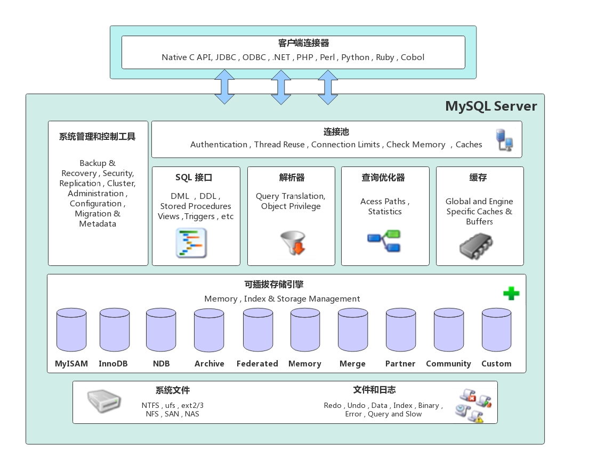


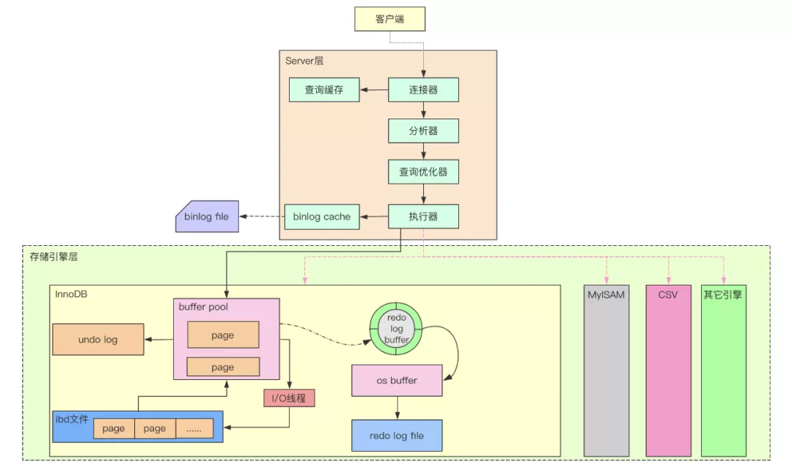


* MySQL Server架构自顶向下大致可以分网络连接层,服务层,存储引擎层和系统文件层


## 网络连接层


* 客户端连接器: Client Connectors,提供与MySQL服务器建立的支持,目前几乎支持所有主流的服务端编程技术


## 服务层


* 服务层是MySQL Server的核心,主要包含系统管理和控制工具,连接池,SQL接口,解析器,查询优化器和缓存六个部分
* 连接池: Connection Pool,负责存储和管理客户端与数据库的连接,一个线程负责管理一个连接
* 系统管理和控制工具: Management Services & Utilities,例如备份恢复,安全管理,集群管理等
* SQL接口: SQL Interface,用于接受客户端发送的各种SQL命令,并且返回用户需要查询的结果.比如DML,DDL,存储过程,视图,触发器等
* 解析器: Parser,负责将请求的SQL解析生成一个解析树,然后根据一些MySQL规则进一步检查解析树是否合法
* 查询优化器: Optimizer,当解析树通过解析器语法检查后,将交由优化器将其转化成执行计划,然后与存储引擎交互
  * 例如: `select uid,name from user where gender=1;`
  * 选取->投影->联接 策略
  * 1.select先根据where语句进行选取,并不是查询出全部数据再过滤
  * 2.select查询根据uid和name进行属性投影,并不是取出所有字段
  * 3.将前面选取和投影联接起来最终生成查询结果
* 缓存: Cache&Buffer,缓存机制是由一系列小缓存组成的.比如表缓存,记录缓存,权限缓存,引擎缓存等.如果查询缓存有命中的查询结果,查询语句就可以直接去查询缓存中取数据


## 存储引擎层


* Pluggable Storage Engines,负责MySQL中数据的存储与提取,与底层系统文件进行交互.
* MySQL存储引擎是插件式的,服务器中的查询执行引擎通过接口与存储引擎进行通信,接口屏蔽了不同存储引擎之间的差异


## 系统文件层


* File System,该层负责将数据库的数据和日志存储在文件系统之上,并完成与存储引擎的交互,是文件的物理存储层,主要包含日志文件,数据文件,配置文件,pid 文件,socket 文件等
* 日志文件
  * 错误日志: Error log,默认开启,可通过 `show variables like '%log_error%';`查看
  * 通用查询日志: General query log,记录一般查询语句,通过` show variables like '%general%';`查看
  * 二进制日志: binary log,记录了对MySQL数据库执行的更改操作,并且记录了语句的发生时间,执行时长.但是它不记录select,show等不修改数据库的SQL,主要用于数据库恢复和主从复制
    * `show variables like '%log_bin%';`: 检查是否binlog
    * `show variables like '%binlog%';`: 参数查看
    * `show binary logs;`: 查看日志文件
  * 慢查询日志: Slow query log,记录所有执行时间超时的查询SQL,默认是10秒
    * `show variables like '%slow_query%';`: 是否开启
    * `show variables like '%long_query_time%';`: 慢查询超时时长
* 配置文件:用于存放MySQL所有的配置信息文件,比如my.cnf(linux),my.ini(windows)等
* 数据文件
  * db.opt: 记录这个库的默认使用的字符集和校验规则
  * frm: 存储与表相关的元数据信息,包括表结构的定义信息等,每一张表都会有一个frm 文件
  * MYD: MyISAM专用,存放 MyISAM 表的数据,每一张表都会有一个.MYD 文件
  * MYI: MyISAM专用,存放 MyISAM 表的索引相关信息,每一张 MyISAM 表对应一个 .MYI 文件
  * ibd和 IBDATA: 存放 InnoDB 的数据文件,包括索引.InnoDB 存储引擎有两种表空间方式:
    * 独享表空间: 使用 .ibd 文件来存放数据,且每一张InnoDB 表对应一个 .ibd 文件
    * 共享表空间: 使用 .ibdata 文件,所有表共同使用一个(或多个,自行配置).ibdata 文件
  * ibdata1: 系统表空间数据文件,存储表元数据,Undo日志等 
  * ib_logfile0,ib_logfile1 文件: Redo log 日志文件
  * pid: 该文件是 mysqld 应用程序在 Unix/Linux 环境下的一个进程文件,它存放着自己的进程 id
  * socket: 该文件在 Unix/Linux 环境下才有,用户在 Unix/Linux 环境下客户端连接可以不通过TCP/IP 网络而直接使用 Unix Socket 来连接 MySQL


# 运行机制


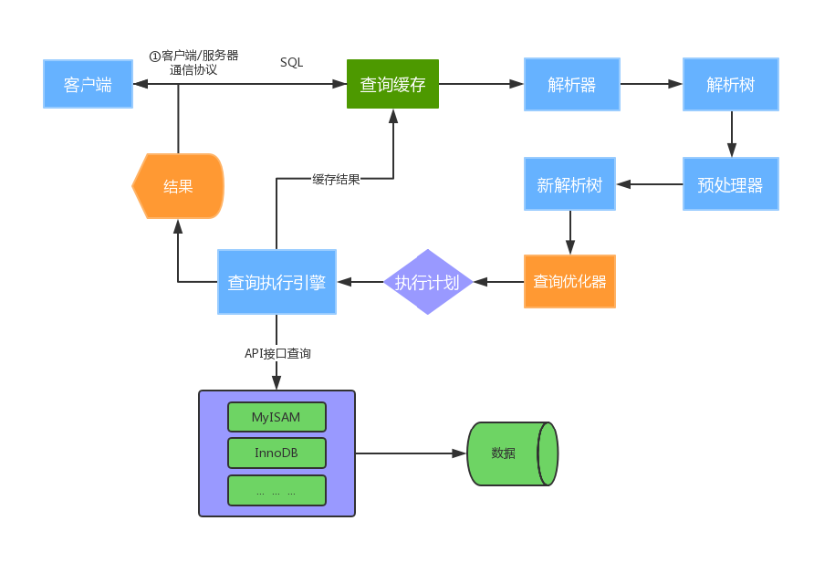


## 建立连接


* Connectors&Connection Pool,通过客户端/服务器通信协议与MySQL建立连接
* MySQL 客户端与服务端的通信方式是半双工,对于每一个 MySQL 的连接,时刻都有一个线程状态来标识这个连接正在做什么
  * 全双工: 能同时发送和接收数据,例如平时打电话
  * 半双工: 指的某一时刻,要么发送数据,要么接收数据,不能同时.例如早期对讲机
  * 单工: 只能发送数据或只能接收数据.例如单行道
* 链接信息可以通过 `show processlist` 查看,具体见MySQLOpt的ProcessList


## 查询缓存


* 在版本8以后该模块被删除了

* Cache&Buffer,这是一个可优化查询的地方,如果开启了查询缓存且在查询缓存过程中查询到完全相同的SQL,则将查询结果直接返回给客户端;反之则会由解析器进行语法语义解析,并生成解析树
* 缓存过程如下:
  * 缓存Select查询的结果和SQL语句
  * 执行Select查询时,先查询缓存,判断是否存在可用的记录集,要求是否完全相同,包括参数值,这样才会匹配缓存数据命中
  * 即使开启查询缓存,以下SQL也不能缓存
    * 查询语句使用SQL_NO_CACHE
    * 查询的结果大于query_cache_limit设置
    * 查询中有一些不确定的参数,比如now()
* `show variables like '%query_cache%';`: 查看查询缓存是否启用,空间大小,限制等
* `show status like 'Qcache%';`: 查看更详细的缓存参数,可用缓存空间,缓存块,缓存多少等


## 解析器


* Parser,将客户端发送的SQL进行语法语义解析,生成解析树


## 预处理器


* 根据MySQL规则进一步检查解析树是否合法,例如检查数据表和数据列是否存在,解析名字和别名,看看是否有歧义,最后生成新的解析树


## 查询优化器


* Optimizer,根据解析树生成最优的执行计划
* MySQL使用很多优化策略生成最优的执行计划,可以分为两类: 静态优化(编译时优化),动态优化(运行时优化)
* 等价变换策略
  * 5=5 and a>5 改成 a > 5
  * a < b and a=5 改成b>5 and a=5
  * 基于联合索引,调整条件位置等
* 优化count,min,max等函数
  * InnoDB引擎min函数只需要找索引最左边
  * InnoDB引擎max函数只需要找索引最右边
  * MyISAM引擎count(*),不需要计算,直接返回
* 提前终止查询.使用了limit查询,获取limit所需的数据,就不在继续遍历后面数据
* in的优化:MySQL对in查询,会先进行排序,再采用二分法查找数据.比如where id in (2,1,3),变成 in (1,2,3)


## 查询执行引擎


* 负责执行 SQL 语句,此时查询执行引擎会根据 SQL 语句中表的存储引擎类型,以及对应的API接口与底层存储引擎缓存或者物理文件的交互,得到查询结果并返回给客户端
* 若开启查询缓存,这时会将SQL 语句和结果完整地保存到查询缓存中,以后若有相同的 SQL 语句执行则直接返回结果
* 如果返回结果过多,采用增量模式返回


# 数据库引擎


* 主要介绍MyISAM和InnoDB,其他类型用的不多.MySQL5.5之前默认引擎是MyISAM,之后是InnoDB
* `show engines`:查看所有引擎类型
* `show variables like '%storage_engine%'`:查看所有表所用引擎类型


## MyISAM


### 概述


* 不支持外键,不支持事务
* 只能表锁,即使操作一条数据时也会锁住整个表,不适合高并发
* 读写互相阻塞:写入的时候肯定是都阻塞的,读的时候也阻塞写,但不阻塞另外的读
* 只缓存索引,不缓存真实数据
* 读取速度较快,占用资源较少
* 不支持外键约束,但支持全文索引
* 表空间小


### 适用场景


* 适用于不需要事务的生产场景,一般是读数据比较多的应用
* 并发相对较低的业务
* 数据一致性要求不是很高的业务
* 数据修改相对较少,以读为主


### 优化


* 设置合适的索引
* 调整速写优先级,根据实际需求确保重要操作更优先执行
* 启用延迟插入改善大批量写入性能,降低写入频率,尽可能多条数据一次性写入
* 尽量顺序操作让insert数据都写入到末尾,减少阻塞
* 分解大的时间长的操作,降低单个操作的阻塞时间
* 降低并发数,减少对MySQL的访问,某些高并发场景通过应用进行排队机制
* 对于相对静态(更改不频繁)的数据库数据,充分利用query cache或redis缓存服务提高访问效率
* MyISAM的count只有在全表扫描到时候效率比较高,带有其他条件的的count都需要进行实际的数据访问


## InnoDB


###  概述


* 支持外键,支持事务,支持多版本读(MVCC)
* 支持行锁,适合高并发,通过索引实现.但是全表扫描时仍然会升级成表锁,同时需要注意间隙锁的影响
* 读写阻塞与事务的隔离级别相关
* 不仅缓存索引还缓存真实数据,对内存要求较高,且内存大小对性能有决定性的影响
* 支持分区和表空间
* 整个表和主键以cluster方式存储,组成一颗平衡树(B+Tree)
* 所有二级索引(辅助索引)都会保存主键信息和索引信息,但不存储数据


### 适用场景


* 需要事务支持的业务,具有较好的事务特性
* 行级锁定对高并发有很好的适应能力,但需要确保查询是通过索引完成
* 数据读写以及更新比较频繁的场景
* 数据一致性高的业务
* 硬件设备内存较大,可以利用InnoDB较好的缓存能力来提高内存利用率,减少磁盘IO


### 优化


* 主键尽可能小,避免给二级索引带来过大的空间负担
* 避免全表扫描,会使用表锁
* 尽可能缓存所有的索引和数据,提高响应速度,减少磁盘IO消耗
* 在大批量小插入的时候,尽量自己控制事务而不要使用自动提交
* 合理设置innodb_flush_log_at_trx_commit(日志刷到磁盘上)参数,不要过度追求安全性
* 避免主键更新,因为这会带来大量的数据移动


## 对比


* 事务和外键
  * InnoDB支持事务和外键,具有安全性和完整性,适合大量insert或update操作
  * MyISAM不支持事务和外键,它提供高速存储和检索,适合大量的select查询操作
* 锁机制
  * InnoDB支持行锁,锁定指定记录
  * MyISAM支持表锁,锁定整张表
* 索引结构
  * InnoDB使用聚集索引(聚簇索引),索引和记录在一起存储,既缓存索引,也缓存记录
  * MyISAM使用非聚集索引(非聚簇索引),索引和记录分开
* 并发处理能力
  * InnoDB读写阻塞可以与隔离级别有关,可以采用多版本并发控制(MVCC)来支持高并发
  * MyISAM使用表锁,会导致写操作并发率低,读之间并不阻塞,读写阻塞
* 存储文件
  * InnoDB表对应两个文件,一个.frm表结构文件,一个.ibd数据文件,表最大支持64TB
  * MyISAM表对应三个文件,一个.frm表结构文件,一个MYD表数据文件,一个.MYI索引文件,表最大支持256TB


## 引擎对比


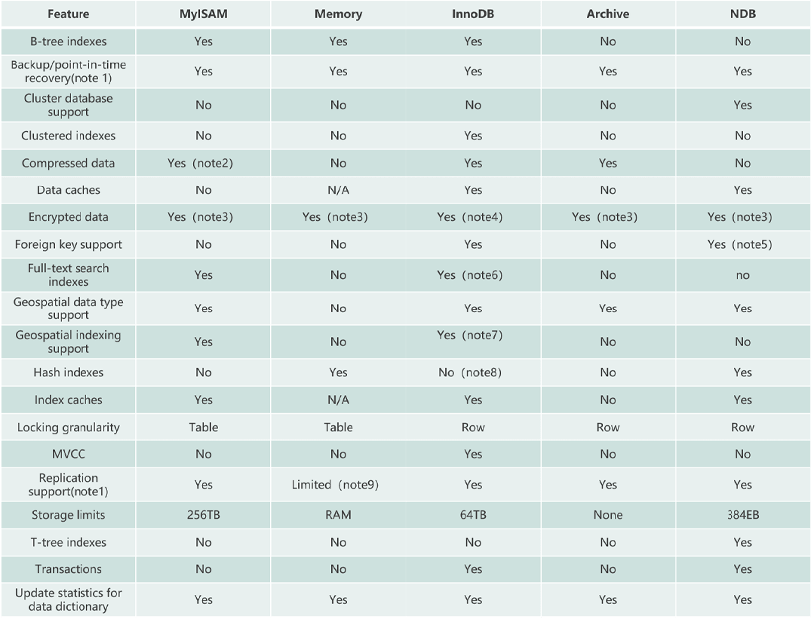


# InnoDB存储结构


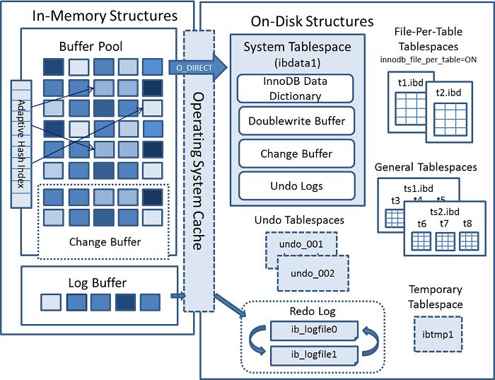


* 主要分为内存结构和磁盘结构两大部分,左边是内存结构,右边是磁盘结果


## 内存结构


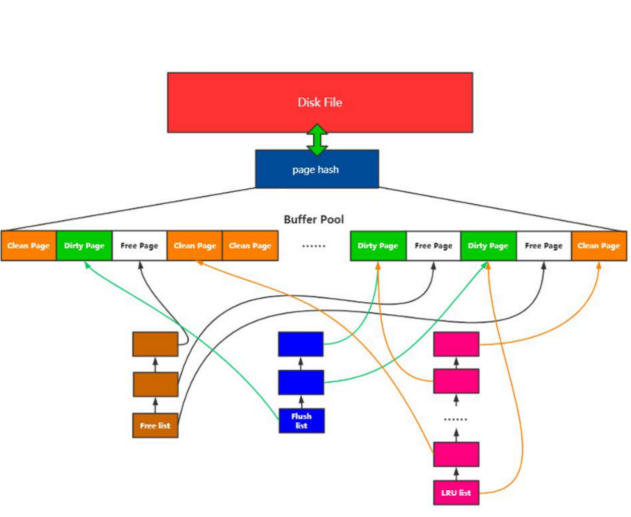


* 内存结构主要包括Page Hash,Buffer Pool,Change Buffer,Adaptive Hash Index和Log Buffer五大组件


### Page Hash


* 维护内存Page和磁盘文件Page的映射关系


### Buffer Pool


* 缓冲池(BP),以Page页为单位,底层采用链表结构管理Page
* 在InnoDB访问表记录和索引时会在Page页中缓存,以后使用可以减少磁盘IO操作,提升效率


### Change Buffer


* 写缓冲区(CB),在进行DML操作时,如果BP没有其相应的Page数据,并不会立刻将磁盘页数据加载到BP中,而是在CB记录缓冲变更,等未来数据被读取时,再将数据合并到BP中
  * 当更新一条记录时,该记录在BP存在,直接在BP修改,一次内存操作
  * 如果BP不存在该记录(没有命中),会直接在CB进行一次内存操作,不用再去磁盘查询数据,避免一次磁盘IO
  * 当下次查询记录时,会先进磁盘读取,然后再从CB中读取信息合并,最终载入BP中

* CB占用BP空间,默认占25%,最大允许占50%,可以根据读写业务量来调整(innodb_change_buffer_max_size)
* 写缓冲区,仅适用于非唯一普通索引页.因为唯一索引在进行修改时,InnoDB必须要做唯一性校验,因此必须查询磁盘,做一次IO操作,会直接将记录查询到BP中,然后在缓冲池修改,不会在CB操作


### Adaptive Hash Index


* 自适应哈希索引,用于优化对BufferPool数据的查询
* InnoDB存储引擎会监控对表索引的查找,如果观察到建立哈希索引可以带来速度的提升,则建立哈希索引,所以称之为自适应
* InnoDB存储引擎会自动根据访问的频率和模式来为某些页建立哈希索引


### Log Buffer


* 日志缓冲区,用来保存要写入磁盘上log文件(Redo/Undo)的数据,日志缓冲区的内容定期刷新到磁盘log文件中
* 日志缓冲区满时会自动将其刷新到磁盘,当遇到BLOB或多行更新的大事务操作时,增加日志缓冲区可以节省磁盘I/O
* LogBuffer主要是用于记录InnoDB引擎日志,在DML操作时会产生Redo和Undo日志
* LogBuffer空间满了,会自动写入磁盘,可以通过将innodb_log_buffer_size参数调大,减少磁盘IO频率
* `innodb_flush_log_at_trx_commit`参数控制日志刷新行为,默认为1
  * 0: 每隔1秒写日志文件和刷盘操作(写日志文件LogBuffer-->OS cache,刷盘OScache-->磁盘文件),最多丢失1秒数据
  * 1: 事务提交,立刻写日志文件和刷盘,数据不丢失,但是会频繁IO操作
  * 2: 事务提交,立刻写日志文件,每隔1秒钟进行刷盘操作


## 内存管理


* Page装载:预分配内存空间,使用内存加载部分数据,存储引擎从内存中查找数据
  * 内存池

* 数据以页为单位加载
  * 页面动态映射
  * 页面数据管理
    * 空闲页:没有数据的页
    * 数据页:写入了数据的页,和磁盘上的数据一致,也称为干净页
    * 脏页:页上的数据和磁盘上的数据不一致

* 数据淘汰
  * 内存页都被使用
  * 需要加载新数据
* 数据内外存交换:磁盘和内存中数据的交互


### Page管理机制


* Buffer Pool的最小单位,默认大小16K

* Page根据状态可以分为三种类型:
  * free page: 空闲page,未被使用
  * clean page: 被使用page,数据没有被修改过
  * dirty page: 脏页,被使用page,数据被修改过,页中数据和磁盘的数据产生了不一致
* 针对上述三种page类型,InnoDB通过三种链表结构来维护和管理
  * free list: 表示空闲缓冲区,还没有使用的page链表,管理free page
  * flush list: 表示需要刷新到磁盘的缓冲区,管理dirty page,内部page按修改时间排序.脏页既存在于flush链表,也在LRU链表中,但是两种互不影响,LRU链表负责管理page的可用性和释放,而flush链表负责管理脏页的刷盘操作
  * lru list: 表示正在使用的缓冲区,管理clean page和dirty page,缓冲区以midpoint为基点,前面链表称为new列表区,存放经常访问的数据,占63%;后面的链表称为old列表区,存放使用较少数据,占37%


### Page页装载


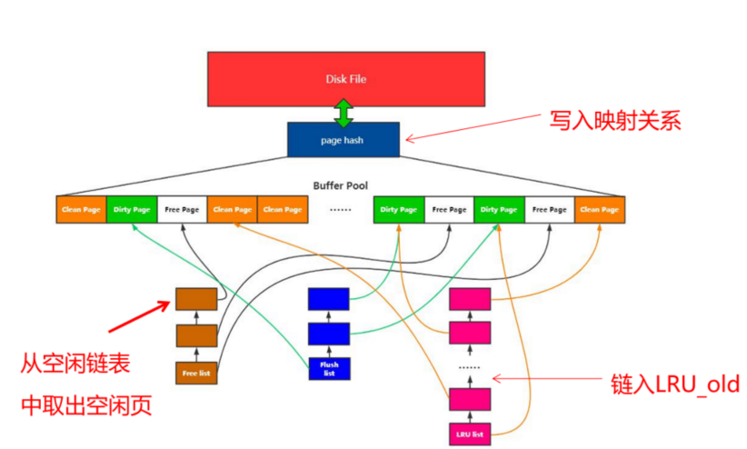


* 主要是将磁盘数据加载到内存中
* 先从空闲链表中取出空闲页,将数据写入到空闲页中,使该空闲页变为数据页
* 如果空闲页链表中没有空闲页,则使用LRU算法淘汰数据页
* 从LRU_OLD尾部往前查找.如果尾部正在使用,不能淘汰,则往前找到脏页进行淘汰
  * Free List中取页->LRU中淘汰冷表尾部数据->LRU Flush
* 将当前数据页从空闲页链表中剔除,插入到冷链表中
* 将映射磁盘内存映射关系写入Page Hash


### 数据淘汰


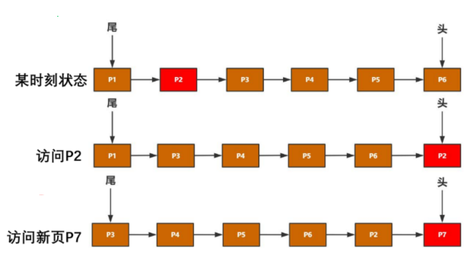


* 如上图所示,在热点链表中,每次访问的新数据都会被移动到链表头部,新页也会被加载到头部


### 配置参数


* `show variables like '%innodb_page_size%';`: 查看page页大小
* `show variables like '%innodb_old%';`: 查看lru list中old列表参数
* `show variables like '%innodb_buffer%';`: 查看buffer pool参数
* 建议将innodb_buffer_pool_size设置为总内存大小的60%-80%,innodb_buffer_pool_instances可以设置为多个,避免缓存争夺


### LRU


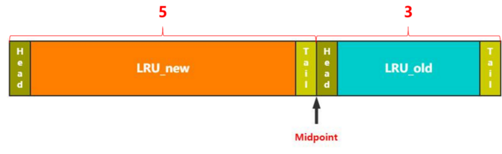


* LRU:最久没有使用的页被淘汰,同时将最近访问的数据放到表头
* LRU尾部淘汰:默认从冷表尾部进行淘汰,新数据从链表头部加入,释放空间时从末尾淘汰
* 改性LRU: 链表分为new和old两部分,加入元素时并不是从表头插入,而是从MidPoint位置插入:
  * 如果数据很快被访问,那么page就会向new列表头部移动
  * 如果数据没有被访问,会逐步向old尾部移动,等待淘汰
  * LRU_NEW:热点数据链表
  * LRU_OLD:冷数据链表
  * MidPoint:区分冷表,热表数据,是一个指针.默认冷热占比为3:5,而MidPoint值指向5/8处
* 每当有新的page数据读取到Buffer Pool时,InnoDb引擎会判断是否有Free Page,是否足够:
  * 如果有就将Free Page从Free List列表删除,放入到LRU列表中
  * 如果没有Free Page,就会根据LRU算法淘汰LRU链表页,将内存空间释放分配给新的页
  * 如果LRU冷表中尾部数据无法释放,则将第一个脏页刷盘并释放,再将页放到Free List中.写完新数据后再将数据页放到冷链头部
* 全表扫描: 会将表中数据全部加载到内存中,造成内存污染,将原来的热点数据淘汰
* 如何避免热数据被淘汰
  * 访问时间+频率
  * 建立2个LRU表:一个热数据表,一个冷数据表.当数据频率发生变化时,可以将2个表的数据交互


### 冷链表到热链表


* `innodb_old_blocks_time`: old区存活时间,大于该值,则数据页**有机会**进入热链表,默认1S


### 热链表到冷链表


* MidPoint默认是指向5/8处,当数据页从冷表到热表时,直接移动MidPoint到5/8即可


### 热链表内移动


* 将最近发访问的数据移动到表头,这会加重系统开销.同时,在高并发下,还会有加锁的问题
* 处理方法是减少移动次数,有以下几个指标:
  * `freed_page_clock`: Buffer Pool全局淘汰页数,发生一次就加一
  * `当前freed_page_clock-上次移动到Header时freed_page_clock > LRU_NEW长度1/4`时进行移动


## 磁盘结构


* InnoDB磁盘主要包含Tablespaces,InnoDB Data Dictionary,Doublewrite Buffer,Redo Log和Undo Logs


### 表空间


* Tablespaces,用于存储表结构和数据,分为系统表空间,独立表空间,通用表空间,临时表空间,Undo表空间等多种类型


#### 系统表空间


* The System Tablespace,包含InnoDB数据字典,Doublewrite Buffer,Change Buffer,Undo Logs的存储区域
* 系统表空间也默认包含任何用户在系统表空间创建的表数据和索引数据
* 系统表空间是一个共享的表空间,因为它是被多个表共享的
* 该空间的数据文件通过参数innodb_data_file_path控制,默认值是ibdata1:12M:autoextend(文件名为ibdata1,12MB,自动扩展)


#### 独立表空间


* File-Per-Table Tablespaces,默认开启,是一个单表表空间,该表创建于自己的数据文件中,而非创建于系统表空间中
* 当innodb_file_per_table选项开启时,表将被创建于表空间中,否则,innodb将被创建于系统表空间中
* 每个表文件表空间由一个.ibd数据文件代表,该文件默认被创建于数据库目录中
* 表空间的表文件支持动态(dynamic)和压缩(commpressed)行格式


#### 通用表空间


* General Tablespaces,是通过create tablespace语法创建的共享表空间

* 通用表空间可以创建于mysql数据目录外的其他表空间,其可以容纳多张表,且其支持所有的行格式

  ```mysql
  --  创建表空间ts1
  CREATE TABLESPACE ts1 ADD DATAFILE ts1.ibd Engine=InnoDB;
  --  将表添加到ts1表空间
  CREATE TABLE t1 (c1 INT PRIMARY KEY) TABLESPACE ts1;
  ```


#### 撤销表空间


* Undo Tablespaces,由一个或多个包含Undo日志文件组成
* 在MySQL 5.7版本之前Undo占用的是System Tablespace共享区,从5.7开始将Undo从System Tablespace分离了出来
* InnoDB使用的undo表空间由innodb_undo_tablespaces控制,默认为0:
  * 0: 表示使用系统表空间ibdata1
  * 大于0: 表示使用undo表空间undo_001,undo_002等


#### 临时表空间


* Temporary Tablespaces,分为session temporary tablespaces 和global temporary tablespace:
  * session temporary tablespaces: 存储的是用户创建的临时表和磁盘内部的临时表
  * global temporary tablespace: 储存用户临时表的回滚段(rollback segments)
* mysql服务器正常关闭或异常终止时,临时表空间将被移除,每次启动时会被重新创建


### 数据字典


* InnoDB Data Dictionary,由内部系统表组成,这些表包含用于查找表,索引和表字段等对象的元数据
* 元数据物理上位于InnoDB系统表空间中,由于历史原因,数据字典元数据在一定程度上与InnoDB表元数据文件(.frm文件)中存储的信息重叠


### 双写缓冲区


* Doublewrite Buffer,位于系统表空间,是一个存储区域
* 在BufferPage的page页刷新到磁盘真正的位置前,会先将数据存在Doublewrite Buffer.如果在page页写入过程中出现操作系统,存储子系统或mysqld进程崩溃,InnoDB可以在崩溃恢复期间从Doublewrite 缓冲区中找到页面的一个好备份
* `show variables like '%innodb_doublewrite%'`:查看是否开启双写缓冲区,默认开启
* 使用Doublewrite Buffer时建议将innodb_flush_method设置为O_DIRECT
* innodb_flush_method控制着innodb数据文件及redo log的打开,刷写模式:
  * fdatasync: 默认,表示先写入操作系统缓存,然后再调用fsync()函数去异步刷数据文件与redo log的缓存信息
  * O_DSYNC
  * O_DIRECT: 表示数据文件写入操作会通知操作系统不要缓存数据,也不要用预读,直接从InnodbBuffer写到磁盘文件


### 重做日志


* Redo Log,是一种基于磁盘的数据结构,用于在崩溃恢复期间更正不完整事务写入的数据
* MySQL以循环方式写入重做日志文件,记录InnoDB中所有对Buffer Pool修改的日志
* 当出现实例故障(如断电),导致数据未能更新到数据文件,则数据库重启时需redo,重新把数据更新到数据文件
* 读写事务在执行的过程中,都会不断的产生redo log
* 默认情况下,redo log在磁盘上由两个名为ib_logfile0和ib_logfile1的文件物理表示


### 撤销日志


* Undo Logs,是在事务开始之前保存的被修改数据的备份,用于例外情况时回滚事务
* 撤消日志属于逻辑日志,根据每行记录进行记录
* 撤消日志存在于系统表空间,撤消表空间和临时表空间中


## 新版本结构演变


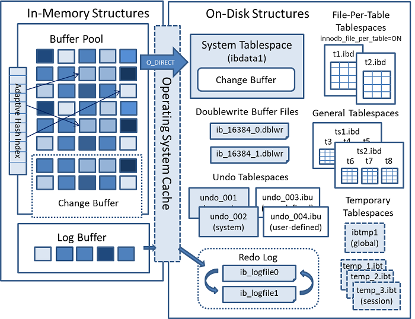


### MySQL 5.7


* 将 Undo日志表空间从共享表空间 ibdata 文件中分离出来,可以在安装 MySQL 时由用户自行指定文件大小和数量
* 增加了 temporary 临时表空间,里面存储着临时表或临时查询结果集的数据
* Buffer Pool 大小可以动态修改,无需重启数据库实例


### MySQL 8.0


* 将数据字典和Undo都从系统表空间ibdata中彻底分离出来,以前需要ibdata中数据字典与独立表空间ibd文件中数据字典一致才行,8.0版本就不需要了
* temporary 临时表空间也可以配置多个物理文件,而且均为 InnoDB 存储引擎并能创建索引,这样加快了处理的速度
* 用户可以像 Oracle 数据库那样设置一些表空间,每个表空间对应多个物理文件,每个表空间可以给多个表使用,但一个表只能存储在一个表空间中
* 将Doublewrite Buffer从共享表空间ibdata中也分离出来了


# InnoDB线程模型


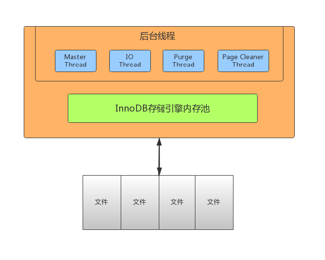


## Master Thread


* Master thread是InnoDB的主线程,负责调度其他各线程,优先级最高
* 作用是将缓冲池中的数据异步刷新到磁盘 ,保证数据的一致性,包含: 脏页的刷新(page cleaner thread),undo页回收(purge thread),redo日志刷新(log thread),合并写缓冲等
* 该线程内部有两个主处理,分别是每隔1秒和10秒处理:
  * 每1秒的操作: 
    * 刷新日志缓冲区,刷到磁盘
    * 合并写缓冲区数据,根据IO读写压力来决定是否操作
    * 刷新脏页数据到磁盘,根据脏页比例达到75%才操作(innodb_max_dirty_pages_pct,innodb_io_capacity)
  * 每10秒的操作: 
    * 刷新脏页数据到磁盘
    * 合并写缓冲区数据
    * 刷新日志缓冲区
    * 删除无用的undo页


## IO Thread


* 在InnoDB中使用了大量的AIO(Async IO)来做读写处理,这样可以极大提高数据库的性能
* 在InnoDB1.0版本之前共有4个IO Thread,分别是write,read,insert buffer和log thread,后来版本将read thread和write thread分别增大到了4个,一共有10个了
  * read thread: 负责读取操作,将数据从磁盘加载到缓存page页.4个
  * write thread: 负责写操作,将缓存脏页刷新到磁盘.4个
  * log thread: 负责将日志缓冲区内容刷新到磁盘.1个
  * insert buffer thread: 负责将写缓冲内容刷新到磁盘.1个


## Purge Thread


* 事务提交之后,其使用的undo日志将不再需要,因此需要Purge Thread回收已经分配的undo页
* `show variables like '%innodb_purge_threads%';`: 查看配置


## Page Cleaner Thread


* 作用是将脏数据刷新到磁盘,脏数据刷盘后相应的redo log也就可以覆盖,即可以同步数据,又能达到redo log循环使用的目的,会调用write thread线程处理
* `show variables like '%innodb_page_cleaners%';`: 查看配置


# InnoDB数据文件


## 文件存储结构


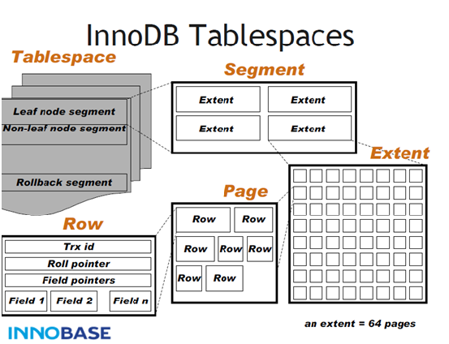


## 数据文件存储结构


* 分为一个ibd数据文件-->Segment(段)-->Extent(区)-->Page(页)-->Row(行)


### Tablesapce


* 表空间,用于存储多个ibd数据文件,用于存储表的记录和索引。一个文件包含多个段


### Segment


* 段,用于管理多个Extent,分为数据段(Leaf node segment),索引段(Non-leaf nodesegment),回滚段(Rollback segment)
* 一个表至少会有两个segment,一个管理数据,一个管理索引。每多创建一个索引,会多两个segment


### Extent


* 区,一个区固定包含64个连续的页,大小为1M.当表空间不足,需要分配新的页资源,不会一页一页分,直接分配一个区


### Row


* 行,包含了记录的字段值,事务ID(Trx id),滚动指针(Roll pointer),字段指针(Field pointers)等信息


### Page


* 页,用于存储多个Row行记录,大小为16K.包含很多种页类型,比如数据页,undo页,系统页,事务数据页,大的BLOB对象页
* Page是文件最基本的单位,无论何种类型的page,都是由page header,page trailer和page body组成:


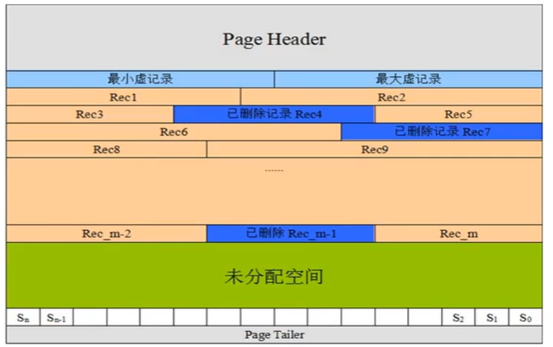


#### 页头


* 记录页面的控制信息,共占56个字节,包括页的左右兄弟页面指针,页面空间使用情况等


#### 虚记录


* 最大虚记录:比页内最大主键还大,主要是比较主键大小
* 最小虚记录:比页内最小主键还小


#### 记录堆


* 行记录存储区,分为有效记录和已删除记录两种


#### 自由空间链表


* 已删除记录组成的链表


#### 未分配空间


* 页面未使用的存储空间


#### Slot


* 每个Slot会指向某个链表的头部,以便于二分查找


#### 页尾


* 页面最后部分,占8个字节,主要存储页面的校验信息


## 页内维护记录


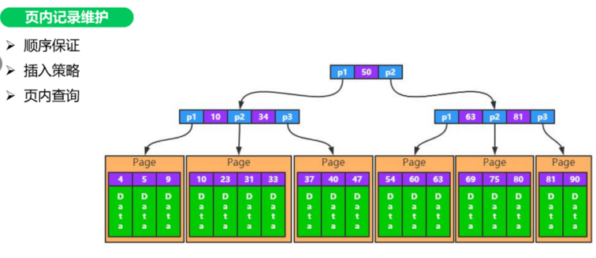


### 顺序保证


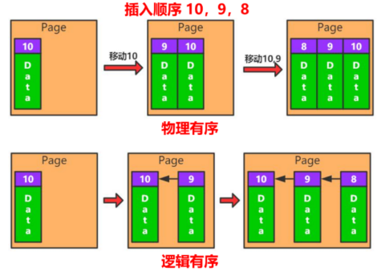


* 物理有序:类似数组,连续的空间存储数据,有利于读
* 逻辑有序:类似链表,有利于写数据.数据库底层使用逻辑有序


### 插入策略


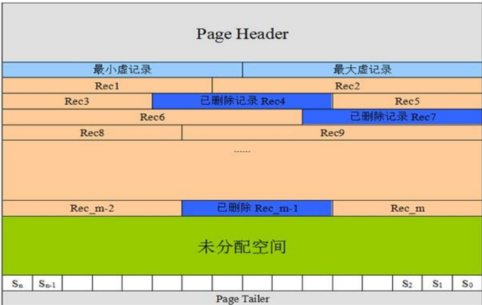


* 自由空间链表:已删除记录是逻辑删除,物理地址仍然存在,当何时的值进行存储时会填入该处.如果逻辑删除的空间不使用,则数据占用空间越来越大,且很多地方无法使用,浪费空间
* 未使用空间:存储新数据


### 页内查询


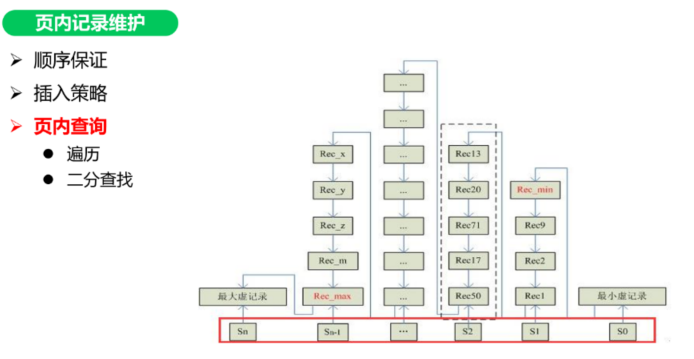


* 遍历
* 二分查找


### Physical Redo


#### MLOG_SINGLE_REC


* 当前日志,记录的是一个Page的一个Redo日志
* 对应操作:简单的I/U/D,Undo的Redo等
* 例如:一个Insert操作会产生3个MLOG_SINGLE_REC,分别对应:聚簇索引页;二级索引页;Undo页
* MLOG_SINGLE_REC日志,一定是有效的


#### MLOG_MULTI_REC


* 当前日志,是一组日志中的一个,这一组日志,包含了多个Page的多条Redo日志
* 对应操作:I/U/D导致的索引分裂,合并;Varchar/LOB导致的链接行等
* 例如:Insert使得聚簇索引分裂,分裂操作需要涉及至少3个Page,这三个Pages上的所有修改日志,均为MLOG_MULTI_REC中的一部分
* MLOG_MULTI_REC日志组,只有当最后一条MLOG_MULTI_REC_END写出之后,才起作用;否则全部丢弃


### Logical Redo


* 逻辑Redo,不是记录页面的实际修改,而是记录修改页面的一类固定操作
* 如何写页面初始化日志:
  * 写MLOG_COMP_PAGE_CREATE日志
  * 重做此日志, 只需再次调用page0page.c::page_create方法初始化对应的Page即可
* MLOG_COMP_PAGE_CREATE;MLOG_UNDO_HDR_CREATE;MLOG_IBUF_BITMAP_INIT
* 这类动作是固定的,减少Redo的一个优化


### Mini-Transaction


* MTR,不属于事务,InnoDB内部使用,对于InnoDB内所有page的访问(I/U/D/S),都需要mini-transaction支持
* 访问page,对page加latch(只读访问:S latch;写访问:X latch)
* 修改page,写redo日志 (mtr本地缓存)
* page操作结束,提交mini-transaction (非事务提交)
  * 将redo日志写入log buffer
  * 将脏页加入Flush List链表
  * 释放页面上的 S/X latch
* 保证单page操作的原子性(读/写单一page),保证多pages操作的原子性(索引SMO/记录链出,多pages访问的原子性)


## 文件存储格式


* `SHOW TABLE STATUS\G;`


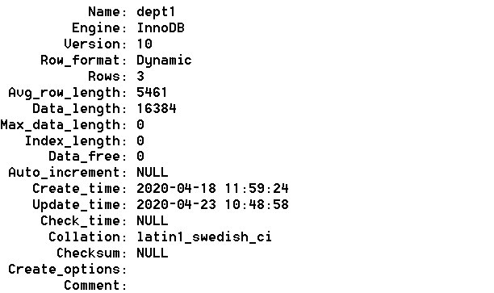


* 一般情况下,如果row_format为REDUNDANT,COMPACT,文件格式为Antelope
* 如果row_format为DYNAMIC和COMPRESSED,文件格式为Barracuda
* 通过 information_schema 查看指定表的文件格式: `select * from information_schema.innodb_sys_tables;`


## File文件格式


* File-Format,目前InnoDB只支持两种文件格式: Antelope 和 Barracuda
  * Antelope: 最原始的InnoDB文件格式,它支持两种行格式: COMPACT和REDUNDANT,MySQL 5.6以前版本默认格式
  * Barracuda: 新的文件格式.它支持InnoDB的所有行格式,包括新的行格式: COMPRESSED和 DYNAMIC
* 通过innodb_file_format 配置参数可以设置InnoDB文件格式,之前默认值为Antelope,5.7版本开始改为Barracuda


## Row行格式


* Row_format,表的行格式决定了它的行是如何物理存储的,这反过来又会影响查询和DML操作的性能
* 如果在单个page页中容纳更多行,查询和索引查找可以更快地工作,缓冲池中所需的内存更少,写入更新时所需的I/O更少
* InnoDB存储引擎支持四种行格式: REDUNDANT,COMPACT,DYNAMIC和COMPRESSED


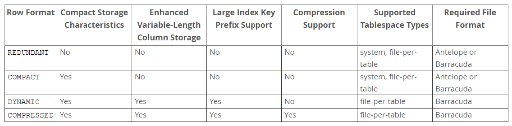


* DYNAMIC和COMPRESSED新格式引入的功能有: 数据压缩,增强型长列数据的页外存储和大索引前缀
* 每个表的数据分成若干页来存储,每个页中采用B树结构存储
* 如果某些字段信息过长,无法存储在B树节点中,这时候会被单独分配空间,此时被称为溢出页,该字段被称为页外列
* 在创建表和索引时,文件格式都被用于每个InnoDB表数据文件(其名称与*.ibd匹配)
* 修改文件格式的方法是重新创建表及其索引,最简单方法是对要修改的每个表使用以下命令: `ALTER TABLE 表名 ROW_FORMAT=格式类型;`


### REDUNDANT


* 使用REDUNDANT行格式,表会将变长列值的前768字节存储在B树节点的索引记录中,其余的存储在溢出页上
* 对于大于等于786字节的固定长度字段InnoDB会转换为变长字段,以便能够在页外存储


### COMPACT


* 与REDUNDANT行格式相比,COMPACT行格式减少了约20%的行存储空间,但代价是增加了某些操作的CPU使用量
* 如果系统负载是受缓存命中率和磁盘速度限制,那么COMPACT格式可能更快
* 如果系统负载受到CPU速度的限制,那么COMPACT格式可能会慢一些


### DYNAMIC


* 使用DYNAMIC行格式,InnoDB会将表中长可变长度的列值完全存储在页外,而索引记录只包含指向溢出页的20字节指针
* 大于或等于768字节的固定长度字段编码为可变长度字段
* DYNAMIC行格式支持大索引前缀,最多可以为3072字节,可通过innodb_large_prefix参数控制


### COMPRESSED


* COMPRESSED行格式提供与DYNAMIC行格式相同的存储特性和功能,但增加了对表和索引数据压缩的支持


# Undo Log


## 概述


* Undo: 意为撤销或取消,以撤销操作为目的,返回指定某个状态的操作
* Undo Log: 数据库事务开始之前,会将要修改的记录存放到 Undo 日志里,当事务回滚时或者数据库崩溃时,可以利用 Undo 日志,撤销未提交事务对数据库产生的影响
* Undo Log产生和销毁: Undo Log在事务开始前产生;事务在提交时,并不会立刻删除undo log,innodb会将该事务对应的undo log放入到删除列表中,后面会通过后台线程purge thread进行回收处理
* Undo Log属于逻辑日志,记录一个变化过程.例如执行一个delete,undolog会记录一个insert;执行一个update,undolog会记录一个相反的update
* Undo Log存储: undo log采用段的方式管理和记录.在innodb数据文件中包含一种rollback segment回滚段,内部包含1024个undo log segment,可以通过下面一组参数来控制Undo log存储
* `show variables like '%innodb_undo%';`: 查看undo.log相关配置


## 作用


* 实现事务的原子性:事务处理过程中,如果出现了错误或者用户执行了 ROLLBACK ,MySQL 可利用 Undo Log 中的备份将数据恢复到事务开始之前的状态
* 实现多版本并发控制(MVCC):事务未提交之前,Undo Log保存了未提交之前的版本数据,Undo Log 中的数据可作为数据旧版本快照供其他并发事务进行快照读


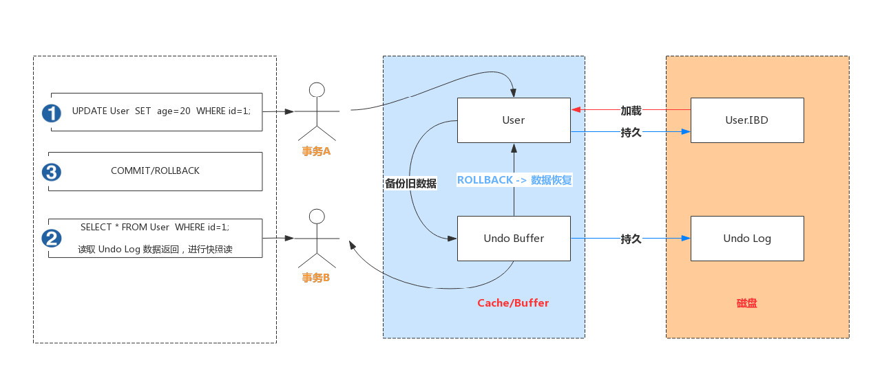


* 事务A手动开启事务,执行更新操作,首先会把更新命中的数据备份到 Undo Buffer 中
* 事务B手动开启事务,执行查询操作,会读取 Undo 日志数据返回,进行快照读


# Redo Log


## 概述


* Redo: 顾名思义就是重做,以恢复操作为目的,在数据库发生意外时重现操作
* Redo Log: 指事务中修改的任何数据,将最新的数据备份存储的位置(Redo Log),被称为重做日志
* Redo Log 的生成和释放: 随着事务操作的执行,就会生成Redo Log,在事务提交时会将产生Redo Log写入Log Buffer,并不是随着事务的提交就立刻写入磁盘文件.等事务操作的脏页写入到磁盘之后,Redo Log 的使命也就完成了,Redo Log占用的空间就可以重用(被覆盖写入)


## 工作原理


* Redo Log 是为了实现事务的持久性而出现的产物,防止在发生故障的时间点,尚有脏页未写入表的 IBD 文件中,在重启 MySQL 服务的时候,根据 Redo Log 进行重做,从而达到事务的未入磁盘数据进行持久化这一特性


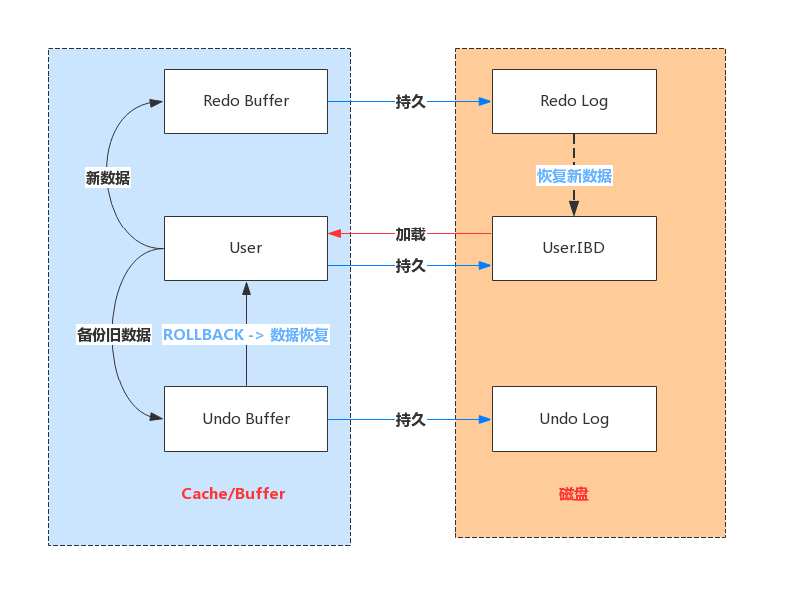


* Redo Log 文件内容是以顺序循环的方式写入文件,写满时则回溯到第一个文件,进行覆盖写


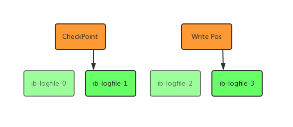


* 如图所示: write pos 是当前记录的位置,一边写一边后移,写到最后一个文件末尾后就回到 0 号文件开头
* checkpoint 是当前要擦除的位置,也是往后推移并且循环的,擦除记录前要把记录更新到数据文件
* write pos 和 checkpoint 之间还空着的部分,可以用来记录新的操作.如果 write pos 追上checkpoint,表示写满,这时候不能再执行新的更新,得停下来先擦掉一些记录,把 checkpoint推进一下


## 相关配置


* 每个InnoDB存储引擎至少有1个重做日志文件组(group),每个文件组至少有2个重做日志文件,默认为ib_logfile0和ib_logfile1,可以通过下面一组参数控制Redo Log存储: `show variables like '%innodb_log%';`
* Redo Buffer 持久化到 Redo Log 的策略,可通过 Innodb_flush_log_at_trx_commit 设置: 
  * 0: 每秒提交 Redo buffer ->OS cache -> flush cache to disk,可能丢失一秒内的事务数据,由后台Master线程每隔 1秒执行一次操作
  * 1(默认值): 每次事务提交执行 Redo Buffer -> OS cache -> flush cache to disk,最安全,性能最差的方式
  * 2: 每次事务提交执行 Redo Buffer -> OS cache,然后由后台Master线程再每隔1秒执行OS cache -> flush cache to disk 的操作
  * 一般建议选择取值2,因为 MySQL 挂了数据没有损失,整个服务器挂了才会损失1秒的事务提交数据


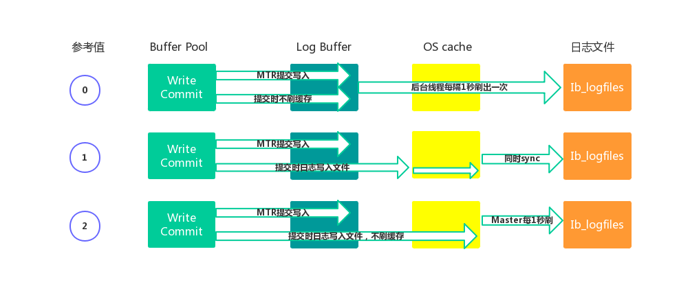


# Bin Log


## 概述


* Redo Log 是属于InnoDB引擎所特有的日志,而MySQL Server也有自己的日志,即 Binary log(二进制日志),简称Binlog,Binlog是记录所有数据库表结构变更以及表数据修改的二进制日志,不会记录SELECT和SHOW这类操作
* Binlog日志是以事件形式记录,还包含语句所执行的消耗时间
* 开启Binlog日志有以下两个最重要的使用场景:
  * 主从复制: 在主库中开启Binlog功能,这样主库就可以把Binlog传递给从库,从库拿到Binlog后实现数据恢复达到主从数据一致性
  * 数据恢复: 通过mysqlbinlog工具来恢复数据
* Binlog文件名默认为`主机名_binlog-序列号`格式,例如localhost_binlog-000001,也可以在配置文件中指定名称,文件记录模式有STATEMENT,ROW和MIXED三种,建议使用ROW模式:
  * ROW: row-based replication, RBR,日志中会记录每一行数据被修改的情况,然后在slave端对相同的数据进行修改
    * 优点: 能清楚记录每一个行数据的修改细节,能完全实现主从数据同步和数据的恢复
    * 缺点: 批量操作,会产生大量的日志,尤其是alter table会让日志暴涨
  * STATMENT: statement-based replication, SBR,每一条被修改数据的SQL都会记录到master的Binlog中,slave在复制的时候SQL进程会解析成和原来master端执行过的相同的SQL再次执行,简称SQL语句复制
    * 优点: 日志量小,减少磁盘IO,提升存储和恢复速度
    * 缺点: 在某些情况下会导致主从数据不一致,比如last_insert_id(),now()等函数
  * MIXED: mixed-based replication, MBR,以上两种模式的混合使用,一般会使用STATEMENT模式保存binlog,对于STATEMENT模式无法复制的操作使用ROW模式保存binlog,MySQL会根据执行的SQL语句选择写入模式


## 文件结构


* MySQL的binlog文件中记录的是对数据库的各种修改操作,用来表示修改操作的数据结构是Logevent,不同的修改操作对应的不同的log event
* 比较常用的log event有: Query event,Row event,Xid event等,binlog文件的内容就是各种Log event的集合
* Binlog文件中Log event结构如下图所示: 


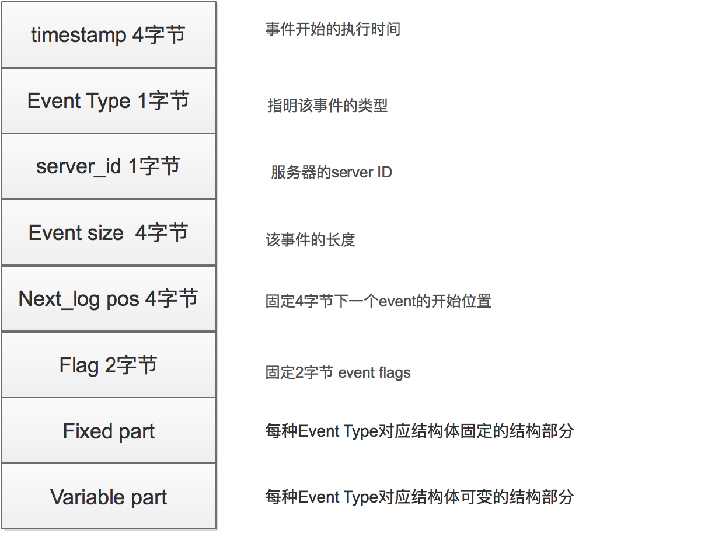


## 写入机制


* 根据记录模式和操作触发event事件生成log event(事件触发执行机制)
* 将事务执行过程中产生log event写入缓冲区,每个事务线程都有一个缓冲区Log Event保存在一个binlog_cache_mngr数据结构中,在该结构中有两个缓冲区,一个是stmt_cache,用于存放不支持事务的信息;另一个是trx_cache,用于存放支持事务的信息
* 事务在提交阶段会将产生的log event写入到外部binlog文件中.不同事务以串行方式将log event写入binlog文件中,所以一个事务包含的log event信息在binlog文件中是连续的,中间不会插入其他事务的log event


## 文件操作


* `show variables like 'log_bin';`: Binlog状态查看

* 开启Binlog功能,必须修改配置文件,不能在MySQL控制台修改,会报错.修改my.cnf或my.ini,重启MySQL服务

  ```mysql
  [mysqld]
  binlog-format=ROW
  log_bin=mysqlbinlog
  ```
  
* 使用show binlog events命令

  ```mysql
  show binary logs; //等价于show master logs;
  show master status;
  show binlog events;
  show binlog events in 'mysqlbinlog.000001';
  ```

* 使用mysqlbinlog 命令

  ```mysql
  mysqlbinlog "文件名"
  mysqlbinlog "文件名" > "test.sql"
  ```

* 使用 binlog 恢复数据

  ```shell
  # 按指定时间恢复
  mysqlbinlog --start-datetime="2020-04-25 18:00:00" --stopdatetime="2020-04-26 00:00:00" mysqlbinlog.000002 | mysql -uroot -p123456
  
  # 按事件位置号恢复
  mysqlbinlog --start-position=154 --stop-position=957 mysqlbinlog.000002 | mysql -uroot -p123456
  ```

* 删除Binlog文件

  ```mysql
  # 删除指定文件
  purge binary logs to 'mysqlbinlog.000001';
  # 删除指定时间之前的文件
  purge binary logs before '2020-04-28 00:00:00';
  # 清除所有文件
  reset master;
  ```

  * 可以通过设置expire_logs_days参数来启动自动清理功能: 默认0表示没启用,设置为1表示超出1天binlog文件会自动删除掉


## BinLog和RedoLog区别


* Redo Log是属于InnoDB引擎功能,Binlog是属于MySQL Server自带功能,并且是以二进制文件记录
* Redo Log属于物理日志,记录该数据页更新状态内容,Binlog是逻辑日志,记录更新过程
* Redo Log日志是循环写,日志空间大小是固定,Binlog是追加写入,写完一个写下一个,不会覆盖使用
* Redo Log作为服务器异常宕机后事务数据自动恢复使用,Binlog可以作为主从复制和数据恢复使用,Binlog没有自动crash-safe能力
