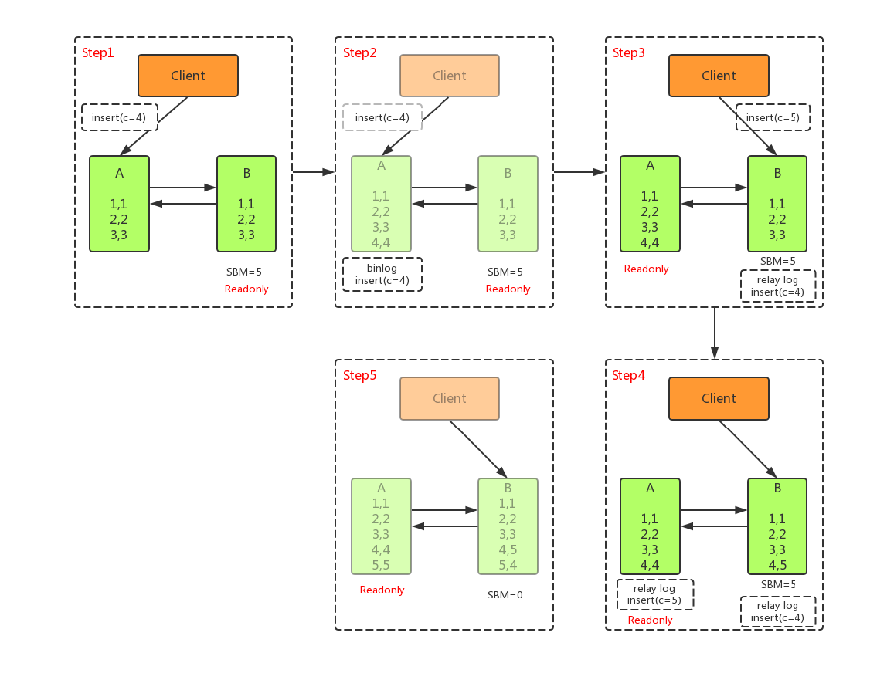

# MySQL运维


# Linux安装


## 卸载MySQL


* 所有操作都是以linux的centos7版本为基础进行的,其他操作系统可百度
* 查询linux中是否安装了mysql

```shell
rpm -qa|grep -i mysql #查询系统中已经安装的mysql包,例如mysql-community...
```

* 卸载mysql

```shell
service mysqld status # 查看mysql状态
service mysqld stop # 停止mysql服务
rpm -ev mysql-community... # 卸载2中查询到的mysql安装包,若卸载时提示找不到依赖,可以在命令后加上--nodeps,该参数表示不检查依赖
```

* 找到系统中关于mysql的文件夹并删除

```shell
find / -name mysql # 查找系统中所有关于mysql的文件夹,之后通过命令删除
```


## rpm安装


* 进入https://dev.mysql.com/downloads/repo/yum/,下载mysql的rpm包
* 根据linux版本选择mysql版本,点击download
* 页面跳转之后会需要登录,可以不登陆,直接点击左下方的No thanks,just start download或者直接右键点击该文件,复制连接地址
* 若是复制链接地址的,需要在linux中使用wget下载该文件

```shell
wget https://dev.mysql.com/get/mysql80-community-release-el7-3.noarch.rpm
```

* 若是直接下载的,可以把下载后的文件上传到linux中,此处下载的文件名为mysql80-community-release-el7-3.noarch.rpm,版本不一样,可能文件名不一样
* 安装镜像

```shell
rpm -ivh mysql80-community-release-el7-3.noarch.rpm
```

* 升级系统上的mysql软件包

```shell
yum update mysql-server
```

* 安装mysql

```shell
yum install mysql-server
```

* 安装成功之后会自动将mysql用户和mysql用户组添加到mysql中

```shell
groupadd mysql
useradd mysql
useradd -g mysql mysql
```

* 设置mysql权限

```shell
# 最后的参数是mysql即将安装的目录,可自定义
chown mysql:mysql -R /app/software/mysql
```

* 初始化mysql

```shell
 # 初始化完成之后会生成密码,该密码在/var/log/mysqld.log中
mysqld --initialize
/var/log/mysqld.log # 查找安装时的默认密码
grep "password"
```

* 启动mysql,并设置开机启动

```shell
systemctl start mysqld或service mysqld start # 启动mysql
systemctl enable mysqld # 开机启动mysql
systemctl daemon-reload # 重新加载mysql的配置文件
```

* **启动mysql的时候报错**

```shell
# Job for mysqld.service failed because the control process exited with error code. See "systemctl status mysqld.service" and "journalctl -xe" for details
# 解决办法
chown mysql:mysql -R /app/software/mysql
# 之后再启动mysql
service mysqld start
service mysqld status # 查看mysql状态
mysqladmin --version # 查看mysql版本
```

* 修改数据库密码root密码

```shell
mysqladmin -u root password "密码" # 从10那步的日志中找
```

* 若设置密码遇到问题,

```shell
# ERROR 1045 (28000): Access denied for user 'root'@'localhost' (using password: NO)
# 一般该错误是由密码错误引起,只能重置密码,查看3.重置密码
```


## 压缩包安装


1. 进入[mysql下载页](https://dev.mysql.com/downloads/mysql/),选择linux-Generic,选择下载版本**Linux - Generic (glibc 2.12) (x86, 64-bit), TAR**(根据需求选择),点击download进入下载页

2. 页面跳转之后会需要登录,可以不登陆,直接点击左下方的No thanks,just start download或者直接右键点击该文件,复制连接地址

3. 若是复制链接地址的,需要在linux中使用wget下载该文件

   ```shell
   wget https://dev.mysql.com/get/Downloads/MySQL-8.0/mysql-8.0.19-linux-glibc2.12-x86_64.tar
   ```

4. 若是直接下载的,可以把下载后的文件上传到linux中,此处下载的文件名为mysql-8.0.19-linux-glibc2.12-x86_64.tar,版本不一样,可能文件名不一样

5. 解压压缩包到指定目录,如/app/mysql

   ```shell
   tar -xvf mysql-8.0.19-linux-glibc2.12-x86_64.tar /app/mysql
   ```

6. 新建mysql的用户和用户组,新建mysql的数据目录和日志目录

   ```shell
   # 创建mysql用户组
   groupadd mysql 
   # 创建mysql用户
   useradd mysql
   # 将mysql用户添加到mysql用户组
   useradd -g mysql mysql
   # 给文件赋权
   chmod -R 755 /app/software/mysql
    # 创建数据和日志目录
   mkdir -p /app/software/mysql/data /app/software/mysql/logs
   ```

7. 进入/app/software/mysql/bin中执行以下命令

   ```mysql
   mysqld --initalize --user=root --basedir=/app/software/mysql --datadir=/app/mysql/software/data
   # 若是包依赖找不到的错误,安装指定依赖即可
   # 初始化时会在屏幕上显示root密码,若是没有注意,可以在日志文件中查找
   # cat /var/log/mysql |grep password
   ```

8. 添加系统环境变量,开机启动

   ```shell
   vi /etc/profile
   export PATH=/app/software/mysql/bin:$PATH
   source /etc/profile
   cp /app/software/mysql/support-files/mysql.server  /etc/init.d/mysqld
   chkconfig --add mysqld # 或者chkconfig mysql on
   vi /etc/init.d/mysqld # 价格datadir和basedir的目录改成自己的
   ```


## 编译安装


### 依赖


* gcc/g++:MySQL 5.6开始,需要使用g++进行编译
* cmake:MySQL 5.5开始,使用cmake进行工程管理,cmake需要2.8以上版本
* bison:MySQL语法解析器需要使用bison进行编译
* ncurses-devel:用于终端操作的开发包
* zlib:MySQL使用zlib进行压缩
* libxml:用于XML输入输出方式的支持
* openssl:使用openssl安全套接字方式通信
* dtrace:用于诊断MySQL问题


### 编译参数


* CMAKE_BUILD_TYPE:编译的版本类型.RelWithDebInfo和Debug,RelWithDebInfo会进行优化

* CMAKE_INSTALL_PREFIX:指定make install安装的目标路径

* SYSCONFDIR:指定配置文件的默认路径

* MYSQL_DATADIR:指定data目录的默认路径

* WITH_DEBUG:指定是否有debug信息,一般用于源码调试时,生产环境关闭

* ENABLED_PROFILING:指定是否可以使用show profile显示操作执行的详细信息

* DEFAULT_CHARSET:指定默认字符集,可以在启动的配置文件中指定

* DEFAULT_COLLATION:指定默认字符比较,排序的规则

* WITH_EXTRA_CHARSETS:指定其他可能使用的字符集

* WITH_SSL:指定SSL的类型,从5.6.6开始默认bundled类型,也可以指定SSL库的路径地址

* WITH_ZLIB:指定zlib的类型,用于压缩功能

* WITH_storage_STORAGE_ENGINE:指定编译支持的存储引擎.默认支持MyISAM,MERGE,MEMORY,CSV存储引擎

* ENABLED_LOCAL_INFILE:指定是否允许使用load data infile功能

* WITH_EMBEDDED_SERVER:指定是否编译libmysqld嵌入式库

* INSTALL_LAYOUT:指定安装的布局类型

* 编译语句

  ```shell
  CFLAGS="-O3 -g -fno-exceptions -static-libgcc -fno-omit-frame-pointer -fno-strict-aliasing"
  CXX=g++
  CXXFLAGS="-O3 -g -fno-exceptions -fno-rtti -static-libgcc -fno-omit-frame-pointer -fno-strict-aliasing"
  export CFLAGS CXX CXXFLAGS
  cmake . [PARAMETERS]
  make -j & make install
  
  # 仅参考
  cmake -DCMAKE_INSTALL_PREFIX=/app/software/mysql \
  -DMYSQL_UNIX_ADDR=/tmp/mysqld.sock \
  -DDEFAULT_CHARSET=utf8 \
  -DDEFAULT_COLLATION=utf8_general_ci \
  -DWITH_EXTRA_CHARSETS:STRING=utf8,gbk \
  -DWITH_MYISAM_STORAGE_ENGINE=1 \
  -DWITH_INNOBASE_STORAGE_ENGINE=1 \
  -DWITH_MEMORY_STORAGE_ENGINE=1 \
  -DWITH_READLINE=1 \
  -DENABLED_LOCAL_INFILE=1 \
  -DMYSQL_DATADIR=/data/mysql \
  -DMYSQL_USER=mysql \
  -DMYSQL_TCP_PORT=3306
  # make
  # make install
  ```


### 配置


* 复制配置文件:`cp /app/software/mysql/support-files/my-medium.cnf /etc/my.cnf`

* 初始化数据库,执行前需赋给scripts/mysql_install_db文件执行权限

  ```shell
  chmod 755 /app/software/mysql/scripts/mysql_install_db
  scripts/mysql_install_db --user=mysql --basedir=/app/software/mysql/ --datadir=/app/software/mysql/mysql/
  
  # 配置环境变量
  export PATH=/usr/local/mysql/bin:$PATH
  alias mysql_start="mysqld_safe &"
  alias mysql_stop="mysqladmin –u root -p shutdown
  ```


### 开机启动


```shell
cp /app/software/mysql/support-files/mysql.server /etc/init.d/mysql
chmod 755 /etc/init.d/mysql
chkconfig mysql on
```


##  启动数据库


* service mysqld start/systemctl start mysqld
* service mysqld restart/systemctl  restart mysqld


## 停止数据库


* 一定不能强制关闭数据库,大概率造成数据库损坏,数据丢失
* service mysqld stop/systemctl stop mysqld
* mysqladmin -uroot -p123456 shutdown
* /etc/init.d/mysqld stop
* kill -USER2 \`cat path/pid\`:不要用这种方法,可能造成数据丢失


## 相关目录


* `/var/lib/mysql`:mysql数据库文件存放路径
* `/etc/my.cnf`:主要配置文件
* `/etc/init.d/mysql`:mysql启停相关脚本


# Linux多实例


* 一台机器上开多不同的服务端口,运行多个Mysql服务进程,这些Mysql多实例公用一套安装程序,使用相同的/不同的my.cnf配置,启动程序,数据文件

* 配置多个数据目录,多个配置文件及多个启动程序实现多实例

  ```mysql
  # 多实例中需要修改的参数
  [client]
  port
  socket
  [mysql]
  no-auto-rehash
  [mysqld]
  port
  socket
  basedir
  datadir
  log-error
  log-slow-quries
  pid-file
  log-bin
  relay-log
  relay-log-info-file
  server-id
  ```

* 多实例启动mysql

```shell
mysqld_safe --defaults-file=/app/mysql/data/3306/my.cnf 2>&1 > /dev/null &
mysqld_safe --defaults-file=/app/mysql/data/3307/my.cnf 2>&1 > /dev/null &
```

* 多实例停止mysql

```shell
mysqladmin -uroot -p123456 -S /app/mysql/data/3306/mysql.sock shutdown
mysqladmin -uroot -p123456 -S /app/mysql/data/3307/mysql.sock shutdown
```


# Windows安装


* 下载压缩包到自定义目录,解压之后得到目录如:E:\mysql-8.0.24
* 进入mysql目录新建data和my.ini文件,data为mysql的数据目录,my.ini为配置文件,内容如下

```ini
[mysqld]
# 设置3306端口
port=3306
# 设置mysql的安装目录
basedir=E:\\mysql-8.0.24
# 设置mysql数据库的数据的存放目录
datadir=E:\\mysql-8.0.24\\data
# 允许最大连接数
max_connections=200
# 允许连接失败的次数。这是为了防止有人从该主机试图攻击数据库系统
max_connect_errors=10
# 服务端使用的字符集默认为UTF8
character-set-server=utf8mb4
# 创建新表时将使用的默认存储引擎
default-storage-engine=INNODB
[mysql]
# 设置mysql客户端默认字符集
default-character-set=utf8mb4
[client]
# 设置mysql客户端连接服务端时默认使用的端口
port=3306
default-character-set=utf8mb4
```

* 配置环境变量:MYSQL_HOME=E:\mysql-8.0.24,加入Path中:%MYSQL_HOME%\bin

* CMD进入E:\mysql-8.0.24\bin,执行以下命令进行数据库初始化

```mysql
mysqld --initialize --user=mysql --console
```

* 初始化时会将root密码输出到控制台中,登录时需要使用
* `mysqld -install`:将服务添加到windows启动任务中
  * 如果出现`Install/Remove of the Service Denied!`错误,需要以管理员身份运行cmd
* `net start mysql`:启动
* 登录数据库,使用刚才的控制台密码
* `ALTER USER root@localhost IDENTIFIED BY '123456'; `:修改密码


# 密码管理


##  修改密码


* 在mysql环境外

```mysql
# 单实例
mysqladmin -uroot -poldpwd password newpwd;
# 多实例
mysqladmin -uroot -poldpwd password newpwd -S /app/mysql/data/3306/mysql.sock
```

* 在mysql环境中

```mysql
update mysql.user set password=PASSWORD('newpwd') where user='root';
flush privileges;
# 或者如下
set global validate_password.policy=0;
set global validate_password.length=1;
ALTER USER "root"@"localhost" IDENTIFIED BY "新密码";
```


## 忘记密码


### Linux


```shell
# 停止mysql
systemctl stop mysqld
# /etc/init.d/mysqld stop
# 跳过权限启动mysql
mysqld_safe --skip-grant-tables --user=mysql &;
# 如果有多实例,需要加上配置文件地址
# mysqld_safe --default-file=/mysql/my.cnf --skip-grant-tables --user=mysql &;
# 如果上面的命令无效报错,则执行下面这段命令
# mysqld --skip-grant-tables --user=mysql &;
# 或者直接在/etc/my.cnf加上如下,之后再正常启动mysql
# skip-grant-tables
# 无密码登录mysql
mysql -uroot -p
# 更新root密码
ALTER USER 'root'@'localhost' IDENTIFIED BY 'newpwd';
# 或者
UPDATE MYSQL.`user` SET PASSWORD=PASSWORD("newpwd") WHERE `user` = 'root';
# 刷新权限
FLUSH PRIVILEGES;
```

若修改密码提示错误:**ERROR 1290 (HY000): The MySQL server is running with the --skip-grant-tables option so it cannot execute this statement**

```shell
# 解决方法,刷新权限
FLUSH PRIVILEGES;
# 再修改密码
ALTER USER 'root'@'localhost' IDENTIFIED BY 'newpwd';
# 再刷新权限
FLUSH PRIVILEGES;
```


### Windows


```mysql
-- MySQL8重置密码
-- 在服务中停止MySQL服务,CMD进入MySQL/bin下,执行以下命令,前台启动MySQL
mysqld --console --skip-grant-tables --shared-memory;
-- 再打开一个cmd,无密码登录
mysql -uroot;
-- 将root用户密码置为空
UPDATE mysql.user SET authentication_string='' WHERE user='root' and host='localhost';
-- 刷新权限
FLUSH PRIVILEGES;
-- 重置密码
ALTER USER 'root'@'localhost' IDENTIFIED WITH mysql_native_password BY '你的密码';
```


## 登录加密


* **远程访问时,mysql8之前的版本和8以后的版本不一样,因为登录时密码的加密方式不一样.MYSQL_NATIVE_PASSWORD是5的加密方式,8的加密方式改成了caching_sha2_password**,若是用远程访问工具登录数据库时,需要做部分修改

* 创建用户时指定登录的加密方式,该方式只会影响单个用户,不会影响其他用户

  ```mysql
  CREATE USER 'newuser'@'%' IDENTIFIED WITH MYSQL_NATIVE_PASSWORD BY 'newpwd';
  ```

* 修改用户登录时候的加密方式

  ```mysql
  ALTER USER 'newuser'@'%' IDENTIFIED WITH mysql_native_password BY 'newpwd';
  ```

* 在配置文件的mysqld下加上如下配置,则所有的加密方式都用旧的

  ```mysql
  default_authentication_plugin=mysql_native_password
  service mysqld restart # 重启之后还需要重置原帐号密码,重新设置
  update mysql.user set authentication_string='' where user='root';
  alter user 'root'@'%' identified by '123456';
  flush privileges;
  ```

* 登录mysql

  ```mysql
  # mysql是服务名称,默认mysql
  # -h是登录的数据库自治,-u表示登录mysql的用户名,-p表示对应的用户名密码
  # 密码可以明文接在-p后面,也可以回车之后提示输入密码
  mysql [-h127.0.0.1] -uroot -p
  ```


# 配置文件


> mysqld --help --verbose|grep -A 1 'Default options':查看mysql读取配置文件的顺序,不同系统顺序不一样

* set global config_option=xxx:设置全局参数,对所有连接都有效,但是有些已经登录了的连接无效,需要重新登录之后才有效
* set [session] config_option=xxx:设置会话参数,只对当前会话有效,不影响其他连接

```mysql
[mysqld] # 服务端配置文件
basedir=/app/mysql # mysql安装目录
datadir=/app/mysql/data # 数据存放目录
socket=/app/mysql/data/mysql.sock 
port = 3306 # socket访问端口
bind-address=0.0.0.0 # 可访问数据库的ip地址,默认只能是本地访问

# 0:默认值,表示不主动刷新cache到磁盘,而是由操作系统自己决定
# 大于0:2次写入到磁盘的间隔不超过binlog的多少次写操作,写1最好.若开启主从同步,该配置要开启
sync_binlog # 控制mysql如何向磁盘刷新binlog
# strict_trans_tables:如果给定的事务数据不能插入到事务类型数据库中,则中断操作,在非事务数据库无效
# no_engine_subtitution:若create table所指定的引擎无效,不会使用默认引擎建表
# no_zero_date:不接受日期为0的日期
# no_zero_in_date:在严格模式下,不接受部分日期为0的日期
# only_full_group_by:select的字段必须在group子句中出现
sql_mode # 支持的各种服务器sql模式
# 若是从库也开启binlog日志,做其他从库的主库(级联),或者做备份,还需要下面的参数
# log-slave-updates 该参数无值,只需要写上即可,主库不需要
binlog-ignore-db=mysql,performance-schema # binlog日志中,忽略同步的表,多个用逗号隔开或写多行
binlog-do-db = mysql # binlog中只记录某些数据库,多个用逗号隔开
binlog_format = mixed # binlog的类型,row,statement,mixed
expire_logs_days = 15 # 保留binlog日志的天数,一般一个星期
pid-file=/app/mysql/data/mysql.pid # mysql的标识文件
# 定义innodb的数据字典和内部数据结构的缓冲池大小.当数据库对象非常多时,适当调整该参数的大小以确保所有数据都能存放在内存中提高访问效率,当过小时,MySQL会记录Warning信息到数据库的错误日志中,这时就需要该调整这个参数大小
innodb_additional_mem_pool_size
# innodb数据,索引等缓存,一般配置为内存的1/3到1/2
innodb_buffer_pool_size = 3G
# 文件的io线程数
innodb_file_io_threads = 4
# 设置如何跟文件系统交互
innodb_flush_method = O_DIRECT
# 日志刷新到硬盘上的模式:0,每秒写入一次到缓存,同时写入到磁盘,可能会丢失1秒数据
# 1,默认,每次事务都将事务日志写到缓存,同时写入到磁盘,不会丢失数据,但是太影响性能
# 2,建议,每次提交把事务日志写入到缓存,每秒执行一次将缓存写入到磁盘,除非服务器宕机,可能会丢失1秒数据
innodb_flush_log_at_trx_commit = 2
# 每个表是否设置一个独立的表空间,最好开启
innodb_file_per_table = 1
 # 事务日志缓冲区大小,不需要很大
innodb_log_buffer_size = 16M
innodb_log_file_size = 200M # 单个事务日志的大小,即bin.log单个日志大小,根据业务而定
innodb_log_files_in_group = 2 # 控制事务日志文件的个数
# 设置在缓冲池中保存的最大的脏页数量
innodb_max_dirty_pages_pct = 90
innodb_lock_wait_timeout = 120
innodb_doublewrite = 1 # 是否开启双写缓存,避免数据损坏
innodb_strict_mode # 定义一个专门为innodb插件提供的服务器sql模式级别
# 线程并发情况,设为CPU核数的2倍
innodb_thread_concurrency = 8 
tmp_table_size = 72M # Memory引擎临时文件表的大小
max_heap_table_size # 定义一个Memory引擎表的最大容量,该参数和tmp_table_size最好大小相同
max_connections = 1000 # 最大客户端连接数
max_connect_errors = 6000 # 单次连接最大可能出现的错误数
max_allowed_packet = 32M # 结果集的最大容量
max_length_for_fort_data # 用于排序数据的最大长度,可以影响mysql选择那个排序算法
# 最大连接数,默认为0无上限
max_user_connection
optimizer_switch # 设置mysql优化器中那个高级索引合并功能被开启
init-connect = 'SET NAMES utf8mb4' # 初始化数据库链接时提供的配置信息
# 数据库连接闲置时间,闲置连接会占用内存资源
wait_timeout = 600
interactive_timeout = 600 # 超过多长时间没有写入数据就断开连接,单位s
thread_cache_size=768 # 线程缓存大小
table_cache_size # 缓存表的大小
# 每个线程排序缓存大小.使用的时候才分配,而且是一次性指定,每个表会分配一个,多表同时排序可能会造成内存溢出
sort_buffer_size = 32M
# 每个线程联表缓存大小,一次性指定,每张关联会分配一个,多表时同样可能造成内存溢出
join_buffer_size = 128M
# 为MyISAM数据库的索引设置缓冲区大小,使用时才真正分配
key_buffer_size=32M
lower_case_table_names = 1
#skip_networking
table_open_cache = 400
read_buffer_size=8M
read_rnd_buffer_size=4M
# 连接堆栈大小.MySql连接数据达到max_connections时,新来的请求将会被存在堆栈中,以等待连接释放,如果等待连接数超过back_log,将不被授予连接资源
back_log=1024

# 设置查询缓存大小
query_cache_size
# 对表进行顺序扫描的请求将分配一个读入缓冲区,MySql会为它分配一段内存缓冲区.如果对表的顺序扫描请求非常频繁.可以通过增加该变量值以及内存缓冲区大小提高其性能
read_buffer_size = 16M
# 每个线程查询时索引缓存大小,只会分配需要的内存大小
read_rnd_buffer_size = 32M
# 主从开启时从库的设置
replication-do-db # 设定需要复制的数据库,多个用逗号隔开
replication-ignore-db # 设定忽略复制的数据库,多个用逗号隔开
replication-do-table # 设定需要复制的表,多个用逗号隔开
replication-ignore-table # 设定需要忽略复制的表,多个用逗号隔开
replication-wild-do-table # 同replication-do-table功能一样,但可以加通配符
replication-wild-ignore-table # 同replication-ignore-table功能一样,但可以加通配符
slave-skip-errors=1032,1062 # 主从复制时,忽略符合错误码的错误,1032是错误码
secure_file_priv=’’
# 忽略名字解析,DNS查找,不加可能导致权限错误,但是最好禁用
skip_name_resolve
[mysqld_safe]
# 错误日志,默认是关闭的
log-error=/app/mysql/logs/mysql-error.log
```


# 字符集

* 在安装时指定服务端和客户端的字符集,一般utf8或utfmb4

* SHOW VARIABLES LIKE '%char%':查看所有字符集编码项

  * character_set_client:客户端向服务器发送数据时使用的编码
  * character_set_connection:连接字符集
  * character_set_database:数据库字符集,配置文件指定或建库建表指定
  * character_set_filesystem:文件系统字符集
  * character_set_results:服务器端将结果返回给客户端所使用的编码
  * character_set_server:服务器字符集,配置文件指定或建库建表指定
  * character_set_system:系统字符集

* SET 变量名 = 变量值:设置字符集编码

  * SET character_set_client = utf8mb4;
  * SET character_set_results = utf8mb4;
  * SET character_set_connection = utf8mb4;

* SET NAMES utf8:设置当前回话所有的字符集

* 安装完成之后,若想修改字符集,可以修改/etc/my.cnf文件的client和mysqld

  ```mysql
  [client]
  # 修改客户端字符集影响客户端,连接和结果字符集
  default-character-set=utf8
  [mysqld]
  # 修改服务器端字符集影响database和server字符集
  default-character-set=utf8 # 适合5.1以前
  character-set-server=utf8 # 适合5.5以后
  ```

* **修改已有数据库乱码数据的唯一办法:将数据导出,之后修改数据库的字符集,再将数据重新导入**,以将数据库远字符集为gbk切换成utf8为例

  * 导出表结构

  ```mysql
  # -d表示只导出表结构
  mysqldump -uroot -p123456 --default-charater-set=gbk -d dbname > alltable.sql --default-character-set=utf8
  ```

  * 确保数据库不再更新数据,导出所有数据

  ```mysql
  # --quick:用于转出大的表,强制mysqldump从服务器一次一行的加锁数据而不是检索所有行,并输出前cache到内存中
  # --no-create-info:不创建create table语句
  # --extended-insert:使用包括几个values列表的多行insert语法,这样文件更小,io也小
  # --default-character-set:按照原有字符集导出所有数据,保证数据不乱码
  mysqldump -uroot -p123456 --quick --no-create-info --extended-insert --default-character-set=gbk > alldata.sql
  ```

  * 打开alldata.sql将set names gbk 修改成 utf8.或者删除该语句,直接将mysql服务端和客户端字符集设置为utf8
  * 创建数据库,表,导入数据

  ```mysql
  create database dbname default charset utf8;
  mysql -uroot -p123456 dbname < alltables.sql; # 导入表结构
  mysql -uroot -p123456 <alldata.sql; # 导入数据
  ```


# 开启远程访问

1. 登录数据库

2. **创建用户用来远程连接mysql**

   ```shell
   # mysql8及以前版本赋权,同时创建新用户
   # *.*表示所有数据库的所有表,%表示所有的ip都可以连接,newuser是新用户名,newpwd是新用户的密码
   GRANT ALL PRIVILEGES ON *.* TO 'newuser'@'%' IDENTIFIED BY 'newpwd' WITH GRANT OPTION;
   # mysql8以后的用户创建和赋权分开了,不能用以前的方式,必须先创建用户,之后赋权
   CREATE USER 'newuser'@'%' IDENTIFIED WITH MYSQL_NATIVE_PASSWORD BY 'newpwd';
   # mysql8赋所有权,没有privileges
   GRANT ALL ON *.* TO 'newuser'@'%';
   # 若只赋部分权,部分数据库,部分表
   GRANT SELECT,INSERT ON db1.table1 TO 'newuser'@'%'
   # 刷新权限
   FLUSH PRIVILEGES;
   # 查看授权信息
   SHOW GRANT FOR 'newuser'@'%'
   ```

3. 创建用户的时候加上远程加密方式,该方式只对单个帐号有效,不影响其他帐号

4. 查询数据库的用户

   ```mysql
   SELECT DISTINCT CONCAT('User: ''',user,'''@''',host,''';') AS query FROM mysql.user;
   ```


# 权限


* 查看MySQL历史操作:`cat ~/.mysql_history`
* 历史操作:删除数据库相关的历史操作记录:`cat /dev/null > ~/.mysql_history`


## 用户信息

1. 用户信息表:mysql.user
2. 刷新权限:FLUSH PRIVILEGES;

```mysql
CREATE mysql.USER username IDENTIFIED BY password;
# 重命名用户
RENAME mysql.user old_username TO new_username;
# 设置密码
SET PASSWORD = PASSWORD('密码'); # 为当前用户设置密码
SET PASSWORD FOR username = PASSWORD('密码'); # 为指定用户设置密码
# 删除用户
DROP mysql.USER username;
```

1. 必须拥有mysql的全局CREATE USER权限,或拥有INSERT权限
2. 只能创建用户,不能赋予权限
3. 用户名和密码都需要加上引号
4. 要在纯文本中指定密码,需忽略PASSWORD关键词.要把密码指定为由PASSWORD()函数返回的混编值,需包含关键字PASSWORD


## 赋权

GRANT 权限列表 ON dbname.tablename TO 'username'@'ip';

```mysql
# mysql8以前的版本用下面的语句在创建用户的同时可以赋权,但是8以后的不行
GRANT ALL PRIVILEGES ON *.* TO 'username'@'%' IDENTIFIED BY 'password';
# 8以后的创建用户和赋权分开了,只能先创建用户,之后再赋权
GRANT ALL ON *.* TO 'username'@'%';
# 查询权限
SHOW GRANTS FOR username;
```

1. 权限列表:查看5.2.5权限列表
2. dbname.tablename:某个数据库的某个表,也可以是\*.\*,表示所有数据库的所有表
3. ip:允许用户用那个ip连接,%表示所有ip都可以


## 撤销权限

1. 单个权限:REVOKE 权限列表 ON tablename FROM username;
2. 所有权限:REVOKE ALL PRIVILEGES GRANT OPTION FROM username;
3. 撤销权限的时候最好是和赋权时候一致,给的什么权限就删除是什么权限


## 权限层级

1. 要使用GRANT或REVOKE,您必须拥有GRANT OPTION权限,并且您必须用于您正在授予或撤销的权限

2. 全局层级:全局权限适用于一个给定服务器中的所有数据库,mysql.user

   > GRANT ALL ON *.*|REVOKE ALL ON *.*:授予或撤销全局权限

3. 数据库层级:数据库权限适用于一个给定数据库中的所有目标,mysql.db, mysql.host

   > GRANT ALL ON db_name.*|REVOKE ALL ON db_name.*:授予和撤销某个数据库权限

4. 表层级:表权限适用于一个给定表中的所有列,mysql.talbes_priv

   > GRANT ALL ON db_name.tbl_name|REVOKE ALL ON db_name.tbl_name:授予和撤销表权限

5. 列层级:列权限适用于一个给定表中的单一列,mysql.columns_priv,当使用REVOKE时,必须指定与被授权列相同的列


## 权限列表

* ALL [PRIVILEGES]:设置除GRANT OPTION之外的所有简单权限
* ALTER:允许使用ALTER TABLE
* ALTER ROUTINE:更改或取消已存储的子程序
* CREATE:允许使用CREATE TABLE
* CREATE ROUTINE:创建已存储的子程序
* CREATE TEMPORARY TABLES:允许使用CREATE TEMPORARY TABLE
* CREATE USER:允许使用CREATE USER,DROP USER,RENAME USER和REVOKE ALL PRIVILEGES
* CREATE VIEW:允许使用CREATE VIEW
* DELETE:允许使用DELETE
* DROP:允许使用DROP TABLE
* EXECUTE:允许用户运行已存储的子程序
* FILE:允许使用SELECT...INTO OUTFILE和LOAD DATA INFILE
* INDEX:允许使用CREATE INDEX和DROP INDEX
* INSERT:允许使用INSERT
* LOCK TABLES:允许对您拥有SELECT权限的表使用LOCK TABLES
* PROCESS:允许使用SHOW FULL PROCESSLIST
* REFERENCES:未被实施
* RELOAD:允许使用FLUSH
* REPLICATION CLIENT:允许用户询问从属服务器或主服务器的地址
* REPLICATION SLAVE:用于复制型从属服务器(从主服务器中读取二进制日志事件)
* SELECT:允许使用SELECT
* SHOW DATABASES:显示所有数据库
* SHOW VIEW:允许使用SHOW CREATE VIEW
* SHUTDOWN:允许使用mysqladmin shutdown
* SUPER:允许使用CHANGE MASTER,KILL,PURGE MASTER LOGS和SET GLOBAL语句,mysqladmin debug命令;允许您连接(一次),即使已达到max_connections
* UPDATE:允许使用UPDATE
* USAGE:“无权限”的同义词
* GRANT OPTION:允许授予权限


# 强制访问控制


* 强制访问控制:MAC,是系统强制主体服从访问控制策略,与自主访问控制(DAC)基于系统实体身份及其到系统资源的接入授权方式,同保证用户的权限
* 实现策略:
  * 创建系统表:定义用户的强制访问权限管理表
  * 修改用户认证逻辑:在sql_acl.cc中修改用户验证逻辑,检查强制访问权限管理表,是否符合用户认证要求


# 备份还原


## 数据库备份


```mysql
# 直接输入用户名和密码进行备份,username是用户名,password是密码,dbname是数据库名
# 最后的sql文件可以是路径,若不是路径直接保存到当前目录
mysqldump -uroot -ppwd -hlocalhost -p3306 []> sql_bak_dbname.sql
# 压缩备份
mysqldump -uroot -ppwd -hlocalhost -p3306 [] | gzip> sql_bak_dbname.sql.gz
```

* -A,--all-databases:备份所有数据库数据和结构
* -A -d:备份所有数据库表结构
* -A -t:备份所有数据库数据
* -B db|gzip:在备份的sql中添加创建数据库和使用使用数据库的语句,并压缩文件
* -B db1 db2,--databases db1,db2...:同时备份多个库,不能和表连用
* -A  -B  --events:将所有数据库都一次备份完成
* -F,--flush-logs:刷新binlog日志
* -A  -B  -F  --events:将所有数据库都一次备份完成,并且对bin-log进行分割,产生新的bin-log日志,而以前的数据就直接从即将备份的文件中取,以后增量数据从产生的新的bin-log日志中读.需要将bin-log先打开
* db table1 table2...:备份数据库中的指定表,此时不能和-B参数一起连用
* -d dbname [table]:只备份数据库中所有表的结构或备份指定表的表结构
* -t dbname [table]:只备份数据库中所有表的数据或备份指定表的数据
* --master-data=1:在备份时直接定位到当前bin-log的终点位置,恢复的时候可以直接从提示的位置恢复.需要结合bin_log相关命令完成全量备份
  * 1:输出change master命令
  * 2:注释输出change master命令

```mysql
# 会在备份的文件开头添加此时备份的数据到那个文件,在该文件的那个位置
CHANGE MASTER TO MASTER_LOG_FILE='mysql-bin.000016',MASTER_LOG_POS=17;
```

* --default-character-set=utf8mb4:备份时设置导出数据的字符集

* --compact:去除备份的sql中的注释部分,调试的时候才可以用

* -x,--lock-all-tables:锁所有数据库的所有表,不能进行更新

* -l,--lock-tables:锁指定数据库的所有表为只读

* --single-transaction:适合innodb事务数据库备份,用来保证事务的一致性.本质上设置本次的会话隔离级别为REPEATABLE READ,关闭--lock-tables

* --triggers:备份触发器

* --routines:备份存储过程

* **专业的DBA备份**

  ```mysql
  # 全参数备份,pv参数限流
  mysqldump -uroot -p123456 --all-databases --flush-logs --events --flush-privileges --single-transactioin --master-data=2 --triggers --routines --hex-blob |pv -q -L 10M|gzip > #BACKUP_DIR/full_dump_$BACKUP_TIMESTAMP.SQL.gz
  # 简参数备份
  mysqldump -uroot -p123456 -A -F -E --flush-privileges --single-transactioin --master-data=2 --triggers --routines --hex-blob|pv -q -L 10M |gzip > #BACKUP_DIR/full_dump_$BACKUP_TIMESTAMP.SQL.gz
  ```

* rsync备份:rsync -avz /data/mysql-bin.0* rsync_backup@127.0.0.1::backup -password-file=/etc/rsync.password

* 批量备份数据库

  ```mysql
  # 拼接所有的数据库的备份语句
  mysql -uroot -p123456 -e"show databases;"|grep -Evi "database|infor|prefor" |sed  -r 's#^([a-z].*$)#mysqldump -uroot -p123456 --events -B \1|gzip > /app/bak/mysql\1.sql.gz#g'
  # 执行备份
  mysql -uroot -p123456 -e"show databases;"|grep -Evi "database|infor|prefor" |sed  -r 's#^([a-z0-9_].*$)#mysqldump -uroot -p123456 --events -B \1|gzip > /app/bak/mysql\1.sql.gz#g'|bash
  ```

  ```shell
  # 使用脚本备份
  # /bin/bash
  for dbname in `mysql -uroot -p123456 -e "show databases;"|grep -Evi "database|info|perfor"`
  do
  	mysqldump -uroot -p123456 --events -B $dbname|gzip > /app/bak/mysql/${dbname}_bak.sql.gz
  done
  ```

  


## Binlog备份


* mysqlbinlog --raw --read-from-remote-server --stop-never --host localhost --port 3306 -uroot -p123456 bin.log>binlog_bak.sql:对二进制文件进行备份,可远程备份
* --raw:输出的二进制文件
* --read-from-remote-server:从服务器上读取二进制文件
* --stop-never:开启之后不停止,一直读取
* -d db:只备份执行数据库的日志
* --start-position=xx --stop-position=xxx:将binlog中指定位置点的日志输出


## 物理备份


* 简单而言就是直接将整个data目录复制保存再恢复


```mysql
# 备份
mysqldamin -u[USER] -p[PASSWORD] -h127.0.0.1 -P3306 shutdown
tar -czvf /$MYSQL_HOME/data data.tar.gz
# 恢复
mysqldamin -u[USER] -p[PASSWORD] -h127.0.0.1 -P3306 shutdown
tar -xzvf data.tar.gz
# 替换当前data目录
mysqld_safe
change master
```


## Xtrabackup


* 第三方工具备份,二进制的可执行程序(基于MySQL的源码+Patch),只能备份innodb存储引擎


### 参数


* 全量备份
* 增量备份:--incremental,--incremental-basedir
* 差分备份:--incremental,--incremental-basedir
* 备份压缩:--stream;tar,xbstream;gzip
* 并发备份:--parallel
* 备份加密:--encryption,openssl


## mydumper


### 安装


```shell
yum install pcre-devel
cmake .
make & make install
```


### 参数


* statement-size:备份参数,sql语句最大长度
* rows:备份参数,按照执行rows分割table数据
* chunk-filesize:备份参数,按照输出文件的大小分割table数据
* no-locks:备份参数,不锁表
* binlogs:备份参数,备份binlog日志
* threads:备份恢复都可用.并发线程数
* queries-per-transaction:恢复参数,每个事务包含的记录数
* overwrite-tables:恢复参数,drop table if exists
* enable-binlog:恢复参数,binlog恢复数据


### 备份


```shell
mydumper -u[USER] -p[PASSWORD] -h[HOST] -P[PORT] -t[THREADS] -b -c -B [DB] -o /tmp/backup
```


### 恢复


```shell
myloader -u[USER] -p[PASSWORD] -h[HOST] -P[PORT] -t[THREADS] -o /tmp/backup -B [DB]
```


## 还原

```shell
# 非压缩sql文件,在不登录mysql时直接恢复
mysql -uusername -ppassword dbname < sql_bak_dbname.sql
# 登录mysql之后恢复,需要写完整的sql路径
source /bak/mysql/sql_bak_dbname.sql 
# 压缩文件需要先解压之后恢复
gizp -d sql_bak_dbname.sql.gz # 之后再用上面的方法恢复
```

* 只有一个主库是否需要做增量恢复

  * 应该做定时全量备份(一天一次)以及增量备份(每个10分钟左右对binlog做切割然后备份到其他服务器上,或者本地其他的硬盘里)或者写到网络文件系统(备份服务器)
  * 如果不允许数据丢失,最好的办法是做从库,通过drbd(基于磁盘块的)同步

* 还原时能锁库锁表的尽量锁库锁表,避免在恢复时用户又写入数据

* 如果实在不能锁库锁表,可以立即刷新bin_log:登录mysql,执行命令flush-logs.此时会立刻生成一个新的bin_log日志文件,新的bin_log是新的更新数据,可以不用管,只需要恢复刷新之前的数据即可

* 假设现在恢复的bin_log是15,刷新出来的bin_log是16,需要从15的bin_log中利用-d参数筛选出错误行为的数据库内容到sql中

  ```mysql
  mysqlbinlog -d dbname mysql-bin.000015 >dbname.sql;
  ```

* 假设是删除了某个数据,此时需要从新生成的dbname.sql中找到该语句,并从dbname.sql中删除该语句,之后保存

* 若是直接将修改后的dbname.sql恢复到数据库中,仍然会存在一个问题:因为15的log中已经有了dbname.sql的操作,而直接导入dbname.sql之后,16的bin_log会再次记录dbname.sql中的操作

* 此时最好的办法是停库.然后进行恢复.无法人为的避免这种情况

* 大公司的做法是:多slave的情况下,让某一个slave延迟复制bin_log日志,延迟多少时间根据实际情况控制.若出现上述情况,直接将主库的bin_log复制到从库上进行恢复,进行主从切换,能保证数据的不丢失

* 另外的解决方案:主从情况下,停止一个从库,将主库的bin_log刷新,把mysql-bin.000015恢复成dbname.sql,删除出错的语句,然后把停止的从库进行全量恢复,加上dbname.sql恢复.恢复完成之后,再将停止的从库切成主库,开始提供服务,之后再将原主库的mysql-bin.000016恢复成sql,恢复到新主库上,原主库可以之后重新作为新主库的从库提供服务


## 导出表数据

```mysql
select * into outfile 文件地址 from tablename;
```


## 导入数据

```mysql
load data [local] infile 文件地址 into table tablename;
```


## 定时备份

* 创建备份脚本目录:mkdir  -p  /bak/tasks,新建mysql备份目录mkdir  -p  /bak/mysql
* 将执行备份的mysql语句写到脚本中,利用定时任务执行脚本

```shell
cd /bak/tasks
vi mysql_bak.sh
#!/bin/sh
# DATE=$(date +%Y%m%d) # 加上时间后缀,每天只会有一个备份
mysqldump -u username -p password [--lock-all-tables] [--default-character-set=utf8mb4] dbname | gzip > /bak/mysql/sql_bak_dbname_`date +%Y%m%d`.sql.gz
# 编写完之后给脚本加上执行权限
chmod +x mysql_bak.sh
```

* 编写定时任务进行定时备份

```shell
crontab -l # 查看正在执行的定时任务
crontab -e # 新增定时任务,进入vi模式
* */3 * * * root sh /bak/tasks/mysql_bak.sh # 每3小时执行一次任务,同名文件会自动覆盖
systemctl restart crontab # 重启定时任务
```


# 主从


## Binlog复制


* slave服务器上执行start slave,开启主从复制
* 此时,slave服务器的io线程会通过在master上授权的复制用户权限请求连接master服务器,并请求从指定bin_log日志文件的指定位置(日志文件名和位置就是在配置主从复制服务器时执行的changet master命令指定的)之后发送bin_log日志内容
* master服务器接收到来自slave服务器的io线程请求后,master服务器上负责复制的io线程根据slave服务器的io线程请求的信息读取指定bin_log日志文件指定位置之后的bin_log日志信息,然后返回给slave端的io线程.返回的信息中除了bin_log日志内容外,还有本次返回日志内容后在master服务器端的新的bin_log文件名以及在bin_log中的下一个指定更新位置
* 当slave服务器的io线程获取到来自master服务器上io线程发送的日志内容以及日志文件位置点后,将bin_log日志内容一次写入到slave自身的relaylog(中继日志)文件(mysql-relay-bin.xxxxxx)的最末端,并将新的bin_log文件名和位置记录到master-info文件中,以便下次读取master端新bin_log日志时能够告诉master服务器要从新bin_log的那个文件,那个位置开始请求
* slave服务器的sql线程会实时的检测本地relaylog中新增加的日志内容,并在吱声slave服务器上按语句的顺序执行应用这些sql语句,应用完毕后清理应用过的日志
* 由于主从同步是异步串行执行的,突发情况下仍然会造成数据的丢失
* 正常的主动同步下,应该主从都开启bin_log,在从库上开启全量和增量方式的备份,可以防止人为对主库的误操作导致数据丢失.确保备份的从库实时和主库是同步状态


### 问题


* 主库宕机后,数据可能丢失(半同步复制解决)
* 从库只有一个SQL Thread,主库写压力大,复制很可能延时(并行复制解决)


### 半同步复制


* 上述图1为传统异步复制时序图,图2为半同步复制
* MySQL从5.5版本开始引入了半同步复制机制来降低数据丢失的概率,但会降低数据库性能
* MySQL让Master在某一个时间点等待Slave节点的 ACK消息,接收到ACK消息后才进行事务提交,这也是半同步复制的基础
* MySQL 事务写入碰到主从复制时的完整过程,主库事务写入分为 4个步骤:
  * InnoDB Redo File Write (Prepare Write)
  * Binlog File Flush & Sync to Binlog File
  * InnoDB Redo File Commit(Commit Write)
  * Send Binlog to Slave
* 当Master不需要关注Slave是否接受到Binlog Event时,即为传统的主从复制
* 当Master需要在第三步等待Slave返回ACK时,即为 after-commit,半同步复制
* 当Master需要在第二步等待 Slave 返回 ACK 时,即为 after-sync,增强半同步


### 并行复制


* MySQL从5.6版本开始追加了并行复制功能,并行复制称为enhanced multi-threaded slave(简称MTS)
* 在从库中有两个线程IO Thread和SQL Thread,都是单线程模式,因此有延迟问题,可以采用多线程加强,减少延迟.(IO Thread多线程意义不大,主要指的是SQL Thread多线程)
* 在MySQL的5.7、8.0版本上,都是基于上述SQL Thread多线程思想,不断优化,减少复制延迟


#### 5.7并行复制


* MySQL 5.7是基于组提交的并行复制,这其中最为主要的原理就是slave服务器的回放与master服务器是一致的,即master服务器上是怎么并行执行的slave上就怎样进行并行回放,不再有库的并行复制限制(5.6是以库为单位的并行复制)

* MySQL 5.7是通过对事务进行分组实现并行复制.当事务提交时,它们将在单个操作中写入到二进制日志中,并添加组提交信息.如果多个事务能同时提交成功,那么它们意味着没有冲突,因此可以在Slave上并行执行

* MySQL 5.7的并行复制基于一个前提,即所有已经处于prepare阶段的事务,都是可以并行提交的.这些也可以在从库中并行提交,因为处理这个阶段的事务都是没有冲突的.在一个组里提交的事务,一定不会修改同一行,这完全摆脱了原来一直致力于为了防止冲突而做的分发算法,等待策略等复杂而又效率低下的工作

* InnoDB事务提交采用的是两阶段提交模式:一阶段是prepare,另一个是commit

* 为了兼容MySQL 5.6基于库的并行复制,5.7引入了新的变量slave-parallel-type,其可以配置为:

  * DATABASE:默认值,基于库的并行复制方式
  * LOGICAL_CLOCK:基于组提交的并行复制方式

* 在MySQL 5.7版本中,其设计方式是将组提交的信息存放在GTID中,为了避免用户没有开启GTID功能(gtid_mode=OFF),MySQL 5.7又引入了称之为Anonymous_Gtid的二进制日志event类型ANONYMOUS_GTID_LOG_EVENT

* 通过mysqlbinlog工具分析binlog日志,就可以发现组提交的内部信息

  ```mysql
  14:23:11 server id 1 end log_pos 1031 CRC_32 0x4ead9ad6 GTID last_commited=0 sequence_number = 1
  14:23:11 server id 1 end log_pos 1483 CRC_32 0xdf94bc85 GTID last_commited=0 sequence_number = 2
  14:23:11 server id 1 end log_pos 2708 CRC_32 0x0914697b GTID last_commited=0 sequence_number = 3
  14:23:11 server id 1 end log_pos 3934 CRC_32 0xd9cb5df3 GTID last_commited=0 sequence_number = 4
  14:23:11 server id 1 end log_pos 5159 CRC_32 0x98653e6d GTID last_commited=4 sequence_number = 5
  14:23:11 server id 1 end log_pos 6386 CRC_32 0x3de1ae55 GTID last_commited=4 sequence_number = 6
  ```

* MySQL 5.7的日志较之原来的日志内容多了last_committed和sequence_number,last_committed表示事务提交的时候,上次事务提交的编号,如果事务具有相同的last_committed,表示这些事务都在一组内,可以进行并行的回放


#### 8.0并行复制


* MySQL8.0 是基于write-set的并行复制
* MySQL会有一个集合变量来存储事务修改的记录信息(主键哈希值),所有已经提交的事务所修改的主键值经过hash后都会与那个变量的集合进行对比,来判断该行是否与其冲突,并以此来确定依赖关系,没有冲突即可并行.这样的粒度,就到了row级别,并行的粒度更加精细,速度会更快


## 并行复制配置


* binlog_transaction_dependency_history_size:控制集合变量的大小

* binlog_transaction_depandency_tracking:控制binlog文件中事务之间的依赖关系,即last_committed值

  * COMMIT_ORDERE:基于组提交机制
  * WRITESET: 基于写集合机制
  * WRITESET_SESSION: 基于写集合,比writeset多了一个约束,同一个session中的事务last_committed按先后顺序递增

* transaction_write_set_extraction:用于控制事务的检测算法,参数值为: OFF、 XXHASH64、MURMUR32

* master_info_repository:开启MTS功能后,务必将参数master_info_repostitory设置为TABLE,这样性能可以有50%~80%的提升,这是因为并行复制开启后对于元master.info这个文件的更新将会大幅提升,资源的竞争也会变大

* slave_parallel_workers: 若将该参数设置为0,则MySQL 5.7退化为单线程复制;设置为1,则SQL线程功能转化为coordinator线程,但是只有1个worker线程进行回放,也是单线程复制.然而,这两种性能却又有一些的区别,因为多了一次coordinator线程的转发,因此该参数设置为1的性能反而比0还要差.所以该参数设置的至少要比1大最好

* slave_preserve_commit_order:MySQL 5.7后的MTS可以实现更小粒度的并行复制,但需要将slave_parallel_type设置为LOGICAL_CLOCK,但仅仅设置为LOGICAL_CLOCK也会存在问题,因为此时在slave上应用事务的顺序是无序的,和relay log中记录的事务顺序不一样,这样数据一致性是无法保证的,为了保证事务是按照relay log中记录的顺序来回放,就需要开启参数slave_preserve_commit_order

* 开启enhanced multi-threaded slave:

  ```mysql
  slave-parallel-type=LOGICAL_CLOCK
  slave-parallel-workers=16
  slave_pending_jobs_size_max = 2147483648
  slave_preserve_commit_order=1
  master_info_repository=TABLE
  relay_log_info_repository=TABLE
  relay_log_recovery=ON  
  ```


## 并行复制监控


* 在使用了MTS后,复制的监控依旧可以通过`SHOW SLAVE STATUS\G`,但是MySQL 5.7在performance_schema库中提供了很多元数据表,可以更详细的监控并行复制过程

  ```mysql
  mysql> show tables like 'replication%';
  +---------------------------------------------+
  | Tables_in_performance_schema (replication%) |
  +---------------------------------------------+
  | replication_applier_configuration |
  | replication_applier_status |
  | replication_applier_status_by_coordinator |
  | replication_applier_status_by_worker |
  | replication_connection_configuration |
  | replication_connection_status |
  | replication_group_member_stats |
  | replication_group_members |
  +---------------------------------------------+
  ```

* 通过replication_applier_status_by_worker可以看到worker进程的工作情况:

  ```mysql
  mysql> select * from replication_applier_status_by_worker;
  +--------------+-----------+-----------+---------------+------------------------
  --------------------+-------------------+--------------------+------------------
  ----+
  | CHANNEL_NAME | WORKER_ID | THREAD_ID | SERVICE_STATE | LAST_SEEN_TRANSACTION| LAST_ERROR_NUMBER | LAST_ERROR_MESSAGE |LAST_ERROR_TIMESTAMP |
  +--------------+-----------+-----------+---------------+--------------------------------------------+-------------------+--------------------+------------------
  ----+
  | | 1 | 32 | ON | 0d8513d8-00a4-11e6-a510-f4ce46861268:96604 | 0 | | 0000-00-0000:00:00 || | 2 | 33 | ON | 0d8513d8-00a4-11e6-
  a510-f4ce46861268:97760 | 0 | | 0000-00-0000:00:00 |
  +--------------+-----------+-----------+---------------+--------------------------------------------+-------------------+--------------------+------------------
  ----+
  2 rows in set (0.00 sec)
  ```


## GTID复制


* 全局事务ID,由source_id:trans_id组成.source_id是MySQL启动时生成的UUID串,保存在MySQL目录中,每一个MySQL实例都会有唯一的UUID串;trans_id是每个事务的id

* 从库保存已执行事务的GTID值,再请求主数据库,获得从库没有执行事务的GTID值

* 保证同一个事务在一个从库上只执行一次

* 配置和binlog复制相同,不同的是主服务器的需要开启相关配置

  ```mysql
  gtid_mode=on
  # 打开该配置后,不能使用create table...select语句,也不能使用临时表相关操作
  enforce-gtid-consistency=on
  # 在5.7以上的版本中不需要配置该参数
  log-slave-updates=on
  ```

* 从服务器上也需要开启gtid_mode和enforce-gtid-consistency

* 启动基于GTID的复制

  ```mysql
  # MASTER_AUTO_POSITION=1就是开启GTID复制
  CHANGE MASTER TO MASTER_HOST='masterip' MASTER_PORT='master_port' MASTER_USER='' MASTER_PASSWORD='' MASTER_AUTO_POSITION=1;
  ```


## 正常配置


* MySQL版本一致且以后台服务运行

* 每个slave只有一个master,每个master可以有多个slave.5.7后一个从库可以有多个主库

* 主从强制从主库查询数据:`/*MASTER*/select * from user;`

* 开始主从同步前,从库上的数据需要先手动使其和主库相同,否则同步会失败

* 主库配置文件,配置完成后重启数据库

  ```mysql
  # 配置文件中指定serverid,唯一
  server-id=1
  # 配置文件中开启主从复制,指定bin-log名称,会自动添加索引,如mysql-bin.000001
  log-bin = mysql-bin
  # 配置文件指定同步的数据库,如果不指定则同步全部数据库.多个用逗号隔开或写多行
  binlog-do-db=my_test
  # 不需要同步的数据库
  binlog-ignore-db=information_schema
  binlog-ignore-db=mysql
  binlog-ignore-db=performation_schema
  binlog-ignore-db=sys
  # 开启gtid
  #gtid_mode=on
  #enforce_gtid_consistency=1
  ```
  
* 主库SQL操作

  ```mysql
  # 创建一个专门用来让从库链接的用户
  CREATE  USER  'username'  IDENTIFIED   BY  'password';
  # 赋权其中*.*表示是将主库中所有的库的所有的表REPLICATION权限给username用户
  GRANT REPLICATION SLAVE ON *.* TO 'username'@'slave_ip' IDENTIFIED BY 'password';
  # 刷新权限
  FLUSH PRIVILEGES;
  ```
  
* 从库配置文件,配置完成后重启

  ```mysql
  # 指定serverid,只要不重复即可,从库只需要这一个配置
  server-id=2
  # 从库可以开启bin-log也可以不开启.若从库需要进行备份时才开bin-log
  #bin-log=mysql_bin
  # 不需要同步的数据库
  binlog-ignore-db=information_schema
  binlog-ignore-db=mysql
  binlog-ignore-db=performation_schema
  binlog-ignore-db=sys
  # 开启gtid
  #gtid_mode=on
  #enforce_gtid_consistency=1
  # 是否只读,只要添加就是只读,默认不添加就是可读写
  #read-only
  # 指定从库读取主库传到从库的bin-log中数据的线程服务名称
  #relay-log=slave-relay-bin
  # 表示当前读取的那一个日志
  #relay-log-index=slave-relay-bin.index
  ```

* 主库执行SQL

  ```mysql
  # 主库锁表,防止数据变化
  FLUSH TABLE WITH READ LOCK;
  # 查看master上bin-log相关信息,在从库相关SQL操作中需要使用
  SHOW MASTER STATUS\G
  ## File:此时正在使用的二进制文件名
  ## Position:此时正在File文件的那个位置
  ## Binlog_Do_DB:需要复制的数据库,为null表示所有数据库都复制
  ## Binlog_Ignore_DB:需要忽略的数据库
  ```
  
* 从库SQL操作

  ```mysql
  # 指定主从同步相关配置
  CHANGE MASTER TO
  # 指定主库的ip,端口,用户名和密码
  master_host='127.0.0.1',
  master_port=3306,
  master_user='slave01',
  master_password='123456',
  # 指定从主库的那个bin-log文件开始复制.在主库上执行show master status,根据File的值填写
  master_log_file='mysql-bin.000001',
  # 指定从上述文件的某个位置开始同步.在主库上执行show master status,根据Position的值填写
  master_log_pos=1120;
  # 启动slave同步
  START SLAVE;
  # 停止主从
  # STOP SLAVE;
  # 查看同步状态,若输出的结果中不报错,且Slave_IO_Running和Slave_SLQ_Running都为yes时,表示主从正常
  SHOW SLAVE STATUS\G
  ```

* 主库SQL

  ```mysql
  # 在从库开启了主从之后解除主库锁表
  unlock tables;
  ```


## 简单配置


* 配置文件的修改同正常配置,不同的是进行主从复制的方式

* 主库锁表:`FLUSH TABLE WITH READ LOCK;`

* 对主库进行备份,同时加上--master-data=1参数,此时在主库的bin_log日志中会自动写入可执行的change master语句,详见4.1

* 使用主库的备份文件在从库上进行恢复,然后在从库中执行进行bin_log同步,此时不再需要加上指定的文件名和文件位置

  ```mysql
  change master master_host='主库ip',master_port=主库port,master_user='username', master_password='password';
  ```


## Show Slave Status


* connecting to master:线程正试图连接主服务器
* checking master version:检查版本,建立同主服务器之间的连接后立即临时出现的状态
* registering slave on master:将slave注册到master上,建立同主服务器之间的连接后立即临时出现的状态
* requesting binlog dump:建立同主服务器之间的连接后立即临时出现的状态.线程向主服务器发送一条请求,索取从请求的二进制日志文件名和位置开始的二进制日志的内容
* waiting to reconnect after a failed binlog dump request:如果二进制日志转储请求失败,线程进入睡眠状态,然后定期尝试重新连接,可以使用--master-connect-retry选项指定重试之间的间隔
* reconnecting after a failed binlog dump request:线程正尝试重新连接主服务器
* waiting for master to send event:线程已经连接上主服务器,正等待二进制日志事件到达.如果主服务器正空闲,会持续较长时间.如果等待持续slave_read_timeout秒,则发生超时.此时,线程认为连接被中断并企图重新连接


## 主从故障


### 第一种


停止主从,跳过故障点,重新开启主从

```mysql
# 从库上执行
stop slave;
# 跳过一个bin_log的复制点,从下一个位置开始.后面的1可以是其他数字,数字越大丢失越多
set global sql_slave_skip_counter=1;
start slave;
```


### 第二种


配置slave-skip-errors,该参数表示跳过指定错误码的错误,错误码可参考mysql文档


### 第三种


主库损坏,备份不可用.若只有一个从库,直接用从库的数据恢复.若有多个从库,查看每一个从库的master.info文件,判断那一个对主库的复制位置更新,POS更大就用那一个

* 确保所有relay_log全部更新完毕
  * 在每个从库上执行stop slave io_thread;show processlist;直到看到Has read all relay log,表示从库更新都执行完毕
* 登录到从库,将从库切换成主库.同时要注意清理授权表,read-only等参数
  * stop slave;
  * retset master;
  * quit;
* 进到从库数据目录,删除master.info,relay-log.info
* 提升从库为主库
  * 开启从库的bin_log,如果存在log-slave-updates,read-only等一定要注释
  * 重启从库,提升主库完毕
* 如果主服务器没宕机,需要去从库拉去bin-log补全提升主库的从库
* 其他从库操作
  * stop slave;
  * change master to master_host='':如果不同步,就指定位置
  * start slave;
  * show slave status\G


### 半同步


## HA


Keepalived+LVS+MYSQL+GALERA(同步复制)


## 延迟


* 分库,将一个主库拆分为4个主库,每个主库的写并发就500/s,此时主从延迟可忽略

* 打开mysql支持的并行复制,多个库并行复制

* 根据业务重写代码,不要在插入之后即可查询

* 若必须立刻查询,则读取的操作直接连接主库

* 若事务太大,将大事务分成小事务

* 在5.7版本之后,可以在从库上进行多线程复制,使用逻辑时钟

  ```mysql
  stop slave;
  set global slave_parallel_type='logical_clock';
  set global slave_parallel_workers=4;
  start slave;
  ```


## 延迟校验


* show master status\G,查看File和Position的值
* show slave status\G,查看Master_Log_File和Read_Master_Log_Pos的值
* 比较查看上述2个值的文件名和大小
* 或者查看Exec_Master_Log_Pos和Relay_Log_Space的值


## 用途


* 实时灾备,用于故障切换(高可用)
* 读写分离,提供查询服务(读扩展)
* 数据备份,避免影响业务(高可用)


# 分库分表框架


## MyCat


## ShardingSphere

* 是Apache的一套开源的分布式数据中间件解决方案组成的生态圈
* 由Sharing-JDBC,Sharding-Proxy,Sharding-Sidecar(未完成)组成,提供标准化的数据分片,分布式事务和数据库治理功能


### Sharding-JDBC

* 相当于增强版的JDBC驱动,完全兼容各种JBDC个各种ORM框架
* 支持任意实现JDBC规范的数据库,如MySQL,Oracle,SQLServer,PostgreSQL等


### Sharding-Proxy

* 透明化的数据库代理端,提供封装了数据库二进制协议的服务端版本,用于完成异构语言的支持
* 所有对数据库的操作实际上就是连接Proxy,适合线下对分库分表的操作


# 高可用


## 双主


### 解决主键自增长


* master1,在mysqld下配置如下2个参数
  * auto_increment_increment=2:设置自增长的间隔为2,若是3主,设置为3
  * auto_increment_offset=1:设置id的起始值为1
* master2
  * auto_increment_increment=2:设置自增长的间隔为2
  * auto_increment_offset=1:设置id的起始值为2
* 2个主库的bin_log和log-slave-updates,read-only也都要开启
* master1为主,master2为从做一次完整的主从
* master2为主,master1为从做一次完整的主从


## InnoDBCluster


* 支持自动Failover,具有强一致性,读写分离,读库高可用,读请求负载均衡,横向扩展的有点

* 由MySQL,MySQL Router,MySQL Shell组成
* 通常状况下是一主多从,主数据库可读写,从数据库可读
* MySQL Router对集群中的数据库进行管理,监听集群中数据库是否可用,自动切换数据库
* MySQL Shell是为管理人员提供的管理集群数据库的工具


## MMM


* Master-Master Replication Manager for MySQL,是一套用来管理和监控双主复制,支持双主故障切换的第三方软件
* MMM 使用Perl开发,虽然是双主架构,但是业务上同一时间只允许一个节点进行写入操作,上图是基于MMM实现的双主高可用架构


### 故障处理机制


* MMM 包含writer和reader两类角色,分别对应写节点和读节点
  * 当 writer节点出现故障,程序会自动移除该节点上的VIP
  * 写操作切换到 Master2,并将Master2设置为writer
  * 将所有Slave节点会指向Master2

* 除了管理双主节点,MMM 也会管理 Slave 节点,在出现宕机,复制延迟或复制错误,MMM 会移除该节点的 VIP,直到节点恢复正常


### 监控机制


* MMM 包含monitor和agent两类程序,功能如下:
  * monitor: 监控集群内数据库的状态,在出现异常时发布切换命令,一般和数据库分开部署
  * agent: 运行在每个 MySQL 服务器上的代理进程,monitor 命令的执行者,完成监控的探针工作和具体服务设置,例如设置 VIP(虚拟IP),指向新同步节点


## MHA


* Master High Availability,是一套比较成熟的 MySQL 高可用方案,主要功能是故障切换和主从提升
* 在MySQL故障切换过程中,MHA能做到在30秒之内自动完成数据库的故障切换操作,并且在进行故障切换的过程中,MHA能在最大程度上保证数据的一致性,以达到真正意义上的高可用
* MHA还支持在线快速将Master切换到其他主机,通常只需0.5-2秒
* MHA主要支持一主多从的架构,要搭建MHA,要求一个复制集群中必须最少有三台数据库服务器
* MHA由两部分组成: MHA Manager(管理节点)和MHA Node(数据节点)
  * MHA Manager可以单独部署在一台独立的机器上管理多个master-slave集群,也可以部署在一台slave节点上,负责检测master是否宕机、控制故障转移、检查MySQL复制状况等
  * MHA Node运行在每台MySQL服务器上,不管是Master还是Slave,都称为Node,是被监控管理的对象节点,负责保存和复制master的二进制日志、识别差异的中继日志事件并将其差异的事件应用于其他的slave、清除中继日志

* MHA Manager会定时探测集群中的master,当master出现故障时,它可以自动将最新数据的slave提升为master,然后将所有其他的slave重新指向新的master,整个故障转移过程对应用程序完全透明


### 故障处理机制


* 把宕机master的binlog保存下来
* 根据binlog位置点找到最新的slave
* 用最新slave的relay log修复其它slave
* 将保存下来的binlog在最新的slave上恢复
* 将最新的slave提升为master
* 将其它slave重新指向新提升的master,并开启主从复制


### 优点


* 自动故障转移快
* 主库崩溃不存在数据一致性问题
* 性能优秀,支持半同步复制和异步复制
* 一个Manager监控节点可以监控多个集群


### 配置文件


* MHA Manager服务器需要为每个监控的 Master/Slave 集群提供一个专用的配置文件,而所有的 Master/Slave 集群也可共享全局配置
* 初始化配置目录

```shell
# /mha (MHA监控根目录),/app1 (MHA监控实例根目录),/manager.log (MHA监控实例日志文件)
mkdir -p /var/log/mha/app1
touch /var/log/mha/app1/manager.log
```

* 配置监控全局配置文件:`vim /etc/masterha_default.cnf`

```mysql
[server default]
# 用户名密码
user=root
password=root
# ssh登录账号
ssh_user=root
# 主从复制账号密码
repl_user=root
repl_password=root
# ping次数
ping_interval=1
# 二次检查的主机
secondary_check_script=masterha_secondary_check -s 192.168.1.150 -s 192.168.1.151 -s 192.168.1.152
```

* 配置监控实例配置文件:`vim /etc/mha/app1.cnf`

```mysql
[server default]
# MHA监控实例根目录
manager_workdir=/var/log/mha/app1
# MHA监控实例日志文件
manager_log=/var/log/mha/app1/manager.log
# [serverx] 服务器编号
# hostname 主机名
# candidate_master 可以做主库
# master_binlog_dir binlog日志文件目录
[server1]
hostname=192.168.1.150
candidate_master=1
master_binlog_dir="/var/lib/mysql"
[server2]
hostname=192.168.1.151
candidate_master=1
master_binlog_dir="/var/lib/mysql"
[server3]
hostname=192.168.1.152
candidate_master=1
master_binlog_dir="/var/lib/mysql"
```


### 配置检测


* 执行ssh通信检测:在MHA Manager服务器上执行: `masterha_check_ssh --conf=/etc/mha/app1.cnf`
* 检测MySQL主从复制:在MHA Manager服务器上执行:`masterha_check_repl --conf=/etc/mha/app1.cnf`.出现`MySQL Replication Health is OK.`证明MySQL复制集群没有问题


### Manager启动


* 在MHA Manager服务器上执行: `nohup masterha_manager --conf=/etc/mha/app1.cnf --remove_dead_master_conf -- ignore_last_failover < /dev/null > /var/log/mha/app1/manager.log 2>&1 &`
* 查看监控状态:`masterha_check_status --conf=/etc/mha/app1.cnf`
* 查看监控日志：`tail -f /var/log/mha/app1/manager.log`


# 主备切换


* 主备切换是指将备库变为主库,主库变为备库,有可靠性优先和可用性优先两种策略

  

## 主备延迟


* 主备延迟是由主从数据同步延迟导致的,与数据同步有关的时间点主要包括以下三个:
  * 主库 A 执行完成一个事务,写入 binlog,我们把这个时刻记为 T1
  * 之后将binlog传给备库 B,我们把备库 B 接收完 binlog 的时刻记为 T2
  * 备库 B 执行完成这个binlog复制,我们把这个时刻记为 T3
* 主备延迟就是同一个事务,在备库执行完成的时间和主库执行完成的时间之间的差值,也就是 T3-T1
* 在备库上执行`show slave status\G`,返回结果中,seconds_behind_master表示当前备库延迟了多少秒
* 同步延迟主要原因如下:
  * 备库机器性能问题
  * 分工问题:备库提供了读操作,或者执行一些后台分析处理的操作,消耗大量的CPU资源
  * 大事务操作:大事务耗费的时间比较长,导致主备复制时间长


## 可靠性优先


* 主备切换过程一般由专门的HA高可用组件完成,但是切换过程中会存在短时间不可用,因为在切换过程中某一时刻主库A和从库B都处于只读状态.如下图所示


* 主库由A切换到B,切换的具体流程如下:
  * 判断从库B的Seconds_Behind_Master值,当小于某个值才继续下一步
  * 把主库A改为只读状态(readonly=true)
  * 等待从库B的Seconds_Behind_Master值降为 0
  * 把从库B改为可读写状态(readonly=false)
  * 把业务请求切换至从库B


## 可用性优先


* 不等主从同步完成, 直接把业务请求切换至从库B,并且让 从库B可读写,这样几乎不存在不可用时间,但可能会数据不一致





* 如上图所示,在A切换到B过程中,执行两个INSERT操作,过程如下:
  * 主库A执行完 INSERT c=4 ,得到 (4,4) ,然后开始执行 主从切换
  * 主从之间有5S的同步延迟,从库B会先执行 INSERT c=5 ,得到 (4,5)
  * 从库B执行主库A传过来的binlog日志 INSERT c=4 ,得到 (5,4)
  * 主库A执行从库B传过来的binlog日志 INSERT c=5 ,得到 (5,5)
  * 此时主库A和从库B会有两行不一致的数据
* 主备切换采用可用性优先策略,可能会导致数据不一致,所以大多数情况下,优先选择可靠性优先策略
* 在满足数据可靠性的前提下,MySQL的可用性依赖于同步延时的大小,同步延时越小,可用性就越高


# 故障监控

* mysql无法启动,启动时显示MySQL is running...,但是查询的时候并没有mysql的服务,造成该情况可能是mysql停止时出现错误导致

  * 解决:删除mysql.sock以及mysql.pid文件之后重新启动,若显示Starting MYSQL表示正常
* 可用性监控:mysqladmin -uroot -p123456 -h127.0.0.1 ping
* 主从复制确认主是否可写,检查read_only是否为on
* 确认表查询是否可用:select @@version;
* 监控数据库的最大连接数:show variables like 'max_connections';获取当前数据库的线程连接数:show global status  like 'Threads_connected';如果这2个参数的值大于执行只就发邮件报警
* 数据库性能监控:
  * QPS,TPS
  * 监控Innodb的阻塞


# mysqlslap

* 使用MySQL自带的基准测试工具,也可以用第三方如sysbench,tpcc测试

* --auto-generate-sql:由系统自动生成SQL脚本进行测试

* --auto-generate-sql-add-autoincrement:在生成的表中生成自增ID

* --auto-generate-sql-load-type:指定测试中使用的查询类型

* --auto-generate-sql-write-number:指定初始化数据时生成的数据量

* --concurrency:指定并发线程数

* --engine:指定要测试表的存储引擎,可以用逗号隔开

* --no-drop:指定测试完后不清理测试数据

* --iterations:指定测试运行次数

* --number-of-queries:指定每一个线程执行的查询数量

* --debug-info:指定输出额外的内存及CPU统计信息

* --number-int-cols:指定测试表中包含的int类型列的数量

* --number-char-cols:指定测试表中包含的varchar类型的数量

* --create-schema:指定用于执行测试的数据库名

* --query:用于指定自定义SQL的脚本

* --only-print:并不运行测试脚本,而是把生成的脚本打印出来

  ```mysql
  -- 非MySQL环境
  mysqlslap -h127.0.0.1 -uroot -p123456 --concurrency 20 --iterations 1 --create-schema=test --query='select * from user limit 1';
  ```

  


# HeartBeat

* 将资源从一台计算机快速转移到另外一台机器上继续提供服务,类似keepalived


## 概述

* 通过修改heartbeat的配置文件,可以指定那一台heartbeat服务器作为主服务器,则另外一台将自动改成热备服务器,然后再热备服务器上配置heartbeat守护程序来监听来自主服务器的心跳消息.如果热备服务器在指定时间内没有监听到主服务器的心跳,就会启动故障转义程序,并取得主服务器上的相关资源服务的所有权,替代主服务器继续不间断的提供服务,从而达到高可用的目的
* heartbeat既可以有主从模式,也可以有主主模式
* 实现高可用切换主备的时间大概在5-20秒之间
* 可能会产生裂脑问题


## 脑裂

> 主备都检测到对方发生了故障,然后进行资源转移,实际上主备都是正常的,结果就造成多主的现象,而且主备都使用相同的VIP(virtual ip:虚拟IP),造成ip冲突,即便不IP冲突,也会造成数据在主备上不一致的问题

* 产生原因
  * 主备之间心跳线路故障,导致无法正常通信,但一会之后又恢复
  * 主备开启了防火墙阻挡了心跳
  * 网卡配置不正确
  * 配置错误
* 解决办法
  * 同时使用串行电缆和以太电缆连接,同时用两条心跳线路
  * 检测到脑裂时强行关闭一个心跳节点,需要特殊的设备支持,如stonith,fence.
  * 做好对脑裂的监控报警,比如邮件,手机短信
  * 启动磁盘锁.正在服务的以防锁住共享磁盘,脑裂发生时,让对方完全抢不到共享资源.但是这有一个很大的问题,如果主服务器突然崩溃,解锁命令就完全无法发送,资源就无法解锁
  * 报警后,不直接自动服务器接管,而是由人为人员控制接管


## 消息类型

* 心跳小心:约150字节的数据包,可能为单播,广播或多播,控制心跳频率及出现故障要等待多久进行故障转移

* 集群转换消息:ip-request和ip-request-resp.当主服务器恢复在线状态时,通过ip-request消息要求备服务器释放主服务器失败时备服务器取得的资源,然后备服务器关闭释放主服务器失败时取得的资源以及服务

  备服务器释放主服务器失败时取得的资源以及服务,就会通过ip-request-resp消息通知主服务器它不在拥有该资源以及服务器,主服务器收到来自备服务器的ip-request-resp之后,启动失败时释放的资源以及服务,并开始提供正常的访问服务

* 重传消息:rexmit-request控制重传心跳请求,此消息不太重要.


## 配置文件

* ha.cf:参数配置文件,配置一些基本参数
* authkey:认证文件,高可用服务之间根据对端的authkey,对对端进行认证
* haresource:资源配置文件,如ip等.可以直接调用/etc/ha.d/resource.d里的资源


# DRBD

> 分布式复制快设备,是基于块设备在不同的高可用服务器对之间同步和镜像数据的软件,通过它可以实现在网络中的两台服务器之间基于块设备级别的实时或异步镜像或同步复制,其实就是类似于rsync+inotify这样的架构项目软件.
>
> 只不过drbd是基于文件系统底层的,即block层级同步,而rsync+inotify是在文件系统上的实际物理文件的同步,因此,drbd效率更高,效果更好

## 概述

* drbd工作位置是在文件系统层级以下,比文件系统更加靠近操作系统内核以及IO栈
* 在基于drbd的高可用(HA)两台服务器主机中,当我们讲数据写入到本地磁盘系统时,数据还会被实时的发送到网络中另外一个主机上,并以相同的形式记录在另一个磁盘系统中,使得主备保持实时数据同步
* 主服务器发生故障时,备服务器就可以立即切换使用,因为和主服务器上的数据一致
* 双节点一般只能主节点提供数据访问,备节点数据会保持实时同步,但是不能提供数据访问


## 生产应用模式

* 单主模式:就是主备模式,典型的高可用集群方案
* 复制模式:需要采用共享集群文件系统,如GFS,OCFS2,用于需要从2个节点并发访问数据的场合


## 同步复制协议

* 协议A:异步复制协议,本地写成功之后立即返回,数据放在发送buffer中,可能丢失
* 协议B:内存同步(半同步)复制协议.本地写成功并将数据发动对方后立即返回,如果双机掉电,可能丢失数据
* 协议C:同步复制协议.本地和对方服务器磁盘都成功确认后返回成功
* 工作中一般用C,但是会影响流量,从而影响网络延迟


## 配置文件


```shell
# 全局配置项
global {
	# 是否参加DRBD使用者统计,默认是yes
	usage-count no;
	# minor-count dialog-refresh disable-ip-verification
}

# 公共配置项
common {
	syncer {
		# 设置主备节点同步时的网络速率最大值,单位字节
		rate 10M;
		# 数据校验算法
		verify-alg crc32c;
	}

	handlers {

		# pri-on-incon-degr "/usr/lib/drbd/notify-pri-on-incon-degr.sh; /usr/lib/drbd/notify-emergency-reboot.sh; echo b > /proc/sysrq-trigger ; reboot -f";
		# pri-lost-after-sb "/usr/lib/drbd/notify-pri-lost-after-sb.sh; /usr/lib/drbd/notify-emergency-reboot.sh; echo b > /proc/sysrq-trigger ; reboot -f";
		# local-io-error "/usr/lib/drbd/notify-io-error.sh; /usr/lib/drbd/notify-emergency-shutdown.sh; echo o > /proc/sysrq-trigger ; halt -f";
		# fence-peer "/usr/lib/drbd/crm-fence-peer.sh";
		# split-brain "/usr/lib/drbd/notify-split-brain.sh root";
		# out-of-sync "/usr/lib/drbd/notify-out-of-sync.sh root";
		# before-resync-target "/usr/lib/drbd/snapshot-resync-target-lvm.sh -p 15 -- -c 16k";
		# after-resync-target /usr/lib/drbd/unsnapshot-resync-target-lvm.sh;
	}

	startup {
		# wfc-timeout degr-wfc-timeout outdated-wfc-timeout wait-after-sb
	}

	options {
		# cpu-mask on-no-data-accessible
	}

	disk {
		# size on-io-error fencing disk-barrier disk-flushes
		# disk-drain md-flushes resync-rate resync-after al-extents
                # c-plan-ahead c-delay-target c-fill-target c-max-rate
                # c-min-rate disk-timeout
        # IO错误的处理方式,分离
        on-io-error detach;
	}

	net {
		# protocol timeout max-epoch-size max-buffers unplug-watermark
		# connect-int ping-int sndbuf-size rcvbuf-size ko-count
		# allow-two-primaries cram-hmac-alg shared-secret after-sb-0pri
		# after-sb-1pri after-sb-2pri always-asbp rr-conflict
		# ping-timeout data-integrity-alg tcp-cork on-congestion
		# congestion-fill congestion-extents csums-alg verify-alg
		# use-rle
	}
}
# 资源.data是标识符,可自定义
resource data {
    net {
    	# 协议
        protocol C;

        on-congestion pull-ahead;
        congestion-fill 400M;
        congestion-extents 1000;
    }
}

# 节点,data-1-1是主机名,可自定义
on data-1-1 {
	# 存放数据信息
	device 		/dev/drbd0;
	disk 		/dev/sdb1;
	# 心跳等通讯地址
	address		10.0.0.7:12345;
	# 存放元数据信息,外部模式,元数据和数据不在一个盘,也可以改成internal,放在一个盘里
	meta-disk	/dev/sdb2[0];
}
```


## Shell


* cat /proc/drbd:查看drbd状态
* drbdadm connect data:数据连接
* drbdadm disconnect data:断开数据连接
* drbdadm primay data:将当前节点设置为主节点
* drbdadm secondary data:将当前节点设置为从节点
* drbdadm dstate all:查看磁盘状态,UpToDate/UpToDate是正常状态


## 脑裂


### 配置文件处理


```shell
# 在配置文件中配置如下
net {
	# 检测到0,1,2个主的时候断开连接,还有其他处理方式,主要使用手动的方式处理
    after-sb-0pri disconnect;
    after-sb-1pri disconnect;
    after-sb-2pri disconnect;
    rr-conflict disconnect;
}
```


### 手动处理


* 在从节点上做如下操作:
  * drbdadm secondary data:将提升为主节点的原从节点再次设置为从节点
  * drbdadm --  --discard-my-data connect data:放弃本地更新数据进行主从连接
* 在主节点上通过cat /proc/drbd查看状态,如果不是WFConnection状态,需要再手动连接
  * drbdadm connect data:主从连接


# 相关数据同步工具

* rsync:实时同步工具sersync,inotify,lsyncd
* scp
* nc
* nfs:网络文件系统
* union:双机同步
* csync2:多机同步
* 软件自身的同步机制
* drbd


# mysqltuner.pl


* 一个常用的数据库性能诊断工具,主要检查参数设置的合理性,包括日志文件,存储引擎,安全建议及性能分析.针对潜在的问题,给出改进的建议

> 项目地址：https://github.com/major/MySQLTuner-perl

* 下载安装

```shell
wget https://raw.githubusercontent.com/major/MySQLTuner-perl/master/mysqltuner.pl
```

* 使用

```shell
[root@localhost ~]# ./mysqltuner.pl --socket /var/lib/mysql/mysql.sock
 >> MySQLTuner 1.7.4 - Major Hayden <major@mhtx.net>
 >> Bug reports, feature requests, and downloads at http://mysqltuner.com/
 >> Run with '--help' for additional options and output filtering
[--] Skipped version check for MySQLTuner script
Please enter your MySQL administrative login: root
Please enter your MySQL administrative password: [OK] Currently running supported MySQL version 5.7.23
[OK] Operating on 64-bit architecture
```

* 报告分析
  * 重要关注[!!]
  * 关注最后给的建议Recommendations 


# pt-query-digest


* 用于分析mysql慢查询的工具,可以分析binlog,general log,slowlog
* 可以通过showprocesslist或tcpdump抓取的MySQL协议数据进行分析
* 可以把分析结果输出到文件中,分析过程是先对查询语句的条件进行参数化,然后对参数化以后的查询进行分组统计,统计出各查询的执行时间,次数,占比等
* 对数据库表进行分表
* 直接分析慢查询文件

  ```mysql
  pt-query-digest /var/lib/mysql/slowtest-slow.log > slow_report.log
  ```
* 分析最近12小时内的查询

  ```mysql
  pt-query-digest --since=12h /var/lib/mysql/slowtest-slow.log > slow_report2.log
  ```

* 分析指定时间范围内的查询：

  ```mysql
  pt-query-digest /var/lib/mysql/slowtest-slow.log --since '2017-01-07 09:30:00' --until '2017-01-07 10:00:00'> > slow_report3.log
  ```

* 分析只含有select语句的慢查询

  ```mysql
  pt-query-digest --filter '$event->{fingerprint} =~ m/^select/i' /var/lib/mysql/slowtest-slow.log> slow_report4.log
  ```

* 针对某个用户的慢查询

  ```mysql
  pt-query-digest --filter '($event->{user} || "") =~ m/^root/i' /var/lib/mysql/slowtest-slow.log> slow_report5.log
  ```

* 查询所有所有的全表扫描或full join的慢查询

  ```mysql
  pt-query-digest --filter '(($event->{Full_scan} || "") eq "yes") ||(($event->{Full_join} || "") eq "yes")' /var/lib/mysql/slowtest-slow.log> slow_report6.log
  ```

  

## 报告分析


### 总体统计结果


- Overall: 总共有多少条查询
- Time range: 查询执行的时间范围
- unique: 唯一查询数量,即对查询条件进行参数化以后,总共有多少个不同的查询
- total:总计
- min:最小
- max:最大
- avg:平均
- 95%:把所有值从小到大排列,位置位于95%的那个数,这个数一般最具有参考价值
- median:中位数,把所有值从小到大排列,位置位于中间那个数


### 查询分组统计结果


- Rank: 所有语句的排名,默认按查询时间降序排列,通过--order-by指定
- Query ID: 语句的ID,去掉多余空格和文本字符,计算hash值
- Response: 总的响应时间
- time: 该查询在本次分析中总的时间占比
- calls: 执行次数,即本次分析总共有多少条这种类型的查询语句
- R/Call: 平均每次执行的响应时间
- V/M: 响应时间Variance-to-mean的比率
- Item: 查询对象


### 每种查询的详细统计结果


- ID: 查询的ID号,和上图的Query ID对应
- Databases: 数据库名
- Users: 各个用户执行的次数(占比)
- Query_time distribution: 查询时间分布,长短体现区间占比
- Tables: 查询中涉及到的表
- Explain: SQL语句


# Docker中使用


```shell
docker run -p 3306:3306 --name mysql-master -v /app/mysql/master/log:/var/log/mysql -v /app/mysql/master/data:/var/lib/mysql -v /app/mysql/master/conf:/etc/mysql -e MYSQL_ROOT_PASSWORD=root --restart=always -d mysql
```


```ini
[client]
default-character-set=utf8mb4
 
[mysql]
default-character-set=utf8mb4
 
[mysqld]
init_connect='SET collation_connection = utf8mb4_unicode_ci'
init_connect='SET NAMES utf8mb4'
character-set-server=utf8mb4
collation-server=utf8mb4_unicode_ci
skip-character-set-client-handshake
skip-name-resolve
```


# 故障解决


## 断电恢复


* 在没有备份数据的情况下,突然断电导致表损坏,打不开数据库,查看数据库日志提示表空间不存在
* 以下方法只适用于表的frm和ibd物理文件完好,但数据库服务找不到表空间的情况,且需要表结构原始语句仍存在


```bash
# 假设旧表为city,新表为city_new.找一台新的数据库重新建新表,表结构需要和以前的相同
CREATE TABLE `city_new` (
  `ID` int(11) NOT NULL AUTO_INCREMENT,
  `Name` char(35) NOT NULL DEFAULT '',
  `CountryCode` char(3) NOT NULL DEFAULT '',
  `District` char(20) NOT NULL DEFAULT '',
  `Population` int(11) NOT NULL DEFAULT '0',
  PRIMARY KEY (`ID`),
  KEY `CountryCode` (`CountryCode`),
  KEY `index_key` (`Name`),
  KEY `idx_key` (`ID`),
  KEY `population_key` (`Population`),
  KEY `District_key` (`District`)
) ENGINE=InnoDB AUTO_INCREMENT=4080 DEFAULT CHARSET=utf8;

# 数据库操作city_new清除自己的表空间
mysql> alter table city_new discard tablespace;

# 物理拷贝旧表city的数据文件.以.frm结尾的是表结构文件,以.ibd结尾的是数据文件,.frm的文件不需要拷贝
cp city.ibd city_new.ibd
# 重新给新表的数据文件赋用户和用户组,必须有,否则恢复表空间数据时会找不到文件
chown -R mysql.mysql city_new.ibd

# city_new读取自己的表空间数据
mysql> alter table city_new import tablespace;

# 数据查询
mysql> select * from city_new;

# 在数据库中删除损坏的旧表,虽然会报错,但是仍然会删除旧的表空间
mysql> drop table city;
ERROR 1051 (42S02): Unknown table 'world.city'		#只是说不认识,没说不能删除,其实仍然会删除数据文件.frm

# 删除数据库数据目录中损坏的表数据
rm city.ibd

# 修改表名
mysql> alter table city_new rename city;
```


## 锁查看


```mysql
-- 先查看表状态,可以看到是否有锁定或者表的一些状态信息
SHOW TABLE STATUS LIKE 'your_table_name';
-- 查看当前运行的所有事务,重点关注trx_state为lock_wait的,查看trx_mysql_thread_id字段的值,之后使用kill杀掉线程
-- 例如查看 trx_mysql_thread_id 的值为 123456789,kill 123456789 可杀掉线程
select * from information_schema.innodb_trx;
-- 注意,这不是linux线程,是mysql线程
kill 123456789;
-- 查看表锁定状态,为1表示锁定
SHOW OPEN TABLES WHERE In_use > 0;
-- 解锁
UNLOCK TABLES;
-- 如果以上方法杀掉线程,但还是不能解决,可以查找执行线程用时比较久的用户,然后直接干掉
SELECT * from information_schema.`PROCESSLIST` WHERE Time > 1000 AND USER = 'root' ORDER BY TIME desc;
kill 123456789;
-- 检查表是否正常
check table tablename;
-- 如果不正常
repair table tablename;
```


## 数据迁移


* 可以先关掉表的索引,等数据导入完成之后再打开索引
