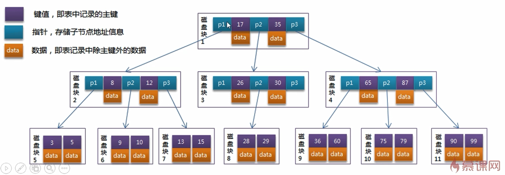
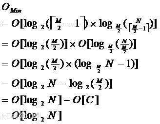
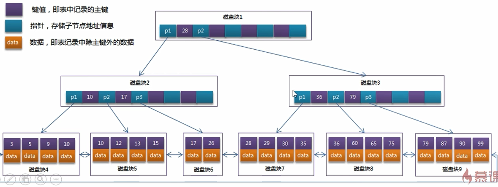

# MySQLOpt


# 硬件优化


* CPU:选择64位系统,更高的频率,更多个核心数
* 内存:选择足够大的内存,但是如果超出了数据库中数据的大小,也无法起到更快的读写效果
* 磁盘性能:PCI-E>ssd(固态硬盘)>sas>sata,raid:raid0>raid10>raid5>raid1
* 网卡:多网卡bind,以及buffer,tcp优化
* 数据库主机的IO性能是需要最优先考虑的因素,适当增大IO数
* 打开tcp连接数的限制,打开文件数的限制,安全性的限制


# CentOS系统参数优化


* 内核相关参数配置文件:/etc/sysctl.conf

  * net.core.somaxconn=65535:每个端口最大的监听队列长度.该参数默认值比较小,可以适当增大
  * net.core.netdev_max_backlog=65535:每个网络接口接收数据包的速率比内核接收速率快的时候允许发送到队列包中数据包最大的数量
  * net.ipv4.tcp_max_syn_backlog=65535:还未获得对方连接的请求,可保存在队列中的最大数量,超过的会被抛弃
  * net.ipv4.tcp_fin_timeout=10:控制TCP连接处理等待状态的时间,加快tcp连接的回收速度
  * net.ipv4.tcp_tw_reuse=1:该参数和fin_timeout,recycle参数都是为了加快tcp连接的回收速度
  * net.ipv4.tcp_tw_recycle=1:该参数和fin_timeout,reuse参数都是为了加快tcp连接的回收速度
  * 以下4个参数决定了tcp接收连接和发送缓冲区大小的默认值和最大值
    * net.core.wmem_default=87380
    * net.core.wmem_max=16777216
    * net.core.rmem_default=87380
    * net.core.rmem_max=16777216
  * 减少失效连接占用的TCP系统资源数量
    * net.ipv4.tcp_keepalive_time=120:TCP发送类似心跳检测的时间间隔,单位S
    * net.ipv4.tcp_keepalilve_intvl=30:当未收到心跳时下一次重发心跳检测的时间间隔,单位为S
    * net.ipv4.tcp_keepalive_probes=3:认定TCP失效前重发次数
  * kernel.shmmax=4294967295:定义单个共享内存段的最大值,该参数应该设置的足够大,以便能在一个共享内存段下容纳下整个InnnoDB缓冲池的大小.对于64位系统可取的最大值是物理内存减去1byte,建议值为大于物理内存的一半,一般取值大于InnoDB缓冲池大小即可
  * vm.swappiness=0:当虚拟内存不足时是否需要使用交互分区来存储数据,0为不使用

* 资源限制配置文件:/etc/security/limit.conf

  ```shell
  # 加到该文件的最后即可,加完之后重启系统生效
  * soft nofile 65535
  * hard nofile 65535
  ```

  * \*:表示对所有用户有效
  * soft:指当前系统生效的设置
  * hard:系统中所能设定的最大值
  * nofile:表示所限制的资源是打开文件爱你的最大数目
  * 65535:限制的数量

* 磁盘调度策略配置文件:/sys/block/sda/queue/scheduler

  * cfq:完全公平策略,默认情况下是该模式,查看文件显示的为none
  * noop:电梯式调度策略,是一个FIFO队列,该种策略利于写,对于闪存,RAM以及嵌入式系统比较好
  * deadline:截止时间调度策略,确保在一个截止时间段内服务请求,截止时间是可以调整的,而默认读期限短于写期限.这样就防止了写操作因为不能被读取而饿死的现象,deadline对数据库类应用是最好的选择
  * anticipatory:预料I/O调度策略,本质上和deadline一样,但在最后一次读操作后,要等待6ms,才能继续进行对其他I/O请求进行调度.它会在每个6ms中插入新的I/O操作,而会将一些小写入流合并成一个大写入流,用写入延时换区最大的写入吞吐量.AS适合于写入较多的环境,比如文件爱你服务器,AS对数据库环境表现很差.
  * 直接将三种模式中的一种写入到配置文件中即可修改调度策略


# 基准测试


- sysbench: 一个模块化,跨平台以及多线程的性能测试工具
- iibench-mysql: 基于 Java 的 MySQL/Percona/MariaDB 索引进行插入性能测试工具
- tpcc-mysql: Percona开发的TPC-C测试工具


# 服务优化


* 通过脚本,刷新观察status

  ```shell
  #!/bin/bash
  # MySQL status观察脚本
  while true
  do
  mysqladmin -h127.0.0.1 -uroot -p123456 ext|awk '/Queries/ {q=$4} /Threads_connected/{tc=$4} /Threads_running/{tr=$4} END{printf "%3d %s %s\n",q,tc,tr}' >> num.txt
  sleep 1
  done
  
  # awk 计算每秒查询数
  awk '{q=$1-last;last=$1}{printf("%d\t%d\t%d\n",q,$2,$3)}' num.txt > num2.txt
  ```

* 判断是否周期性故障或波动

* 一般由访问高峰或缓存崩溃引起,加缓存并更改缓存失效策略,使失效时间分散或夜间定时失效

* 若仍出现不规则的延迟或卡顿现象,使用`show processlist`或开启慢查询获取有问题SQL

  ```shell
  # 观察MySQL进程状态
  #!/bin/bash
  while true
  do
  	mysql -uroot -p123456 -e 'show processlist\G'|grep State:|uniq -c|sort -rn
  	echo '---'
  	sleep 1
  done
  ```

  * converting HEAP to MyISAM:查询结果太大时,把结果放在磁盘(语句写的不好,取数据太多)
  * create tmp table:创建临时表(如group时储存中间结果,说明索引建的不好)
  * Copying to tmp table on disk:把内存临时表复制到磁盘 (索引不好,表字段选的不好)
  * locked:被其他查询锁住 (一般在使用事务时易发生,互联网应用不常发生)
  * logging slow query:记录慢查询

* 如果语句等待时间过长,则调优服务器参数,如缓冲区,线程数等

* 如果语句执行过长,则优化SQL,优化表,优化关联查询,优化索引等


# 表优化


* 尽量遵循三范式原则,但在必要的情况下,可以适当做数据的冗余,反三范式
* 不常用的字段单独存在在一个表中
* 大字段独立存在到一个表中
* 经常一起使用的字段放到一起
* 如果表数据量超过百万级别就要考虑分表


# 字段优化


* 字段类型优先级 整型 > date,time > enum,char>varchar > blob
* 够用就行,不要慷慨 (如smallint,varchar(N)),大的字段浪费内存,影响速度,以varchar(10) ,varchar(300)存储的内容相同, 但在表联查时,varchar(300)要花更多内存
* 尽量避免用NULL().NULL不利于索引,要用特殊的字节来标注.在磁盘上占据的空间其实更大
* Enum列的说明
  * enum列在内部是用整型来储存的
  * enum列与enum列相关联速度最快
  * enum列比(var)char 的弱势---在碰到与char关联时,要转化. 要花时间
  * 优势在于,当char非常长时,enum依然是整型固定长度.当查询的数据量越大时,enum的优势越明显
  * enum与char/varchar关联 ,因为要转化,速度要比enum->enum,char->char要慢,但有时也这样用-----就是在数据量特别大时,可以节省IO


# 索引优化


## 概述


* 索引也是一张表,该表保存了主键与索引字段,并指向实体表的记录,所以索引是要占空间的

* 索引大大提高了查询速度,但是会降低增删改的速度,因为要同时对表和索引都做操作

* 查询数据在总数据的7%-15%之间加索引效果最好.若查询数据超过20%,相当于全表扫描

* 字段多适用数值,字段长度多使用定长

* 冷热隔离,即使用频率高的字段放一张表,使用频率低的放另外表,如实时和历史数据

* 索引在新增数据时也会消耗大量资源,一个表中的索引最多不要超过6个

* 索引一般也很大,不可能全部都存在内存中,因为索引往往都以索引文件的形式存储在磁盘上

* where子句中多个索引同时只能用一个

* 索引字段的值必须和数据库定义类型相同,若是数据库自动进行类型转换,那么索引将不生效

  ```mysql
  # col1=varchar,col2=varchar,col1和col2为复合索引
  explain select * from test where col1='1' order by col2; # 索引生效
  explain select * from test where col1=1 order by col2; # 索引不生效
  ```


## 索引类型


### 聚簇索引


* 是物理索引,数据表就是按顺序存储的,物理上是连续的
  * 如果表中定义了主键,MySQL将使用主键作为聚簇索引
  * 如果表中不指定主键,MySQL将第一个not null的唯一索引作为聚簇索引
  * 如果表中没有主键且没有适合的唯一索引,MySQL将自动创建一个名为GEN_CLUST_INDEX的隐藏聚簇索引
* 一旦创建了聚簇索引,表中的所有列都根据构造聚簇索引的关键列来存储
* 因为聚簇索引是按该列的排序存储的,因此一个表只能有一个聚簇索引
* 每个InnoDB表都需要一个聚簇索引,该聚簇索引可以帮助表优化增删改查操作
* 在InnDB存储引擎中,每个辅助索引的每条记录都包含主键,也包含非聚簇索引指定的列.MySQL使用辅助索引的主键值来检索聚簇索引,因此应该尽可能将主键缩短,否则辅助索引占用空间会更大
* 逻辑上聚簇索引是主键和数据存在一起,而辅助索引是辅助索引列数据值和主键索引值列存一起,聚簇索引数据访口更快
* 聚簇索引中,N行形成一个页,如果碰到不规则数据插入或者更新时,需要移动行,这可能会造成频繁的页分裂
* 插入速度严重依赖于插入顺序,按照主键的顺序插入是最快的方式
* 更新聚簇索引列的代价很高,因为会强制将每个被更新的行移动到新的位置
* 删除聚簇索引中的数时,页空间缩小,此时可能就会有页合并
* 聚簇数据最大限度地提高了IO密集型应用的性能,如果数据全部在内存,那么聚族索引就没有什么优势
* 聚簇索引可能导致全表扫描变慢,尤其是行比较稀或者由于页分裂导致教据存储不连续的时候


### 二级索引


* 所有不是聚簇索引的索引都叫非聚簇索引或辅助索引或二级索引

* 二级索引的叶子节点中存储的是索引值和主键值,通过主键值查找主键索引再找到数据,又叫回表

* 单列索引:即一个索引只包含单个列,一个表可以有多单列索引

* 唯一索引:索引列的值必须唯一,但允许有空值

* 复合索引:一个索引包含多个列,最左匹配,按第一列排序,第一列相同则按第二列排序,依次类推.如果不是按最左开始查找,则无法使用索引.不能跳过中间列;某些列使用范围查询,后面的列不能使用索引;非范围查找的字段在`where`中的位置可以随意,不必按照索引顺序,但最左原则仍存在

* 覆盖索引:该索引类型并不是一个实际存在的,只是一个特殊情况.当select查询的字段是单索引字段或与复合索引的字段的个数,顺序相同时,即使是全表扫描的情况下,仍然会使用索引

* 基本语法:

  ```mysql
  # 创建主键/唯一/全文/普通索引
  CREATE [PRIMARY KEY]/[UNIQUE]/[FULLTEXT]/[INDEX] indexname ON tablename(columnname(length));
  # 新增索引
  ALTER TABLE tablename ADD [PRIMARY KEY]/[UNIQUE]/[FULLTEXT]/[INDEX] indexname[ON](columnname(length));
  # 删除表中所有/单个索引
  DROP INDEX [indexname] ON tablename
  # 查看索引,\G表示竖排显示
  SHOW INDEX FROM tablename\G
  ```


### 全文索引


* fulltext: 在MySQL5.6以后才有Innodb引擎的全文索引,结果是B-Tree

```mysql
CREATE FULLTEXT INDEX indexName ON tableName(columnName);
ALTER TABLE tableName ADD FULLTEXT INDEX indexName columnName;
CREATE TABLE tableName(,,,,FULLTEXT KEY indexName columnName);
-- 查询字段值中以text开头的数据
SELECT * FROM tableName WHERE MATCH(columeName) AGAINST('text');
-- boolean模式,可模糊匹配
SELECT * FROM tableName WHERE MATCH(columnName) AGAINST('text' IN BOOLEAN MODE);
```

* 全文索引只能建立在字符串,文本字段上,且存储的值长度必须在3-84之间
* 全文索引的字段值要进行分词处理,按syntax字符串进行分词,例如b+aaa分词为b,aaa
* 全文索引匹配查询,默认使用的是等值匹配,如a匹配a,不匹配ab,ac等


## 回表


* 假如普通索引INDEX1为非唯一索引,要查询age=10的数据,需要先在INDEX1索引查找age=10
* 根据age=10的辅助索引上得到主键索引的值为30
* 然后再到主键索引树查找值为30对应的记录R
* 然后INDEX1索引树继续向右查找,发现下一个是age=5不满足条件(非唯一索引后面有可能有相等的值,因此向右查找到第一个不等于3的地方),停止搜索
* 整个过程从INDEX1索引树到主键索引树的过程叫做回表


## 覆盖索引


* 通常出现在复合索引上,即需要查询的值在索引中已经存在

```mysql
-- 假设a,b字段建立复合索引,此时explain的extra显示的为using index,使用了覆盖索引
SELECT b FROM table WHERE a='xxx';
```


## 索引下推


* 只针对复合索引
* 如 `select * from tb where a='' and b=99`,a,b为复合索引
* 5.7以前,上述语句的执行流程是先找到符合条件a的数据,然后存储引擎直接将数据返回给server层,由server层过略数据b;如果b不符合条件,则丢失结果,再次从索引中寻找,直到找到为止
* 5.7以后,存储引擎并不直接返回给server层,而是继续判断这条记录的b是否等于99,如果b=99,再去回表,如果b!=99,就不回表,直接继续读取下一条记录
* 存储引擎将读取到的数据行返回给server层,此时如果还有其他非索引的查询条件,server层再去继续过滤.假设 server 层还有其他的过滤条件,并且这个过滤条件把刚刚查到的记录过滤掉了,那么就会通过记录的指针读取下一条记录,然后重复查找


## 存储空间


* 索引key的大小,页内节点个数,树的层级决定索引文件大小
* 一页的大小为16KB,一个BIGINT是8字节,下一层指针是8个字节,即非叶子节点可以存`16K * 1024 / (8+8)`的索引,即1K个索引,如果每条数据大小是1K,则3层树就是`1K + 1K * 1K + 1K *1K *16`,大概是2000W数据


## 主键选择

* 自增主键:顺序写入,效率高.写入磁盘利用率高,每次查询走两级索引
* 随机主键:节点分裂,数据移动.写入磁盘利用率低,每次查询走两级索引
* 业务主键:写入,查询磁盘利用率高,可以使用一级索引
* 复合索引:影响索引大小,不易维护,不建议使用


## 索引结构


### B-Tree





* 就是所有的索引节点都按照 balance tree 的数据结构来存储

* B-Tree索引值和data数据分布在整棵树结构中

* 每个节点可以存放多个索引值及对应的data数据

* 树节点中的多个索引值从左到右升序排列

* B-tree 结构可以显著减少定位记录时所经历的中间过程,从而加快存取速度

* B-tree 中,每个节点包含:

  * 本结点所含关键字的个数
  * 指向父结点的指针
  * 关键字
  * 指向子结点的指针

* 对于一棵m 阶B-tree,每个节点至多可以拥有m 个子结点,各结点的关键字和可以拥有的子结点数都有限制,规定m 阶B-tree 中,根节点至少有2 个子节点,除非根节点为叶子节点,相应的,根节点中关键字的个数为1~m-1;非根结点至少有`[m/2]([]，向上取整)`个子节点,相应的,关键字个数为[m/2]-1~m-1

* B-tree 有以下特性:

  * 关键字集合分布在整棵树中
  * 任何一个关键字出现且只出现在一个结点中
  * 搜索有可能在非叶子结点结束
  * 其搜索性能等价于在关键字全集内做一次二分查找
  * 自动层次控制
  * 由于限制了除根节点以外的非叶子节点,至少含有M/2 个儿子,确保了节点的至少利用率,其最低搜索性能为:

  

  * 其中,M 为设定的非叶子节点最多子树个数,N 为关键字总数

  * 所以B-Tree的性能总是等价于二分查找(与M 值无关),也就没有B 树平衡的问题

  * 由于M/2 的限制,在插入结点时,如果节点已满,需要将节点分裂为两个各占M/2 的节点;删除节点时,需将两个不足M/2 的兄弟节点合并


### B+Tree





* 二叉树的变种,每一个节点有多个数据,可以进行指定.子节点可以是多个,当该节点存放的数据个数超过指定的数据个数,就分裂出另外的同层子节点.当子节点超过一定数量时,向下分裂子节点
* B+Tree非叶子节点不存储data数据,只存储索引值,这样便于存储更多的索引值
* 叶子节点包含了所有的索引值和data数据
* 叶子节点用指针连接,提高区间的访问性能


### Hash


* key-value,检索效率远高于B+tree,可以一次定位.因为是存的hashcode值,是散列结构,不能排序
* 要先查找hashcode值,然后通过hashcode查找索引键值,相当于要2次查找
* 不支持范围查找
* 可能会产生hash冲突
* 无法利用左前缀索引
* 自适应hash索引: 在使用Hash索引访问时,一次性查找就能定位数据,等值查询效率要优于B+Tree
* InnoDB存储引擎会监控表上各个索引页的查询,当InnoDB注意到某些索引值访问非常频繁时,会在内存中基于B+Tree索引再创建一个哈希索引,使得内存中的 B+Tree 索引具备哈希索引的功能,即能够快速定值访问频繁访问的索引页
* 自适应hash索引的建立使得InnoDB存储引擎能自动根据索引页访问的频率和模式自动地为某些热点页建立哈希索引来加速访问
* 自适应hash索引的功能只能选择开启或关闭,无法进行人工干涉
* `show variables like '%innodb_adaptive%';`: 查看hash自适应索引信息


## 索引失效


* LIKE前后使用%->使用覆盖索引
* OR->使用UNION或UNION ALL或使用INDEX MERGE技术,对同一个表使用多个索引分别扫描
* 隐式类型转换->使用精准的数据类型
* 索引列包含计算,使用了函数
* 数据范围影响:索引区分度过低,条件超出索引范围


## 适合创建索引


* 主键自动创建索引,外键应当有索引
* 频繁用来查询的字段创建索引
* 和其他表关联的字段创建索引
* 查询中用来排序的字段可用来创建索引
* 用来分组和统计的字段可创建索引
* 数据量超过 300 的表应该有索引
* 索引应该建在选择性高的字段上
* 索引应该建在小字段上,对于大的文本字段甚至超长字段,不要建索引
* 复合索引的建立需要进行仔细分析,尽量考虑用单字段索引代替
* 复合索引的几个字段经常同时以AND方式出现在WHERE子句中,单字段查询极少甚至没有,则可以建立复合索引,否则考虑单字段索引
* 如果复合索引中包含的字段经常单独出现在WHERE子句中,则分解为多个单字段索引
* 如果复合索引所包含的字段超过 3 个,那么仔细考虑其必要性,考虑减少复合的字段
* 如果既有单字段索引,又有这几个字段上的复合索引,一般可以删除复合索引
* 频繁进行数据操作的表,不要建立太多的索引
* 删除无用的索引,避免对执行计划造成负面影响
* 过多的复合索引,在有单字段索引的情况下,一般都是没有存在价值的.相反,还会降低数据增加删除时的性能,特别是对频繁更新的表来说,负面影响更大
* 尽量不要对数据库中某个含有大量重复的值的字段建立索引


## 不适合创建索引


* 频繁更新的字段不适合创建索引
* where条件用不到的字段不创建索引
* 数据库列有多个重复值的,不适合创建索引
* 数据量比较小的表不适合建立索引
* 数据太少的字段不创建索引


## 索引优化


* 复合索引:只要where和order by条件中的字段和索引定义的一样,且复合索引的第一个字段在where子句中,不管是第几个条件,索引就会生效

  * 不用所有的索引字段都作为条件
  * 顺序可以不相同
  * 中间可以添加其他非索引字段
  * **最优的方案应该是复合索引中间不跳过任何字段,按照索引顺序来.虽然上述3种情况仍然会使用索引,但是会减少精度(key_len)**
  * 存储引擎不能使用索引中范围条件右边的列
  * order by和group by使用索引排序的条件差不多,有一个不一样,group by可以接having
  * 索引中只要有一个列含有null,那么这一列也不会使用索引
  * 将区分度高的列放在前面,可以过滤掉更多数据

  ``` mysql
  # e为普通字段,索引顺序为a,b,c,d
  explain select * from ts_user where a='' and b='' and c='' and d='';
  explain select * from ts_user where b='' and a='' and c='' and d=''; # 同上
  # 会用到索引,但是key_len会下降,其实是索引查找中只用到了a和b,但排序用到了索引的c,d
  explain select * from ts_user where a='' and b='' order by c, d;
  explain select * from ts_user where a='' and b='' and e='' order by c, d;
  # 会用到索引,但是key_len同样会下降,只用到了abc的key_len
  explain select * from ts_user where a='' and b='' and c='';
  # 会用到索引,但是key_len只是用到a的key_len
  explain select * from ts_user where a='' and c='' and d='';
  # ab会用到查找索引,但是d用不到,c作为排序也可以用到索引
  explain select * from ts_user where a='' and b='' and d='' order by c;
  # ab会用到查找索引,但是d既用不到索引查找,也用不到索引排序,此时排序用的是using filesort
  explain select * from ts_user where a='' and b='' order by d;
  # ab会用到查找索引,cd用的索引排序
  explain select * from ts_user where a='' and b='' order by c,d;
  # ab会用到查找索引,cd既用不到索引查找,也用不到索引排序,此时排序用的是using filesort
  explain select * from ts_user where a='' and b='' order by d,c;
  # ab会用到查找索引,此时排序用的不是using filesort,因为c已经是一个常量了,cd是索引排序
  explain select * from ts_user where a='' and b='' and c='' order by d,c;
  # 索引不生效
  explain select * from ts_user where b='' and c='' and d='';
  explain select * from ts_user where b='' and c='' order by a;
  # 查找索引生效,但只用了ab,精度也只有ab精度,b是范围查找,c没有用上,故而排序索引也不生效
  explain select * from ts_user where a='' and b>1 order by c;
  # abc索引全部都用到了,虽然是范围查找
  explain select * from ts_user where a='' and b like '1%' and c='';
  # 如果排序中有非索引字段,不管是什么顺序,必然会产生file sort
  explain select * from ts_user where a='' order by e,a;
  # 一样会产生file sort
  explan select * from ts_user where a='' order a,e;
  ```

* 应该尽量避免更新复合索引,因为复合索引的顺序就是表记录的物理顺序,变更将会消耗大量资源

* like:当%name%和%name时,索引不生效.只有当name%时索引才会生效

  ```mysql
  # 通常状态下都是必须使用%name%,此时有一种解决方式,使用覆盖索引
  # 将name当作select的字段查询出来,不管是什么类型索引,都不能有索引外字段,否则索引将不生效
  # name为单字段索引
  explain select name from t1 where name like '%aaa%'; # 索引生效
  explain select * from t1 where name like '%aaa%'; # 索引不生效
  explain select name,age from t1 where name like '%aaa%'; # 索引不生效
  # name,age为复合索引
  explain select name,age from t1 where name like '%aaa%'; # 索引生效
  # 若仍然需要额外的字段,可以将只有like查询的字段作为另外的表进行连接查询
  explain explain select b.name,b.age,b.pwd from (select col1 from t1 where name like '%1%') a LEFT JOIN t1 b on b.name = a.name; 
  ```

* !=,<>,is null,is not null:在where子句中使用时将不使用索引

* <,<=,>,>=,between:在where子句中将会使用索引

* or:在where子句中or不会使用索引,可以使用union或union all代替or

* 小表驱动大表,适当的时候用exists代替in是可以提高效率,特别是子查询

  * in:当in后面接的是一个子查询时,先查询子查询中的数据,然后再查询外部数据
  * exists:正好和in相反,先查询外部数据,放到子查询中做条件验证,true则保留

  ```mysql
  # 当B表的数据小于A表的数据时,in优于exists
  select * from t1 where t1.a in (select a from B);
  # 当A表的数据小于B表的数据时,exists优于in
  select * from t1 where exists(select 1 from B.a=t1.a);
  ```

* 索引列上不要使用函数,计算,类型转换,表达式,这将会使用全表扫描.可以对常量进行表达式操作

  ```mysql
  select num from ts_user where num/2=100; # 不使用所用
  select num from ts_user where num = 100*2; # 使用索引
  select num from ts_user where lower(num)='str'; # 不使用索引
  select num from ts_user where num='100'; # 类型会自动转换,将不使用索引
  ```

* 尽量避免频繁创建和删除临时表,可以适当作为存储过程来使用临时表数据或建立视图

* 在新建临时表时,若一次性插入数据量很大,可以使用select into 代替create table,避免造成大量log

* 如果存储过程中使用到临时表,应在最后将临时表显示删除

* 尽量避免使用游标,因为游标的效率较差

* 在所有的存储过程和触发器开始处设置set nocount on,在结束时设置set nocount off,无需在执行存储过程和触发器的每个语句后向客户端发送done_in_proc消息

* 应尽量少的连表查询,因为连表查询的数据量更大,且很容易造成锁表和阻塞

* where中有多索引时,选择key_len最短的使用

* MySQL存储引擎不能继续使用索引中范围条件(between,<,>,in等)右边的列

* 时间字段建议使用long,枚举和boolean建议使用tinyint

* 多条联合查询时,需要根据情况加索引

  * 保证sql语句中被驱动表上的join条件字段已经被索引
  * 左右连接:非主表的连接字段上加索引能提高查询效率,不管是2表还是多表都是如此.**注意,该种情况只能对单字段索引有效,若是多字段索引**

  ```mysql
  # left join,此时应该在t2表col1加索引
  select * from t1 left join t2 on t1.col1=t2.col1;
  # right join,此时应该在t1表col1加索引
  select * from t1 right join t2 on t1.col1=t2.col1;
  ```

* 对于左前缀不易区分的列 ,如 url列`http://www.baidu.com`,`http://www.zixue.it`,列的前11个字符都是一样的,不易区分, 可以把列内容倒过来存储,并建立索引,这样左前缀区分度大

* 在索引中的NULL也可以被索引查找


# Explain优化


* explain可以分析sql的表读取顺序,索引使用情况,表之间的引用,每张表有多少行被优化器查询,排序等

* explain sql:直接在sql前面加上explain即可

  

## ID


* select查询的序列号,包含一组数字,表示查询中执行select子句或操作表的顺序

* id相同:table加载的顺序由上而下
* id不同:如果是子查询,id的序号会递增,id越大优先级越高,越先被执行.一般是先执行子句
* id不同和相同同时存在:先加载数字大的,数字相同的顺序执行.若table行内出现衍生表(derived+id),衍生表后的数字是id的值,表示该验证表是由那一个id衍生而来
* id为null,表示这是一个结果集,不需要进行查询

```mysql
# id相同,此时id是相同的,都为1,而表加载顺序是t1->t3->t2
explain select * from t1,t2,t3 where t1.id =t2.id and t2.id = t3.id;
# id不同,此时id递增,1,2,3,而表加载顺序是t3->t1->t2
explain select * from t2 where id=(select id from t1 where id = (select t3.id from t3 where t3.name=''));
# id相同和不同同时存在,数字大的先加载,相同的顺序执行,加载顺序为t3->t2
explan select * from (select t3.id from t3 where t3.name='') s1,t2 where s1.id=t2.id
```


## Select_type


* 查询类型,在版本8和版本5中可能出现的情况不一样

* simple:简单select查询,查询中不包含子查询或union.有连接查询时,外层查询为simple,且只有一个
* primary:查询中若包含任何子查询或union,最外层查询将会认为是primary,且只有一个
* subquery:除了from子句中包含的子查询外,其他地方的子查询都可能是subquery
* dependent subquery:表示当前subquery的查询结果会受到外部表查询的影响
* derived:在from列表中包含的子查询被标记为DERIVED(衍生),mysql会递归执行这些子查询,把结果放在临时表中
* union:union连接的2个查询.除第一个查询是derived之外,之后的表都是union;若union包含在from子句的子查询中,外层select将被标记为derived
* union result:在union表获取结果的select,不需要参与查询,所以id为null
* dependent union:与union一样,出现在union中,但是union中第二个或后续的查询语句,使用了外部查询结果
* materialized:物化通过将子查询结果作为一个临时表来加快查询速度,正常来说是常驻内存,下次查询会再次引用临时表.通常情况下是作为子查询的大表第一次被查询之后,结果将会被存储在内存中,下次再试用该大表查询时就能直接从内存中读取


## Table


* 显示查询表名,也可能是表别名.如果不涉及数据操作,就显示null
* <subqueryN>:表示这个是子查询.N就是执行计划的id,表示结果来自于该子查询id
* <derivedN>:表示这个是临时表.N就是执行计划中的id,表示结果来自于该查询id
* <union M,N>:与derived类型,表示结果来自于union查询的id为M,N的结果集


## Prititions


* 查询涉及到的分区


## Type


* 表示查询的数据使用了何种类型,从好到坏:system>const>eq_ref>ref>range>index>all

* 一般来说,得保证查询至少达到range级别,最好能达到ref

* system:表只有一行记录,这是const的特例,一般不会出现.而且只能用于myisam和memory表,如果是innodb表,通常显示all或index

* const:表示通过unique索引或主键等值查询.因为只匹配一行数据,所以很快

* eq_ref:主键和唯一索引扫描.出现在要连接多个表的查询中,表示前面表的每一个记录,都只能匹配后面表的一行结果.此时驱动表该行数据的连接条件是第二个表的主键或唯一索引,作为条件查询只返回一条数据,且必须是not null.唯一索引和主键是多列时,只有所有列都用作比较时才会出现eq_ref

* ref:非唯一性索引扫描,返回匹配某个单值的所有行,属于查找和扫描的混合体,但本质上也是一种索引访问.和eq_ref不同,ref不要求连接顺序,也不一定需要唯一索引和主键,只要使用等值查找或多列主键,唯一索引中,使用第一个列之外的列作为等值查找也会出现

* fulltext:全文索引检索,优先级很高.若全文索引和普通索引同时存在时,优先使用全文索引.只能在创建了全文索引(fulltext)的表中,才可以使用match和against函数

* ref_or_null:与ref类似,只是增加了null值的比较,实际用的不多

* unique_subquery:用户where中的in子查询,子查询返回不重复唯一值

* index_subquery:用户in子查询使用了辅助索引或in常数列表,子查询可能返回重复值

* range:只检索给定范围的行,使用一个索引来选择行,key列显示使用了那个索引

  * 一般是where语句中出现了between,<,>,in等查询时会出现range
  * 这种范围索引扫描比全表扫描要好,因为它只需要开始于索引的某一点,而结束于另一点,不用扫描全部索引
  * range会让复合索引在排序时失效:当range类型用于复合索引的中间时,即使where子句中的字段和顺序都符合复合索引,同时排序,仍然用不上索引

  ```mysql
  # col1,col2,col3为复合索引
  # 此时虽然用上了索引,但是在排序时因为col2为range模式,使得排序的col3使用了using filesort
  explain select * from t1 where t1.col1=1 and t1.col2>1 order by t1.col3;
  # 解决办法:将col2从索引中剔除或直接建立col1和col3的独立索引
  ```

* index:扫描索引全部数据,比all快一点,因为索引文件通常比较小

* all:扫描全表数据,效率最低


## Possible_keys


* 显示可能应用在这张表中的索引,一个或多个,并非真实应用
* 查询涉及到的字段上若存在索引,则该索引将被列出,但不一定被查询使用
* 和key一起判断是否使用了索引,索引是否失效.多个索引竞争下,到底用了那一个索引


## Key


* 实际使用的索引,null表示没有使用.若查询中使用了覆盖索引,则该索引仅出现在key列表中


## Key_len


* 表示索引中使用的字节数,可通过该列计算查询中使用的索引长度
* 在不损失精确性的情况下,长度越短越好
* key_len显示的值为索引字段的最大可能长度,并非实际使用长度
* 多列索引时,索引可能不会全部使用,需要手动计算使用了那些索引
* 只会计算where条件中使用的索引,排序分组使用的索引不会计算进去
* 计算规则,字符串类型和字符集有关:latin1=1,gbk=2,utf8=3,utf8mb4=4,数字类型无关
  * char(n):n*字符集长度
  * varchar(n):n*字符集长度+2字节
  * tinyint:1字节
  * smallint:2字节
  * int,float:4
  * bigint,double:8
  * date:3字节
  * datetime:8字节
  * timestamp:4字节
  * NULL属性占用1个字节,如果设置了NOT NULL,则不占用字节


## Ref


* 显示索引使用了那些列或常量被用于查找索引列上的值
  * const:表示使用的是一个常量
  * db.table.column:表示使用的是某个数据库的某张表的某个字段
  * null:没有使用索引
* 如果连接查询时,被驱动表的执行计划显示的是驱动表的关联字段
* 如果是条件使用了表达式,函数或条件列发生了内部隐式转换,可能显示为func


## Rows


* 根据表统计信息以及索引选用情况,大致估算出找到所需记录要读取的行数,越小效率越高


## Extra


* 包含不适合在其他列显示但十分重要的额外信息


### Using filesort


* 该类型需要避免出现.文件内排序,MySQL中无法利用索引完成的排序操作称为文件排序,相当于排序字段并非索引字段.此时MySQL会对数据使用外部索引排序,而不是按照表内的索引顺序进行读取行.当索引字段为复合索引时,where里使用了索引字段,且是按照复合索引的顺序使用,那么排序所使用的字段若不符合复合索引的顺序,也将不使用索引

  ```mysql
  # col1,col2,col3为复合索引
  # col3将无法使用索引进行排序,此时会出现using filesort的内排序
  select * from t1 where col1='' order by col3;
  # 此时仍然使用的是索引排序,而不会出现using filesort,性能更好
  select * from t1 where col1='' order by col2,col3;
  # 此时虽然复合索引中间出现了其他的字段,但仍然会使用索引排序,而不会出现using filesort
  select * from t1 where col1='' and col4='' order by col2,col3;
  ```


### Using temporary


* 该类型需要避免出现.新建了一个内部临时表,保存中间结果.mysql对结果进行排序时使用临时表.该种情况多出现于复合索引的时候使用group by和order by

  ```mysql
  # col1,col2为复合索引
  # col2将无法使用索引进行排序,此时会出现using temporary,using filesort
  explain select * from t1 where col1 in('','') group by col2;
  # 此时仍然使用的是索引排序,而不会出现using temporary,using filesort,性能更好
  explain select * from t1 where col1 in('','') group by col1,col2;
  ```


### Using index


* 表示相应的select操作中使用了覆盖索引(Covering Index),避免访问了表的数据,效率还行

  ```mysql
  # col1,col2为复合索引
  # 此时会用到using where和using index
  explain select col2 from t1 where col1 ='';
  # 只用到了using index
  explain select col1,col2 from t1;
  ```

  * 如果同时出现using where,表明索引被用来执行索引键值的查找
  * 如果没有同时出现using where,表明索引用来读取数据而非执行查找动作.


### Using where


* 用到了where条件,但查询需要通过索引回表查询数据


### Using where Using index


* 查询的列被索引覆盖,并且where筛选条件是索引列之一但是不是索引的前导列,意味着不能直接通过索引查找符合条件的数据.多出现于复合索引中,被查询字段非复合索引的第一个字段,而是其他字段


### Using index condition


* 与Using where类似,查询的列不完全被索引覆盖,where条件中是一个前导列的索引,即查询的字段中包含了非索引中的字段


### Using join buffer


* 表示使用了连接缓存,可以调整join buffer来调优


### impossible where


* where子句的值总是false,不能用来获取任何元组


### select tables optimized away


* 在没有group by子句的情况下,基于索引优化MIN/MAX操作或者对于MyISAM存储引擎优化count(*)操作,补习等到执行阶段再进行计算,查询执行计划生成的的阶段即完成优化


### distinct


* 优化distinct操作,在找到第一行匹配的元组后即停止找同样值的动作


### no tables used


* 不带from子句的查询或from dual查询


### null


* 查询的列未被索引覆盖,并且where筛选条件是索引的前导列,意味着用到了索引


### Using intersect


* 表示使用and连接各个索引条件时,从处理结果获取交集


### Using union


* 表示使用or连接各个使用索引的条件时,从处理结果获得并集,只有一个or


### Using sort_union,Using sort_intersect


* 用and和or查询信息量大时,先查询主键,然后排序合并后返回结果集


## Filtered


* 表示存储引擎返回的数据在srever层过来后,剩下多少满足查询的记录数量的比例
* 是百分比,不是具体记录数


# SQL优化


## SQL执行顺序


```mysql
select distinct(t1.c) c,sum(t1.c) num from t1 inner join t2 on t1.a=t2.a where t1.a = t2.a group by t1.c having num > 0 order by t1.a limit 10 # 一个sql例子
```

* from:先从from语句开始读,多表会形成笛卡尔积
* on:主表数据保留
  * inner join:2张表都有的数据才会保留到下一步
  * left join:2张表中left左边表的数据都会保留,右边表没的数据以null代替
  * right join:2张表中right右边表的数据都会保留,左边表没有的数据以null代替
* where:非聚合,非select别名的条件筛选
* group by:分组
* having:对分组后的数据进行再次筛选
* select:查询出所需要的字段.如果进行了聚合,那么只能查询进行聚合的字段
* order by:排序
* limit:分页


## 优化


* 查询不要使用select *,查询字段也是开销,使用具体的字段代替
* 如exist和in,in和not in,like,索引的使用,关联太多join.可使用explain sql来分析
* 不要在where子句中使用!=,<>,is null,is not null这种条件将跳过索引,直接使用全表扫描
* 不要在where中使用or,会导致索引失效
* 尽量去除表连接操作
* 尽可能在索引中完成排序
* 小结果集驱动大结果集
* 试用mysqldumpshow查看慢日志,优化慢SQL
* 利用第三方工具pt-query-digest查找慢SQL


## Count


* `count(*)`会统计NULL,而count(常量)或count(字段)不会统计NULL

* `count(distinct col)`计算该列的非NULL之外的不重复行数

* `count(distinct col1,col2)`如果其中一列全为NULL,那么即时另一列有不同的值,也返回0

* 当某一列值全为NULL时,count(col)返回0,但sum(col)返回NULL,需要注意NPL

  


## IN


* 尽量避免IN操作,若实在需使用,应控制IN的参数个数在1000以内


# 分页优化


* 利用覆盖索引优化.在查询的字段中添加主键索引或其他索引字段,不要使用*
* 利用范围查找,减少分页的偏移量查找时间,即减少limit第一个参数的查找时间,如limit 10,10比limit 10000 10快很多
* 利用子查询优化,效果等同于范围查找优化,都是减少偏移量的查找时间


# 排序优化


* order by子句,尽量使用index方式排序,避免使用filesort方式排序

* 尽可能在索引列上完成排序操作,详见索引优化的复合索引优化

* order by子句中只要是索引的前导列都可以使索引生效,可以直接在索引中排序

* 复合索引在where子句中的某些情况,可能会导致索引排序失效

  ```mysql
  -- id,name是复合索引
  -- 排序走索引
  select * from user where id=1 order by name;
  -- 排序不走索引
  select * from user where id > 1 order by name;
  -- 发生上述情况是因为=相当于已经进行分组了,而>则没有分组,无法使用前导列排序
  ```


## 常规排序


* 从表中获取满足where条件的记录
* 将每条记录的主键+排序键取出放入sort buffer
* 如果sort buffer可以存放所有满足条件的对(主键+排序键),则进行排序;否则sort buffer满后,进行排序并固化到临时文件中
* 若排序中产生了临时文件,需要利用归并排序算法,保证临时文件中记录是有序的
* 循环执行上述过程,直到所有满足条件的记录全部参与排序
* 扫描排好序的对,并利用id去获取select需要返回的其他列
* 将获得的结果返回给用户


## filesort


* 单路排序:4.1之后版本,从磁盘读取查询需要的所有列,再在buffer内排序,然后扫描排序后的列表进行输出.该方法将随机IO变成了顺序IO,但是会消耗更多的空间.**该排序模式下,如果数据大小超过了sort_buffer_size的值,反而不如双路排序**
  * 增大sort_buffer_size的设置
  * 增大max_length_for_sort_data的设置
* 双路排序:4.1版本之前使用,读2次,先读排序列并排序,再读其他字段.在磁盘取排序字段,在buffer进行排序,再从磁盘取其他字段
* 出现filesort排序的情况
  * 对索引列同时使用了ASC和DESC
  * WHERE子句和ORDER BY子句满足最左前缀,但where子句使用了范围查询
  * ORDER BY或者WHERE+ORDER BY索引列没有满足索引最左前列
  * 使用了不同的索引,MySQL每次只采用一个索引,ORDER BY涉及了两个索引
  * WHERE子句或者ORDER BY子句中索引列使用了表达式,包括函数表达式
* 优先队列排序算法:主要是针对order by limit M,N语句,在空间层面做了优化.这种排序采用堆排序实现,堆排序算法特征正好可以解决limit M,N排序的问题,虽然仍然需要所有元素参与排序,但是只需要M+N个元组的sort buffer空间即可

```mysql
# 索引顺序为a,b
# 使用索引排序:排序使用索引的最左前缀或where+order by使用最左前缀
explain select * from ts_user where a='' order by a;
explain select * from ts_user where a='' order by a,b;
explain select * from ts_user where a='' order by b;
# 不使用索引排序,使用的是filesort
explain select * from ts_user order by b;
explain select * from ts_user where a='' order by b,a;
-- 对索引同时使用了不同的排序方式
explain select * from ts_user where a='' order by a desc,b asc;
-- where中使用了范围查询
explain select * from ts_user where a > 1 order by b;
```


# 联表优化


* 小结果集驱动大结果集.联表查询相当于多重循环,应该以小表驱动大表,减少循环次数
* 当进行多表连接查询时,驱动表的定义:
  *  指定了联接条件时,满足查询条件的记录行数少的表为驱动表
  *  未指定联接条件时,行数少的表为驱动表
* 如果搞不清楚该让谁做驱动表,谁Join谁,则让MySQL自行判断,即不显示的使用left,right,inner
* MySQL表关联查询的算法是Nest Loop Join,是通过驱动表的结果集作为循环基础数据,然后一条一条地通过该结果集中的数据作为过滤条件到下一个表中查询数据,然后合并结果
  * Simple Nested-Loop:简单循环.就是简单的嵌套循环,不使用索引,Join Buffer等
  * Index Nested-Loop:索引循环.即先从索引中获取值,之后再和内层表进行循环
  * Block Nested-Loop:块循环.利用Join Buffer缓冲区进行多条数据同时循环的策略,在内存足够的情况下,可尽量增大Join Buffer的值

```mysql
-- user表10000条数据,class表20条数据
select * from user u left join class c u.userid=c.userid;
-- 这样则需要用user表循环10000次才能查询出来,而如果用class表驱动user表则只需要循环20次
select * from class c left join user u c.userid=u.userid
```

* 根据驱动表的字段排序.对驱动表可以直接排序,对非驱动表(的字段排序)需要对循环查询的合并结果(临时表)进行排序,产生临时表会浪费性能
* 尽可能避免复杂的join和子查询
* 最终驱动表是哪张表,可以通过EXPLAIN的id查看
* 当联表查询有条件,且不指定驱动表时,默认会使用无索引的表为驱动表

```mysql
-- user表10000条数据,class表20条数据,user表的id无索引,class表userid有索引
-- 此时用class表驱动
select * from user t1 join class t2;
-- 此时t1表驱动,因为条件中t1表无索引,会被MySQL优化成驱动表
select * from user t1 join class t2 on t1.userid = t2.userid;
```


# 性能优化


## 负载过高


* 情形:服务器出现长时间负载过高 /周期性负载过大,或偶尔卡住
* 思路:
  * 发生该情况的服务器是周期性的变化还是偶尔问题
  * 是服务器整体性能的问题, 还是某单条语句的问题
  * 具体到单条语句, 这条语句是在等待上花的时间,还是查询上花的时间
  * 唯一的办法-----监测并观察服务器的状态:`show status;show processlist;`
* 减少无关请求(业务逻辑层面,其实是最有效的手段)
* 如果请求数是一定的,不可减少的,则要尽量让请求数平稳,不要有剧烈波动,比如秒杀时段请求数过高.使用缓存或队列改变尽量减少波动.缓存需要注意击穿,雪崩等


## 降低磁盘写入次数


* 增大redolog,减少落盘次数:`innodb_log_file`设置为`0.25 * innodb_buffer_pool_size`
* 通用查询日志,慢查询日志可以不开,bin-log开.遇到问题时在开慢日志查看
* 写redolog策略innodb_flush_log_at_trx_commit设置为0或2.如果不设计非常高的安全性,或基础架构足够安全,或事务非常小时使用


# 其他优化


* 当单表数据超过700W(根据数据库不同而不同)时,sql优化已达到极致,此时应增加缓存,读写分离,分库分表

* 尽量避免全表扫描,避免多表连接,首先应考虑在where以及order by设计的列上建立索引

* 尽量避免在where子句中对null进行判断,否则将导致引擎放弃使用索引而进行全表扫描

* 尽量设置默认值以避免null值出现

* 尽量使用数字型字段,尽量使用定长的字符串类型

* 尽量进行批量操作,而不是频繁的读写

* 分页limit优化,偏移量越大,执行越慢.即limit M,N中M越大,执行越慢.可以使用索引先将一部分数据过来,之后再分页

  ```mysql
  -- 效率低
  select * from t1 limit 100000,10;
  -- 效率高,id上有索引
  select * from t1 where id in (select id from t1 where id > 100000) limit 100000,10;
  ```

* 为每个表建立独立表空间,使用系统表空间会出现大量浪费空间的问题

  * show variables like '%innodb_file_per_table%':查看是否使用了独立表空间,ON表示使用.每个表都会有一个单独的表空间名称->tablename.idb,该文件会生成在数据目录的数据库目录下,每个表一个
  * optimize table:收缩系统文件.可以收缩独立表空间和系统表空间,但是收缩系统表空间需要很复杂的操作,也很浪费时间.但是收缩独立表空间就很简单,而且可以不停服
  * 将表空间从系统表空间转到独立表空间
    * 使用mysqldump导出所有的数据库表数据
    * 停止mysq服务,修改参数,并删除Innodb相关文件
    * 重启mysql服务,重建Innodb独立空间
    * 重新导入数据

* 通过慢日志进行优化查询语句,优化未使用索引语句

* 实时查询有性能问题的SQL:`select * from information_schema.PROCESSLIST where time>5`;通过特定表查询超过指定时间的sql,时间单位为S.可通过脚本实时查询,进行分析

* 打开死锁日志:`set global innodb_print_all_deadlocks=on;`

* count优化:查询表中全部数据总量很快,因为表已经记录了该值,但是带条件的查询就相对较慢,且条件越大,查询越慢,此时可以根据情况改变条件,再根据总数据做比对,修改条件达到相同效果

  ```mysql
  -- 假设表中有1000W数据,此时查全表数据很快,但是查id大于1000就很慢
  select count(*) from t1;
  select count(1) from t1 where id>1000;
  -- 查id小于1000的就很快,因为要全表扫描,结合小于和总数进行相见得到结果
  select count(1) from t1 where id<=1000;
  select (select count(*) from t1)- (select count(1) from t1 where id<=1000);
  ```

  

# Processlist


* 该命令输出有哪些线程在运行,不仅可以查看当前所有的连接数,还可以查看当前的连接状态帮助识别出有问题的查询语句等

* `SHOW PROCESSLIST`和`SHOW FULL PROCESSLIST`:不带FULL的INFO默认只查询前100个字符,带FULL的查询全部:
  
  * Id:用户登录mysql时,系统分配的connection_id,可以使用函数connection_id()查看
  * User:显示当前用户.如果不是root,这个命令就只显示用户权限范围的sql语句
  * Host:显示这个语句是从哪个ip的哪个端口上发的,可以用来跟踪出现问题语句的用户
  * db:显示这个进程目前连接的是哪个数据库
  * Command:显示当前连接的执行的命令
    * Create: 正在创建操作
    * Drop: 正在删除操作
    * Execute: 正在执行一个PreparedStatement
    * Close Stmt: 正在关闭一个PreparedStatement
    * Query: 正在执行一个语句
    * Sleep: 正在等待客户端发送语句
    * Quit: 正在退出
    * Shutdown: 正在关闭服务器
    * Connect: 链接
  * Time:显示这个状态持续的时间,单位是秒
  * State:显示使用当前连接的sql语句执行的状态.以查询为例,可能需要经过copying to tmp table,sorting result,sending data等状态才可以完成
  * Info:显示这个sql语句,默认只显示前100个字符,使用Full可显示全
  
* State各种状态:

  * Starting: 正在执行请求处理
  * Checking table:正在检查数据表(这是自动的)
  * Closing tables:正在将表中修改的数据刷新到磁盘中,同时正在关闭已经用完的表.如果操作很慢,就应该确认磁盘空间是否满了或磁盘是否正处于重负中
  
  
    * Create tmp table:创建临时表(如group时储存中间结果)以存放部分查询结果
  
  
  
    * Copying to tmp table on disk:由于临时结果集大于tmp_table_size,将临时表从内存存储转为磁盘存储以此节省内存
  
  
  
    * Locked:被其他查询锁住
  
  
  
    * logging slow query:记录慢查询
  
  
  
    * Connect Out:复制从服务器正在连接主服务器
  
  
  
    * deleting from main table:服务器正在执行多表删除中的第一部分,刚删除第一个表
  
  
  
    * deleting from reference tables:服务器正在执行多表删除中的第二部分,正在删除其他表的记录
  
  
  
    * Flushing tables:正在执行FLUSH TABLES,等待其他线程关闭数据表
  
  
  
    * Killed:发送一个kill请求给某线程,这个线程会检查kill标志位,同时会放弃下一个kill请求.MySQL会在每次的主循环中检查kill标志位,不过有些情况下该线程可能会过一小段才能死掉.如果该线程被其他线程锁住了,那么kill请求会在锁释放时马上生效
  
  
  
    * Sending data:正在处理SELECT查询的记录,同时正在把结果发送给客户端
  
  
  
    * Sorting for group:正在为GROUP BY做排序
  
  
  
    * Sorting for order:正在为ORDER BY做排序
  
  
  
    * Opening tables:这个过程很快,除非受到其他因素的干扰.例如,在执ALTER TABLE或LOCK TABLE语句行完以前,数据表无法被其他线程打开,正尝试打开一个表
  
  
  
    * Removing duplicates:正在执行一个SELECT DISTINCT方式的查询,但是MySQL无法在前一个阶段优化掉那些重复的记录.因此,MySQL需要再次去掉重复的记录,然后再把结果发送给客户端
  
  
  
    * Reopen table:获得了对一个表的锁,但是必须在表结构修改之后才能获得这个锁.已经释放锁,关闭数据表,正尝试重新打开数据表
  
  
  
    * Repair by sorting:修复指令正在排序以创建索引
  
  
  
    * Repair with keycache:修复指令正在利用索引缓存一个一个地创建新索引.它会比Repair by sorting慢些
  
  
    * Searching rows for update:正在讲符合条件的记录找出来以备更新.它必须在UPDATE要修改相关的记录之前就完成了
  
  
  
    * Sleeping:正在等待客户端发送新请求
  
  
  
    * System lock:正在等待取得一个外部的系统锁.如果当前没有运行多个mysqld服务器同时请求同一个表,那么可以通过增加--skip-external-locking参数来禁止外部系统锁
  
  
  
    * Upgrading lock:INSERT DELAYED正在尝试取得一个锁表以插入新记录
  
  
  
    * Updating:正在搜索匹配的记录,并且修改它们
  
  
  
    * User Lock:正在等待GET_LOCK()
  
  
  
    * Waiting for tables:该线程得到通知,数据表结构已经被修改了,需要重新打开数据表以取得新的结构.为了能够重新打开数据表,必须等到所有其他线程关闭这个表.以下几种情况下会产生这个通知:FLUSH TABLES tbl_name, ALTER TABLE, RENAME TABLE, REPAIR TABLE, ANALYZE TABLE,或OPTIMIZE TABLE
  
  
  
    * Waiting for handler insert:INSERT DELAYED已处理完所有待处理的插入操作,正在等待新的请求
  


  * 主从模式下有更友好的显示,会多出其他列,State也更多:
    * sending binlog event to slave:线程已经从二进制日志读取了一个事件并正将它发送到从服务器
    * finished reading one binlog:switching to next binlog:线程已经读完二进制日志文件并正打开下一个要发送到从服务器的日志文件
    * has sent all binlog to slave;waiting for binlog to be updated:线程已经从二进制日志读取所有主要的更新并已经发送到了从服务器.线程现在正空闲,等待由主服务器上新的更新导致的出现在二进制日志中的新事件
    * waiting to finalize termination:线程停止时发生的一个很简单的状态


# Profiles


* `show profiles`:观察最近10条语句的具体执行步骤,总耗时等.默认未开启该参数,需要先开启

  ```mysql
  show variables lile '%prof%';
  -- 临时开启
  set profiling = 1;
  ```

* profiling分析语句以及explain SQL语句

  ```mysql
  # 会分析最近使用的10条SQL
  SHOW PROFILES;
  # 通过上一条语句查询到ID,再分析单条语句的执行情况
  SHOW PROFILE FOR QUERY id;
  # 显示所有性能信息
  SHOW PROFILE ALL FOR QUERY id;
  # 显示块IO操作次数
  SHOW PROFILE BLOCK IO FOR QUERY id;
  # 显示上下文切换次数,被动和主动
  SHOW PROFILE CONTEXT SWITCHES FOR QUERY id;
  # 显示用户CPU时间,系统CPU时间
  SHOW PROFILE CPU FOR QUERY id;
  # 显示内存相关信息
  SHOW PROFILE MEMORY FOR QUERY id;
  # 显示发送和接收消息数量
  SHOW PROFILE IPC FOR QUERY id;
  # 显示页错误数量
  SHOW PROFILE PAGE FAULTS FOR QUERY id;
  # 显示源码中的函数名称与位置,和source_function,source_file,source_line相关开销
  SHOW PROFILE SOURCE FOR QUERY id;
  # 显示SWAP的次数
  SHOW PROFILE SWAPS FOR QUERY id;
  ```

* 如果语句等待时间过长,则调优服务器参数,如缓冲区,线程数等

  ```mysql
  mysql> show profiles;
  +----------+------------+----------------------------------------------------------+
  | Query_ID | Duration   | Query                                                    |
  +----------+------------+----------------------------------------------------------+
  |        1 | 0.00034225 | select cat_id,avg(shop_price) from goods group by cat_id |
  +----------+------------+----------------------------------------------------------+
  
  1 row in set (0.00 sec)
  
  mysql> show profile for query 1;
  +----------------------+----------+
  | Status               | Duration |
  +----------------------+----------+
  | starting             | 0.000058 |
  | checking permissions | 0.000008 |
  ...  
  ...
  
  | Sorting result       | 0.000004 |
  | Sending data         | 0.000120 |
  | end                  | 0.000005 |
  | query end            | 0.000006 |
  | closing tables       | 0.000008 |
  | freeing items        | 0.000023 |
  | logging slow query   | 0.000003 |
  | cleaning up          | 0.000004 |
  +----------------------+----------+
  ```

* Status出现以下4种结果,说明查询有很大问题,需要优化:
  * Converting HEAP to MyISAM:查询结果太大时,把结果放在磁盘.如果服务器频繁出现该结果,说明:
    * sql有问题,取出的结果或中间结果过大,内存临时表放不下
    * 服务器配置的临时表内存参数过小.可修改tmp_table_size和max_heap_table_size
  * Creating Tmp Table:创建临时表,拷贝数据到临时表,用完再删除
  * Copying to Tmp Table on disk:把内存中临时表复制到磁盘,危险
  * Locked:锁表了


# Performance


* [Performance Schema](https://dev.mysql.com/doc/refman/5.7/en/performance-schema.html)相关配置

* instruments:生产者,用于采集mysql中各种各样的操作产生的事件信息,对应配置表中的配置项,可以称为监控采集配置项

* consumers:消费者,对应的消费者表用于存储来自instruments采集的数据,对应配置表中的配置项,可以称为消费者配置项

* 在高版本(5.7以上)中profile计划被废弃,需要使用performance_schema表进行查询,开启相关设置

  ```mysql
  UPDATE setup_instruments SET enabled='YES',timed='YES' where name like 'wait%';
  UPDATE setup_instruments SET enabled='YES',timed='YES' where name like 'stage%';
  UPDATE setup_consumers SET enabled='YES' where name like '%wait%';
  UPDATE setup_consumers SET enabled='YES' where name like '%events%';
  ```

* performance_schema默认是开启状态,若要关闭,必须修改配置文件,而不能在MySQL控制台中修改,会报错

* 使用查询语句查询所有表每个阶段消耗时间

  ```sql
  SELECT a.THREAD_ID,a.SQL_TEXT,c.EVENT_NAME,(c.TIMER_END-c.TIMER_START)/1000000000 'DURATION(ms)'
  FROM events_statements_history_long a
  JOIN threads b ON a.THREAD_ID = b.THREAD_ID
  JOIN events_stages_history_long c ON c.THREAD_ID = b.THREAD_ID AND c.EVENT_ID BETWEEN a.EVENT_ID AND a.END_EVENT_ID
  WHERE b.PROCESSLIST_ID = CONNECTION_ID() AND a.EVENT_NAME = 'statement/sql/select'
  ORDER BY a.THREAD_ID,c.EVENT_ID;
  ```


# 临时表


* 在处理请求的某些场景中,服务器创建内部临时表.即表以MEMORY引擎在内存中处理,或以MyISAM引擎储存在磁盘上处理.如果表过大,服务器可能会把内存中的临时表转存在磁盘上.

* 用户不能直接控制服务器内部用内存还是磁盘存储临时表

* 临时表在如下几种情况被创建:

  * 如果group by 的列没有索引,必产生内部临时表
  * 如果order by 与group by为不同列时,或多表联查时order by ,group by包含的列不是第一张表的列,将会产生临时表
  * distinct 与order by 一起使用可能会产生临时表
  * 如果开启了SQL_SMALL_RESULT,MySQL会使用内存临时表,除非查询中有一些必须要把临时表建立在磁盘上
  * union合并查询时会用到临时表
  * 某些视图会用到临时表,如使用temptable方式建立,或使用union或聚合查询的视图

* 想确定查询是否需要临时表,可以用EXPLAIN查询计划,并查看Extra列,看是否有Using temporary

* 如果一开始在内存中产生的临时表变大,会自动转化为磁盘临时表.内存中临时表的最大值为tmp_table_size和max_heap_size中较小值.这和create table时显示指定的内存表不一样:这些表只受max_heap_table_size系统参数影响

* 当服务器创建内部临时表(无论在内存还是在磁盘),create_tmp_tables变量都会增加

* 如果创建了在磁盘上内部临时表(无论是初始创建还是由in-memory转化),create_tmp_disk_tables 变量都会增加

* 一些情况下限制了内存临时表的使用,而使用磁盘临时表,在使用了内存临时表的情况下,以下情况会写到磁盘上:

  * 取出的列含有text/blob类型时 ---内存表储存不了text/blob类型

  * 在group by 或distinct的列中存在>512字节的string列

  * select 中含有>512字节的string列,同时又使用了union或union all语句


# 缓存优化


## 查询缓存


* `query_cache_size`: 该缓存在8以上版本中被移除


## Join缓存


* `join_buffer_size`: 表链接缓存,将主表中数据或索引数据缓存


## Sort缓存


* `sort_buffer_size`: 排序缓存,通用缓存大小
* `innodb_sort_buffer_size`: innodb引擎的排序缓存大小


## Thread缓存


* `thread_cache_size`: 线程缓存,非链接缓存


## Innodb


* `innodb_buffer_pool_size`: 指定大小的内存来缓冲数据和索引,最大可设置为物理内存的80%
* `innodb_flush_log_at_trx_commit`: 控制innodb将log buffer中的数据写入日志文件并flush磁盘的时间值,值分别为0,1,2
* `innodb_thread_concurrency`: 设置innodb线程的并发数,默认为0表示不受限制,如果要设置建议跟服务器的cpu核心数一致或者是cpu核心数的两倍
* `innodb_log_buffer_size`: 确定日志文件所用的内存大小,以M为单位
* `innodb_log_file_size`: 确定数据日志文件的大小,以M为单位
* `innodb_log_files_in_group`: 以循环方式将日志文件写到多个文件中(redo.log)
* `innodb_file_per_table`: 是否为每张表分配一个新的文件,默认是
* `read_buffer_size`: mysql读入缓冲区大小,对表进行顺序扫描的请求将分配到一个读入缓冲区
* `read_rnd_buffer_size`: mysql随机读的缓冲区大小,增删改操作的时候,先从表空间的磁盘文件里读取数据页出来,这个过程是随机读

## 